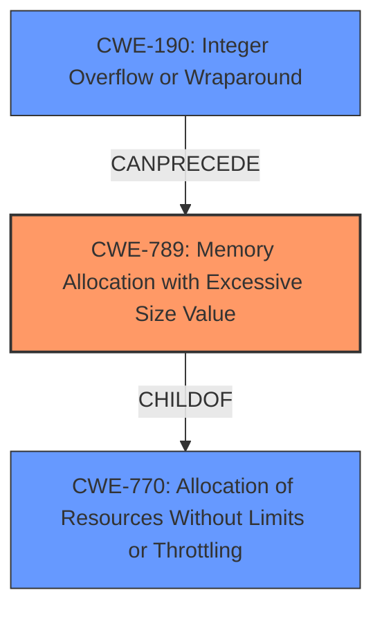

# Raw Analyzer Response for CVE-2021-44590

# Summary
| CWE ID | CWE Name | Confidence | CWE Abstraction Level | CWE Vulnerability Mapping Label | CWE-Vulnerability Mapping Notes |
|---|---|---|---|---|---|
| CWE-789 | Memory Allocation with Excessive Size Value | 1.0 | Variant | Allowed | Primary CWE |
| CWE-190 | Integer Overflow or Wraparound | 0.8 | Base | Allowed | Secondary CWE |
| CWE-770 | Allocation of Resources Without Limits or Throttling | 0.7 | Base | Allowed | Secondary CWE |

## Evidence and Confidence

*   **Confidence Score:** 0.9
*   **Evidence Strength:** HIGH

## Relationship Analysis
The primary CWE, CWE-789 (Memory Allocation with Excessive Size Value), is a variant of CWE-770 (Allocation of Resources Without Limits or Throttling) and can be preceded by CWE-190 (Integer Overflow or Wraparound). The vulnerability involves allocating memory based on an attacker-controlled size without validation, potentially leading to an integer overflow. Therefore, all three CWEs are related, with CWE-789 being the most specific and suitable for this case. The parent-child relationship between CWE-770 and CWE-789 indicates that the uncontrolled resource allocation is manifested through excessive memory allocation.

## Vulnerability Chain
The vulnerability chain starts with the **integer overflow** (CWE-190) when reading the size from the crafted SWF file. This leads to an attacker-controlled size being passed to `realloc`, causing **memory allocation with an excessive size value** (CWE-789) because the size isn't validated. This excessive allocation contributes to **allocation of resources without limits or throttling** (CWE-770) which ultimately leads to a denial of service due to **memory exhaustion**.

## Summary of Analysis
The initial assessment considered the vulnerability description indicating **memory exhaustion** and the CVE reference content summary highlighting an **integer overflow** leading to out-of-bounds memory allocation. The analysis leverages the retriever results, particularly emphasizing CWE-789 (Memory Allocation with Excessive Size Value), which has a high relevance score.

The relationship analysis reinforces the selection of CWE-789 as the primary CWE. It is a variant of CWE-770 and can be preceded by CWE-190, which aligns with the vulnerability chain. The graph representation illustrates these relationships effectively.

The decision is based on the evidence from the CVE reference: "The vulnerability is caused by an integer overflow when reading the size of a compressed SWF file, leading to an out-of-bounds memory allocation via `realloc`." This directly supports the selection of CWE-789.

The chosen CWEs are at the optimal level of specificity. CWE-789 accurately describes the excessive memory allocation based on an untrusted size value. CWE-190 identifies the integer overflow that precedes the memory allocation, and CWE-770 explains how the resources are not properly controlled to prevent the excessive allocation.

Relevant CWE Information:

# Enhanced Context (25 CWEs)

## CWE-789: Memory Allocation with Excessive Size Value
**Abstraction:** Variant
**Status:** Draft

### Description
The product allocates memory based on an untrusted, large size value, but it does not ensure that the size is within expected limits, allowing arbitrary amounts of memory to be allocated.

### Extended Description
Not provided

### Alternative Terms
Stack Exhaustion: When a weakness allocates excessive memory on the stack, it is often described as "stack exhaustion," which is a technical impact of the weakness. This technical impact is often encountered as a consequence of CWE-789 and/or CWE-1325.

### Relationships
ChildOf -> CWE-770
CanPrecede -> CWE-476

### Mapping Guidance
**Usage:** Allowed
**Rationale:** This CWE entry is at the Variant level of abstraction, which is a preferred level of abstraction for mapping to the root causes of vulnerabilities.
**Comments:** Carefully read both the name and description to ensure that this mapping is an appropriate fit. Do not try to 'force' a mapping to a lower-level Base/Variant simply to comply with this preferred level of abstraction.
**Reasons:**
- Acceptable-Use

## CWE-190: Integer Overflow or Wraparound
**Abstraction:** Base
**Status:** Draft

### Description
The product performs a calculation that can
         produce an integer overflow or wraparound when the logic
         assumes that the resulting value will always be larger than
         the original value. This occurs when an integer value is
         incremented to a value that is too large to store in the
         associated representation. When this occurs, the value may
         become a very small or negative number.

### Extended Description
Not provided

### Alternative Terms
None

### Relationships
ChildOf -> CWE-369

### Mapping Guidance
**Usage:** Allowed
**Rationale:** This CWE entry is at the Base level of abstraction, which is a preferred level of abstraction for mapping to the root causes of vulnerabilities.
**Comments:** Carefully read both the name and description to ensure that this mapping is an appropriate fit. Do not try to 'force' a mapping to a lower-level Base/Variant simply to comply with this preferred level of abstraction.
**Reasons:**
- Acceptable-Use

## CWE-770: Allocation of Resources Without Limits or Throttling
**Abstraction:** Base
**Status:** Incomplete

### Description
The product allocates a reusable resource or group of resources on behalf of an actor without imposing any restrictions on the size or number of resources that can be allocated, in violation of the intended security policy for that actor.

### Extended Description

Code frequently has to work with limited resources, so programmers must be careful to ensure that resources are not consumed too quickly, or too easily. Without use of quotas, resource limits, or other protection mechanisms, it can be easy for an attacker to consume many resources by rapidly making many requests, or causing larger resources to be used than is needed. When too many resources are allocated, or if a single resource is too large, then it can prevent the code from working correctly, possibly leading to a denial of service.

### Alternative Terms
None

### Relationships
ChildOf -> CWE-400
ChildOf -> CWE-665
ChildOf -> CWE-400

### Mapping Guidance
**Usage:** Allowed
**Rationale:** This CWE entry is at the Base level of abstraction, which is a preferred level of abstraction for mapping to the root causes of vulnerabilities.
**Comments:** Carefully read both the name and description to ensure that this mapping is an appropriate fit. Do not try to 'force' a mapping to a lower-level Base/Variant simply to comply with this preferred level of abstraction.
**Reasons:**
- Acceptable-Use

CWE-674 (Uncontrolled Recursion), CWE-1325 (Improperly Controlled Sequential Memory Allocation), CWE-401 (Missing Release of Memory after Effective Lifetime), CWE-134 (Use of Externally-Controlled Format String), CWE-1284 (Improper Validation of Specified Quantity in Input), CWE-400 (Uncontrolled Resource Consumption), CWE-121 (Stack-based Buffer Overflow), and CWE-407 (Inefficient Algorithmic Complexity) were considered, but they did not fully capture the root cause or specific nature of the vulnerability. CWE-674 and CWE-407 describe algorithmic inefficiencies and uncontrolled recursion, which are not the primary issue here. CWE-1325 relates to multiple allocations without limits, which is related, but CWE-789 is more specific. CWE-401 describes memory leaks, which is a different issue. CWE-134 involves format string vulnerabilities, which is not relevant. CWE-1284 describes improper validation of input, which is a contributing factor, but CWE-789 more accurately describes the excessive memory allocation. CWE-400 is too general. CWE-121 describes stack-based buffer overflows, which is not the primary issue. Therefore, these were not selected.