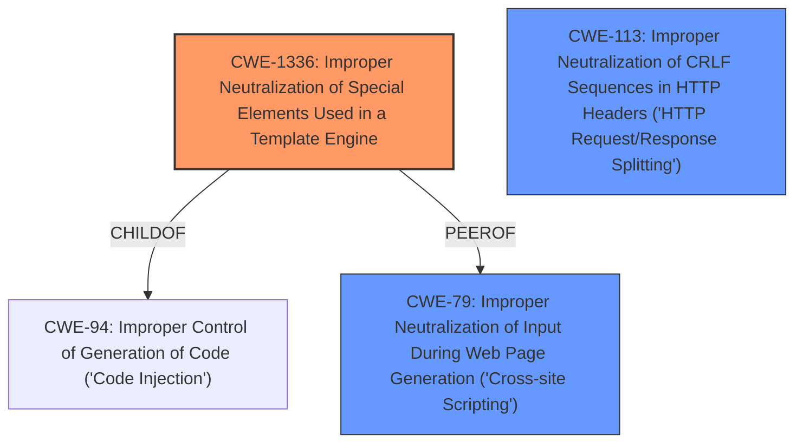

# Enhanced Analysis for CVE-2021-44618

# Summary
| CWE ID  | CWE Name                                                                                                    | Confidence | CWE Abstraction Level | CWE Vulnerability Mapping Label | CWE-Vulnerability Mapping Notes |
| ------- | ----------------------------------------------------------------------------------------------------------- | ---------- | ----------------------- | ------------------------------- | ------------------------------- |
| CWE-1336 | Improper Neutralization of Special Elements Used in a Template Engine                                       | 0.9        | Base                    | Primary                         | Allowed                         |
| CWE-79  | Improper Neutralization of Input During Web Page Generation ('Cross-site Scripting')                        | 0.7        | Base                    | Secondary                       | Allowed                         |
| CWE-113 | Improper Neutralization of CRLF Sequences in HTTP Headers ('HTTP Request/Response Splitting') | 0.6 | Variant | Secondary | Allowed |

## Evidence and Confidence

*   **Confidence Score:** 0.8
*   **Evidence Strength:** HIGH

## Relationship Analysis
The primary relationship is that CWE-1336 (Improper Neutralization of Special Elements Used in a Template Engine) is a specific type of injection that occurs in template engines, which is a child of CWE-94 (Improper Control of Generation of Code) and related to CWE-79 (Improper Neutralization of Input During Web Page Generation ('Cross-site Scripting')). The sanitization efforts mentioned in the commit summary could also be related to preventing CWE-113 (Improper Neutralization of CRLF Sequences in HTTP Headers ('HTTP Request/Response Splitting')).



## Vulnerability Chain
The vulnerability chain starts with the lack of or improper neutralization of special elements in the template engine (CWE-1336). If successful, this can lead to the injection of malicious code or scripts, potentially resulting in Cross-Site Scripting (CWE-79) or HTTP Response Splitting (CWE-113) if headers are affected.

## Summary of Analysis
The initial assessment strongly points to **CWE-1336 (Improper Neutralization of Special Elements Used in a Template Engine)** as the primary weakness, given the vulnerability description explicitly mentions "Server-side Template Injection (SSTI)". The retriever results also identify CWE-1336 as the top match. The evidence "The vulnerability stems from improper handling of URLs, specifically within the context of a Craft CMS plugin called SEOmatic" and "The commit diff shows changes in `src/helpers/UrlHelper.php` where URLs are now being sanitized before being rendered" further supports this.

The secondary CWEs, **CWE-79 (Improper Neutralization of Input During Web Page Generation ('Cross-site Scripting'))** and **CWE-113 (Improper Neutralization of CRLF Sequences in HTTP Headers ('HTTP Request/Response Splitting'))**, are considered due to the potential for injected templates to generate XSS payloads or manipulate HTTP headers, based on the CVE Reference Links Content Summary.

The selected CWEs are at the appropriate level of specificity, with CWE-1336 being a Base CWE that directly addresses the root cause of the SSTI vulnerability, while CWE-79 and CWE-113 represent potential impacts or related vulnerabilities.

Relevant CWE Information:

# Enhanced Context (25 CWEs)
The following CWEs were identified as potentially relevant to this vulnerability:

## CWE-113: Improper Neutralization of CRLF Sequences in HTTP Headers ('HTTP Request/Response Splitting')
**Abstraction Level**: Variant
**Similarity Score**: 0.75
**Source**: dense

**Description**:
The product receives data from an HTTP agent/component (e.g., web server, proxy, browser, etc.), but it does not neutralize or incorrectly neutralizes CR and LF characters before the data is included in outgoing HTTP headers.

**Mapping Guidance**:
- Usage: Allowed
- Rationale: This CWE entry is at the Variant level of abstraction, which is a preferred level of abstraction for mapping to the root causes of vulnerabilities.

**Technical Explanation:** This CWE is relevant because the CVE Reference Links Content Summary mentions "Host Header Injection", which can be achieved through CRLF injection in HTTP headers.
**Security Implications:** An attacker can manipulate HTTP headers, potentially leading to various attacks, including cache poisoning and cross-site scripting.
**Influence:** This CWE is considered as a potential secondary factor because the "Host Header Injection" mentioned in the CVE summary could be a consequence of improper handling of CRLF sequences.

## CWE-74: Improper Neutralization of Special Elements in Output Used by a Downstream Component ('Injection')
**Abstraction Level**: Class
**Similarity Score**: 0.75
**Source**: dense

**Description**:
The product constructs all or part of a command, data structure, or record using externally-influenced input from an upstream component, but it does not neutralize or incorrectly neutralizes special elements that could modify how it is parsed or interpreted when it is sent to a downstream component.

**Mapping Guidance**:
- Usage: Discouraged
- Rationale: CWE-74 is high-level and often misused when lower-level weaknesses are more appropriate.

**Technical Explanation:** This is a very general injection class.
**Security Implications:** Allows modification of how commands, data structures, or records are parsed or interpreted by downstream components.
**Influence:** Not chosen because it is too general, and CWE-1336 is a more specific, appropriate match.

## CWE-131: Incorrect Calculation of Buffer Size
**Abstraction Level**: Base
**Similarity Score**: 0.74
**Source**: dense

**Description**:
The product does not correctly calculate the size to be used when allocating a buffer, which could lead to a buffer overflow.

**Mapping Guidance**:
- Usage: Allowed
- Rationale: This CWE entry is at the Base level of abstraction, which is a preferred level of abstraction for mapping to the root causes of vulnerabilities.

**Technical Explanation:** This CWE is related to buffer overflows due to incorrect size calculations.
**Security Implications:** Can lead to buffer overflows, potentially allowing arbitrary code execution.
**Influence:** Not relevant to the described vulnerability, as it is primarily related to template injection, not buffer size issues.

## CWE-184: Incomplete List of Disallowed Inputs
**Abstraction Level**: Base
**Similarity Score**: 0.74
**Source**: dense

**Description**:
The product implements a protection mechanism that relies on a list of inputs (or properties of inputs) that are not allowed by policy or otherwise require other action to neutralize before additional processing takes place, but the list is incomplete.

**Mapping Guidance**:
- Usage: Allowed
- Rationale: This CWE entry is at the Base level of abstraction, which is a preferred level of abstraction for mapping to the root causes of vulnerabilities.

**Technical Explanation:** This CWE describes a scenario where a denylist is incomplete.
**Security Implications:** Attackers can bypass the filter by using inputs not present in the denylist.
**Influence:** Potentially relevant, but not selected as the primary CWE. It could be a secondary issue if the template engine uses a denylist to sanitize inputs.

## CWE-124: Buffer Underwrite ('Buffer Underflow')
**Abstraction Level**: Base
**Similarity Score**: 0.74
**Source**: dense

**Description**:
The product writes to a buffer using an index or pointer that references a memory location prior to the beginning of the buffer.

**Mapping Guidance**:
- Usage: Allowed
- Rationale: This CWE entry is at the Base level of abstraction, which is a preferred level of abstraction for mapping to the root causes of vulnerabilities.

**Technical Explanation:** Describes a buffer underflow condition.
**Security Implications:** Can lead to memory corruption and potentially arbitrary code execution.
**Influence:** Not relevant to the described vulnerability, as it is primarily related to template injection, not buffer underflow issues.

## CWE-191: Integer Underflow (Wrap or Wraparound)
**Abstraction Level**: Base
**Similarity Score**: 0.74
**Source**: dense

**Description**:
The product subtracts one value from another, such that the result is less than the minimum allowable integer value, which produces a value that is not equal to the correct result.

**Mapping Guidance**:
- Usage: Allowed
- Rationale: This CWE entry is at the Base level of abstraction, which is a preferred level of abstraction for mapping to the root causes of vulnerabilities.

**Technical Explanation:**


## CWE Relationship Analysis

Current CWEs represent these abstraction levels: .


### Vulnerability Chain Analysis

**Chain starting from CWE-113:**
- 113 (Improper Neutralization of CRLF Sequences in HTTP Headers ('HTTP Request/Response Splitting')) - ROOT


**Chain starting from CWE-1336:**
- 1336 (Improper Neutralization of Special Elements Used in a Template Engine) - ROOT


### CWE Relationship Diagram

```mermaid
graph TD
    classDef primary fill:#f96,stroke:#333,stroke-width:2px
    classDef secondary fill:#69f,stroke:#333
    classDef tertiary fill:#9e9,stroke:#333
```