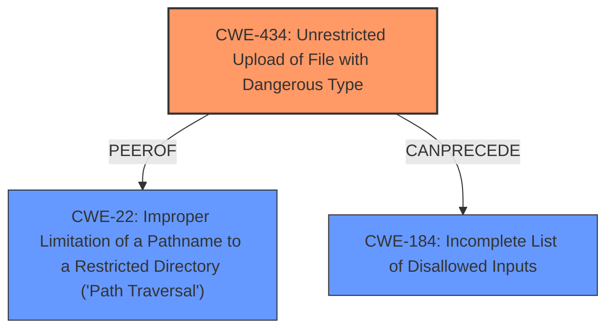

# Analysis Report for CVE-2021-44664

# Vulnerability Analysis Report: CVE-2021-44664

## Description


## Analysis (with Relationship Data)

# Summary
| CWE ID | CWE Name | Confidence | CWE Abstraction Level | CWE Vulnerability Mapping Label | CWE-Vulnerability Mapping Notes |
|---|---|---|---|---|---|
| CWE-434 | Unrestricted Upload of File with Dangerous Type | 1.0 | Base | Allowed | Primary CWE |
| CWE-22 | Improper Limitation of a Pathname to a Restricted Directory ('Path Traversal') | 1.0 | Base | Allowed | Secondary CWE |
| CWE-184 | Incomplete List of Disallowed Inputs | 0.7 | Base | Allowed | Secondary CWE |

## Evidence and Confidence

*   **Confidence Score:** 0.9
*   **Evidence Strength:** HIGH

## Relationship Analysis
The primary weakness is **CWE-434 (Unrestricted Upload of File with Dangerous Type)** because the vulnerability allows the upload of a PHP file disguised as a language file. This can lead to remote code execution. **CWE-22 (Improper Limitation of a Pathname to a Restricted Directory ('Path Traversal'))** is a secondary weakness because the `mediapath` variable allows path traversal. **CWE-184 (Incomplete List of Disallowed Inputs)** is also related as the upload filters are bypassed using a maliciously crafted PHP file, indicating an incomplete list of disallowed inputs or file properties.



## Vulnerability Chain
The vulnerability chain starts with an **incomplete list of disallowed inputs** (**CWE-184**), which allows an attacker to **bypass upload filters**. This leads to an **unrestricted upload of a file with a dangerous type** (**CWE-434**), combined with an **improper limitation of a pathname to a restricted directory** (**CWE-22**), which allows for the **remote code execution**.

## Summary of Analysis
The primary weakness is the **Unrestricted Upload of File with Dangerous Type (CWE-434)**. The supporting evidence includes: "An Authenticated Remote Code Exection (RCE) vulnerability exists in Xerte through 3.9 in website_code/php/import/fileupload.php by uploading a maliciously crafted PHP file though the project interface disguised as a language file to bypasses the upload filters."

The vulnerability allows a malicious PHP file to be uploaded, bypassing upload filters. This matches the description of **CWE-434**: "The product allows the upload or transfer of dangerous file types that are automatically processed within its environment."

The **Improper Limitation of a Pathname to a Restricted Directory ('Path Traversal') (CWE-22)** occurs because "Attackers can manipulate the files destination by abusing path traversal in the mediapath variable." This aligns with the description of **CWE-22**: "The product uses external input to construct a pathname that is intended to identify a file or directory that is located underneath a restricted parent directory, but the product does not properly neutralize special elements within the pathname that can cause the pathname to resolve to a location that is outside of the restricted directory."

The **Incomplete List of Disallowed Inputs (CWE-184)** is present since the "rootcause" is to "**bypass upload filters**", which implies the application had a filter that was incomplete.

Other CWEs Considered:
*   **CWE-74: Improper Neutralization of Special Elements in Output Used by a Downstream Component ('Injection')** - Discouraged because it is high-level.
*   **CWE-73: External Control of File Name or Path** - Considered, but CWE-22 is more specific to the relative path traversal issue.
*   **CWE-79: Improper Neutralization of Input During Web Page Generation ('Cross-site Scripting')** - Not relevant because the vulnerability leads to RCE, not XSS.
*   **CWE-94: Improper Control of Generation of Code ('Code Injection')** - Allowed-with-Review. While RCE is the impact, the root cause is related to file upload and path traversal and is better captured by CWE-434 and CWE-22.
*   **CWE-639: Authorization Bypass Through User-Controlled Key** - Irrelevant because the vulnerability is about file upload and path traversal, not authorization.

Relevant CWE Information:

# Enhanced Context (25 CWEs)

## CWE-434: Unrestricted Upload of File with Dangerous Type
**Abstraction Level**: Base
**Similarity Score**: 6779.00
**Source**: sparse

**Description**:
The product allows the upload or transfer of dangerous file types that are automatically processed within its environment.

**Mapping Guidance**:
- Usage: Allowed
- Rationale: This CWE entry is at the Base level of abstraction, which is a preferred level of abstraction for mapping to the root causes of vulnerabilities.

## CWE-22: Improper Limitation of a Pathname to a Restricted Directory ('Path Traversal')
**Abstraction Level**: Base
**Similarity Score**: 7229.72
**Source**: sparse

**Description**:
The product uses external input to construct a pathname that is intended to identify a file or directory that is located underneath a restricted parent directory, but the product does not properly neutralize special elements within the pathname that can cause the pathname to resolve to a location that is outside of the restricted directory.

**Mapping Guidance**:
- Usage: Allowed
- Rationale: This CWE entry is at the Base level of abstraction, which is a preferred level of abstraction for mapping to the root causes of vulnerabilities.

## CWE-184: Incomplete List of Disallowed Inputs
**Abstraction Level**: Base
**Similarity Score**: 7092.02
**Source**: sparse

**Description**:
The product implements a protection mechanism that relies on a list of inputs (or properties of inputs) that are not allowed by policy or otherwise require other action to neutralize before additional processing takes place, but the list is incomplete.

**Mapping Guidance**:
- Usage: Allowed
- Rationale: This CWE entry is at the Base level of abstraction, which is a preferred level of abstraction for mapping to the root causes of vulnerabilities.


## CWE Relationship Analysis

Current CWEs represent these abstraction levels: .


### Vulnerability Chain Analysis

**Chain starting from CWE-79:**
- 79 (Improper Neutralization of Input During Web Page Generation ('Cross-site Scripting')) - ROOT


**Chain starting from CWE-73:**
- 73 (External Control of File Name or Path) - ROOT


### CWE Relationship Diagram

```mermaid
graph TD
    classDef primary fill:#f96,stroke:#333,stroke-width:2px
    classDef secondary fill:#69f,stroke:#333
    classDef tertiary fill:#9e9,stroke:#333
```


*Report generated on 2025-04-02 09:01:15*
