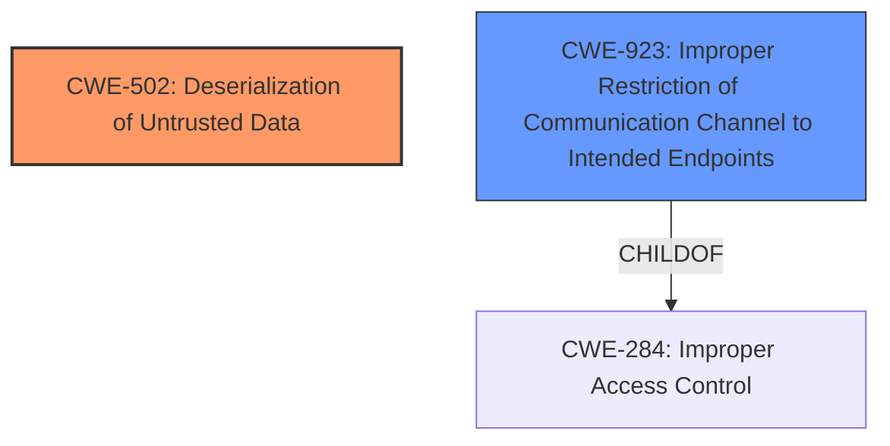

# Analysis Report for CVE-2021-44682

# Vulnerability Analysis Report: CVE-2021-44682

## Description


## Analysis (with Relationship Data)

# Summary
| CWE ID | CWE Name | Confidence | CWE Abstraction Level | CWE Vulnerability Mapping Label | CWE-Vulnerability Mapping Notes |
|---|---|---|---|---|---|
| CWE-502 | Deserialization of Untrusted Data | 1.0 | Base | Allowed | Primary CWE |
| CWE-923 | Improper Restriction of Communication Channel to Intended Endpoints | 0.7 | Class | Allowed-with-Review | Secondary Candidate |

## Evidence and Confidence

*   **Confidence Score:** 0.9
*   **Evidence Strength:** HIGH

## Relationship Analysis
The primary relationship that impacted the decision was the direct match of **deserialization behavior** in the vulnerability description to CWE-502 (Deserialization of Untrusted Data). The retriever results also strongly suggested CWE-502 as the top candidate. CWE-923 was considered due to the mention of .NET Remoting TCP ports, but the core issue is the unsafe deserialization, making CWE-502 the more direct root cause.



## Vulnerability Chain
The vulnerability chain begins with the **deserialization of untrusted data** (CWE-502), which allows an attacker to execute arbitrary code on the Enterprise Vault server, potentially leading to a complete compromise of the system. The reliance on .NET Remoting TCP ports exacerbates the issue.

## Summary of Analysis
The initial analysis strongly pointed towards CWE-502 due to the explicit mention of **deserialization behavior** in the vulnerability description and the CVE Reference Links Content Summary. The retriever results also listed CWE-502 as the top candidate. The final decision is based on the evidence provided, which clearly indicates that the **root cause** of the vulnerability is the **deserialization of untrusted data** without proper validation.

Relevant CWE Information:

# Enhanced Context (25 CWEs)
The following CWEs were identified as potentially relevant to this vulnerability:

## CWE-1289: Improper Validation of Unsafe Equivalence in Input
**Abstraction Level**: Base
**Similarity Score**: 0.80
**Source**: dense

**Description**:
The product receives an input value that is used as a resource identifier or other type of reference, but it does not validate or incorrectly validates that the input is equivalent to a potentially-unsafe value.

**Mapping Guidance**:
- Usage: Allowed
- Rationale: This CWE entry is at the Base level of abstraction, which is a preferred level of abstraction for mapping to the root causes of vulnerabilities.

## CWE-502: Deserialization of Untrusted Data
**Abstraction:** Base
**Similarity Score**: 7639.90
**Source**: sparse

**Description**:
The product deserializes untrusted data without sufficiently ensuring that the resulting data will be valid.

**Mapping Guidance**:
- Usage: Allowed
- Rationale: This CWE entry is at the Base level of abstraction, which is a preferred level of abstraction for mapping to the root causes of vulnerabilities.

## CWE-923: Improper Restriction of Communication Channel to Intended Endpoints
**Abstraction:** Class
**Similarity Score**: 7148.00
**Source**: sparse

**Description**:
The product establishes a communication channel to (or from) an endpoint for privileged or protected operations, but it does not properly ensure that it is communicating with the correct endpoint.

**Mapping Guidance**:
- Usage: Allowed-with-Review
- Rationale: This CWE entry is a Class and might have Base-level children that would be more appropriate

## CWE-306: Missing Authentication for Critical Function
**Abstraction:** Base
**Similarity Score**: 0.555
**Source**: sparse

**Description**:
The product does not perform any authentication for functionality that requires a provable user identity or consumes a significant amount of resources.

### CWE Selection Details:

*   **CWE-502 Deserialization of Untrusted Data:** This is the primary CWE because the vulnerability description explicitly mentions **deserialization behavior**. The CVE Reference Links Content Summary confirms that the **root cause** is the lack of proper validation of user-supplied data, leading to the **deserialization of untrusted data**. The impact is remote code execution.
    *   *Evidence:* "These TCP services can be exploited due to **deserialization behavior** that is inherent to the .NET Remoting service." "The vulnerability stems from the lack of proper validation of user-supplied data within the `EVStorageQueueBroker.exe` component of Veritas Enterprise Vault. This lack of validation leads to the **deserialization of untrusted data**."
    *   *Confidence:* 1.0

*   **CWE-923 Improper Restriction of Communication Channel to Intended Endpoints:** This CWE is a secondary consideration because the vulnerability is exposed through .NET Remoting TCP ports. However, the core issue is not the improper restriction of the communication channel but the unsafe **deserialization** of data received through those channels. CWE-923 is a Class level CWE, making it less specific than CWE-502.
    *   *Evidence:* "On start-up, the Enterprise Vault application starts several services that listen on random .NET Remoting TCP ports for possible commands from client applications." "Attackers can target the .NET Remoting TCP ports used by Enterprise Vault."
    *   *Confidence:* 0.7

*   **CWE-306 Missing Authentication for Critical Function:** Authentication is not required to exploit the vulnerability, but the main issue remains **deserialization of untrusted data**, making it a less accurate primary classification.

### Other CWEs Considered but Not Used:

*   CWE-1289: Improper Validation of Unsafe Equivalence in Input was not selected as it is a more general case of input validation and CWE-502 directly addresses the specific **deserialization** issue.
*   CWE-20: Improper Input Validation was not selected because it is a high-level Class CWE and CWE-502 provides a more specific and accurate description of the vulnerability.
*   CWE-1336: Improper Neutralization of Special Elements Used in a Template Engine was not selected because the vulnerability does not involve a template engine.

The selected CWEs are at the optimal level of specificity, with CWE-502 being a Base-level CWE that directly addresses the **root cause** of the vulnerability.


## CWE Relationship Analysis

Current CWEs represent these abstraction levels: .


### Vulnerability Chain Analysis

**Chain starting from CWE-502:**
- 502 (Deserialization of Untrusted Data) - ROOT


**Chain starting from CWE-306:**
- 306 (Missing Authentication for Critical Function) - ROOT


### CWE Relationship Diagram

```mermaid
graph TD
    classDef primary fill:#f96,stroke:#333,stroke-width:2px
    classDef secondary fill:#69f,stroke:#333
    classDef tertiary fill:#9e9,stroke:#333
```


*Report generated on 2025-04-02 10:52:40*
