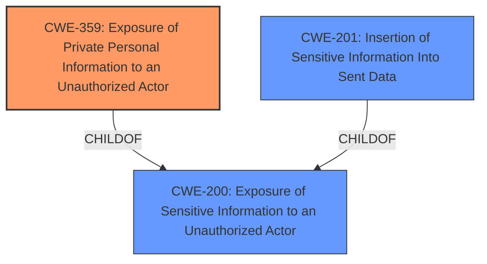

# Analysis Report for CVE-2021-44692

# Vulnerability Analysis Report: CVE-2021-44692

## Description


## Analysis (with Relationship Data)

# Summary
| CWE ID | CWE Name | Confidence | CWE Abstraction Level | CWE Vulnerability Mapping Label | CWE-Vulnerability Mapping Notes |
|---|---|---|---|---|---|
| CWE-359 | Exposure of Private Personal Information to an Unauthorized Actor | 0.9 | Base | Allowed | Primary CWE |
| CWE-201 | Insertion of Sensitive Information Into Sent Data | 0.7 | Base | Allowed | Secondary Candidate |

## Evidence and Confidence

*   **Confidence Score:** 0.9
*   **Evidence Strength:** HIGH

## Relationship Analysis
CWE-359 (Exposure of Private Personal Information to an Unauthorized Actor) is the primary weakness, categorized as a Base level CWE. It is a ChildOf CWE-200 (Exposure of Sensitive Information to an Unauthorized Actor), which is a Class level CWE. CWE-201 (Insertion of Sensitive Information Into Sent Data) is also a child of CWE-200. This indicates that the vulnerability involves a specific type of information exposure.



## Vulnerability Chain
The vulnerability chain starts with the **lack of input sanitization** when generating user profile URLs. This leads to the exposure of user email addresses, resulting in a privacy violation and potential for targeted attacks.

## Summary of Analysis
The initial assessment identifies CWE-359 as the most relevant CWE due to the direct exposure of private personal information. The vulnerability description clearly states that the BuddyBoss Platform allows remote attackers to obtain the email address of each user through a predictable pattern in the user profile URLs. This pattern is based on the user's email address and is accessible to everyone, often without authentication. The "CVE Reference Links Content Summary" confirms this, stating that the plugin exposes sensitive user information (email addresses) through predictable profile URLs, indicating **Lack of input sanitization/encoding**.

CWE-359 aligns well with this scenario because it specifically addresses the improper prevention of a person's private, personal information from being accessed by unauthorized actors. The mapping guidance for CWE-359 allows its usage, further supporting its selection.

CWE-201 was also considered as a secondary weakness, as it involves the insertion of sensitive information into sent data. However, CWE-359 is more specific to the type of information being exposed (private personal information) and the context of the exposure. Therefore, CWE-359 is the more appropriate primary CWE.

The selection of CWE-359 is based on direct evidence from the vulnerability description and the "CVE Reference Links Content Summary," which both highlight the exposure of email addresses through predictable URLs. The confidence level is high (0.9) due to the clear alignment between the vulnerability details and the CWE description.
The selected CWEs are at the optimal level of specificity, with CWE-359 being a Base level CWE that accurately represents the weakness.

Relevant CWE Information:

# Enhanced Context (25 CWEs)
The following CWEs were identified as potentially relevant to this vulnerability:

## CWE-639: Authorization Bypass Through User-Controlled Key
**Abstraction Level**: Base
**Similarity Score**: 0.76
**Source**: dense

**Description**:
The system's authorization functionality does not prevent one user from gaining access to another user's data or record by modifying the key value identifying the data.

**Mapping Guidance**:
- Usage: Allowed
- Rationale: This CWE entry is at the Base level of abstraction, which is a preferred level of abstraction for mapping to the root causes of vulnerabilities.

This CWE was not selected because there is no indication that authorization is involved. The vulnerability is about predictable construction of a URL based on email.

## CWE-538: Insertion of Sensitive Information into Externally-Accessible File or Directory
**Abstraction Level**: Base
**Similarity Score**: 0.76
**Source**: dense

**Description**:
The product places sensitive information into files or directories that are accessible to actors who are allowed to have access to the files, but not to the sensitive information.

**Mapping Guidance**:
- Usage: Allowed
- Rationale: This CWE entry is at the Base level of abstraction, which is a preferred level of abstraction for mapping to the root causes of vulnerabilities.

This CWE was not selected because the email is being leaked via a generated URL, not a file or directory.

## CWE-807: Reliance on Untrusted Inputs in a Security Decision
**Abstraction Level**: Base
**Similarity Score**: 0.76
**Source**: dense

**Description**:
The product uses a protection mechanism that relies on the existence or values of an input, but the input can be modified by an untrusted actor in a way that bypasses the protection mechanism.

**Mapping Guidance**:
- Usage: Allowed
- Rationale: This CWE entry is at the Base level of abstraction, which is a preferred level of abstraction for mapping to the root causes of vulnerabilities.

This CWE was not selected because there is no security decision being bypassed based on untrusted input. The vulnerability is about predictable construction of a URL based on email.

## CWE-472: External Control of Assumed-Immutable Web Parameter
**Abstraction Level**: Base
**Similarity Score**: 0.76
**Source**: dense

**Description**:
The web application does not sufficiently verify inputs that are assumed to be immutable but are actually externally controllable, such as hidden form fields.

**Mapping Guidance**:
- Usage: Allowed
- Rationale: This CWE entry is at the Base level of abstraction, which is a preferred level of abstraction for mapping to the root causes of vulnerabilities.

This CWE was not selected because the email is not being passed via a web parameter that should be immutable. The vulnerability is about predictable construction of a URL based on email.

## CWE-668: Exposure of Resource to Wrong Sphere
**Abstraction Level**: Class
**Similarity Score**: 0.75
**Source**: dense

**Description**:
The product exposes a resource to the wrong control sphere, providing unintended actors with inappropriate access to the resource.

**Mapping Guidance**:
- Usage: Discouraged
- Rationale: CWE-668 is high-level and is often misused as a catch-all when lower-level CWE IDs might be applicable. It is sometimes used for low-information vulnerability reports [REF-1287]. It is a level-1 Class (i.e., a child of a Pillar). It is not useful for trend analysis.

This CWE was not selected because it is too general. CWE-359 is more specific.

## CWE-226: Sensitive Information in Resource Not Removed Before Reuse
**Abstraction Level**: Base
**Similarity Score**: 0.75
**Source**: dense

**Description**:
The product releases a resource such as memory or a file so that it can be made available for reuse, but it does not clear or "zeroize" the information contained in the resource before the product performs a critical state transition or makes the resource available for reuse by other entities.

**Mapping Guidance**:
- Usage: Allowed
- Rationale: This CWE entry is at the Base level of abstraction, which is a preferred level of abstraction for mapping to the root causes of vulnerabilities.

This CWE was not selected because there is no resource reuse involved.

## CWE-212: Improper Removal of Sensitive Information Before Storage or Transfer
**Abstraction Level**: Base
**Similarity Score**: 0.75
**Source**: dense

**Description**:
The product stores, transfers, or shares a resource that contains sensitive information, but it does not properly remove that information before the product makes the resource available to unauthorized actors.

**Mapping Guidance**:
- Usage: Allowed
- Rationale: This CWE entry is at the Base level of abstraction, which is a preferred level of abstraction for mapping to the root causes of vulnerabilities.

This CWE was not selected because there is no indication of a failure to remove sensitive information before storage or transfer of a resource. The vulnerability is about predictable construction of a URL based on email.

## CWE-552: Files or Directories Accessible to External Parties
**Abstraction Level**: Base
**Similarity Score**: 0.75
**Source**: dense

**Description**:
The product makes files or directories accessible to unauthorized actors, even though they should not be.

**Mapping Guidance**:
- Usage: Allowed
- Rationale: This CWE entry is at the Base level of abstraction, which is a preferred level of abstraction for mapping to the root causes of vulnerabilities.

This CWE was not selected because the email is being leaked via a generated URL, not a file or directory.

## CWE-497: Exposure of Sensitive System Information to an Unauthorized Control Sphere
**Abstraction Level**: Base


## CWE Relationship Analysis

Current CWEs represent these abstraction levels: .


### Vulnerability Chain Analysis

**Chain starting from CWE-497:**
- 497 (Exposure of Sensitive System Information to an Unauthorized Control Sphere) - ROOT


**Chain starting from CWE-201:**
- 201 (Insertion of Sensitive Information Into Sent Data) - ROOT


### CWE Relationship Diagram

```mermaid
graph TD
    classDef primary fill:#f96,stroke:#333,stroke-width:2px
    classDef secondary fill:#69f,stroke:#333
    classDef tertiary fill:#9e9,stroke:#333
```


*Report generated on 2025-04-01 16:49:48*
