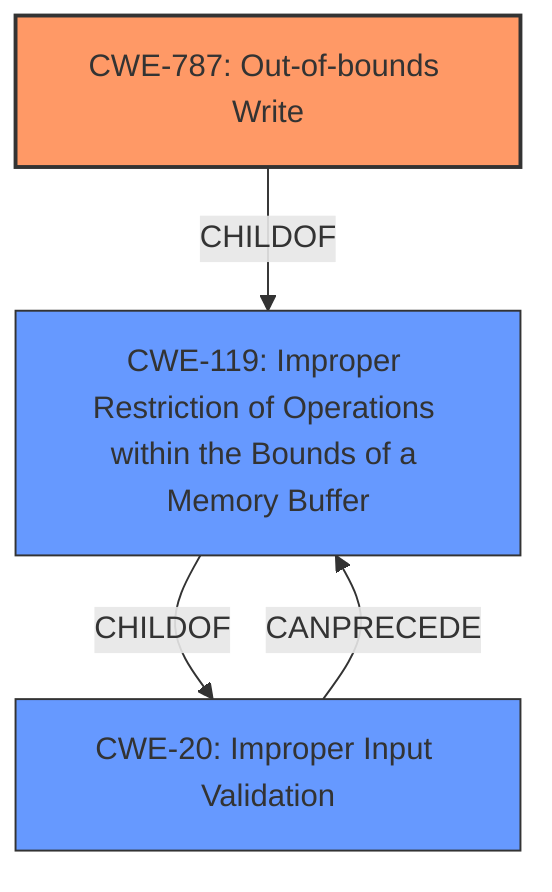

# Raw Analyzer Response for CVE-2021-44712

# Summary
| CWE ID | CWE Name | Confidence | CWE Abstraction Level | CWE Vulnerability Mapping Label | CWE-Vulnerability Mapping Notes |
|---|---|---|---|---|---|
| CWE-787 | Out-of-bounds Write | 1.0 | Base | Primary | Allowed |
| CWE-119 | Improper Restriction of Operations within the Bounds of a Memory Buffer | 0.7 | Class | Secondary | Discouraged |
| CWE-20 | Improper Input Validation | 0.6 | Class | Secondary | Discouraged |

## Evidence and Confidence

*   **Confidence Score:** 0.9
*   **Evidence Strength:** HIGH

## Relationship Analysis
The primary CWE is CWE-787, which is a base-level CWE and a child of CWE-119. CWE-119 is a class-level CWE related to improper memory buffer operation restrictions. CWE-20 is a class-level CWE for improper input validation and can precede CWE-119. The relationship analysis guided the decision to choose CWE-787 due to the explicit **out-of-bounds write** condition as the root cause and the corresponding mapping guidance.

## Vulnerability Chain
The vulnerability chain starts with **improper input validation** (CWE-20), which leads to **improper restriction of operations within the bounds of a memory buffer** (CWE-119), and finally results in an **out-of-bounds write** (CWE-787).

## Summary of Analysis
The initial assessment identified "Access of Memory Location After End of Buffer" as a key phrase. The **CVE Reference Links Content Summary** section identifies **Improper Input Validation** as the root cause.

The retriever results suggested CWE-788 (Access of Memory Location After End of Buffer), CWE-787 (Out-of-bounds Write), and CWE-119 (Improper Restriction of Operations within the Bounds of a Memory Buffer). However, CWE-788 is discouraged according to MITRE mapping guidance.

The vulnerability description states that the application is affected by an "**Access of Memory Location After End of Buffer**" vulnerability, indicating an **out-of-bounds write** condition. This aligns well with the description of CWE-787, which states, "The product writes data past the end, or before the beginning, of the intended buffer." The **CVE Reference Links Content Summary** mentions **Improper Input Validation** as the root cause. This suggests that improper input validation leads to the out-of-bounds write.

The final decision is based on the evidence of an **out-of-bounds write** and the MITRE mapping guidance recommending CWE-787. While **Improper Input Validation** (CWE-20) contributes to the vulnerability, the direct cause is the **out-of-bounds write**.

Relevant CWE Information:

# Enhanced Context (25 CWEs)

## CWE-367: Time-of-check Time-of-use (TOCTOU) Race Condition
**Abstraction Level**: Base
**Similarity Score**: 0.79
**Source**: dense

## CWE-667: Improper Locking
**Abstraction Level**: Class
**Similarity Score**: 0.76
**Source**: dense

## CWE-404: Improper Resource Shutdown or Release
**Abstraction Level**: Class
**Similarity Score**: 0.76
**Source**: dense

## CWE-362: Concurrent Execution using Shared Resource with Improper Synchronization ('Race Condition')
**Abstraction Level**: Class
**Similarity Score**: 0.75
**Source**: dense

## CWE-1289: Improper Validation of Unsafe Equivalence in Input
**Abstraction Level**: Base
**Similarity Score**: 0.75
**Source**: dense

## CWE-125: Out-of-bounds Read
**Abstraction Level**: Base
**Similarity Score**: 0.75
**Source**: dense

## CWE-208: Observable Timing Discrepancy
**Abstraction Level**: Base
**Similarity Score**: 0.75
**Source**: dense

## CWE-754: Improper Check for Unusual or Exceptional Conditions
**Abstraction Level**: Class
**Similarity Score**: 0.75
**Source**: dense

## CWE-226: Sensitive Information in Resource Not Removed Before Reuse
**Abstraction Level**: Base
**Similarity Score**: 0.74
**Source**: dense

## CWE-41: Improper Resolution of Path Equivalence
**Abstraction Level**: Base
**Similarity Score**: 0.74
**Source**: dense

## CWE-125: Out-of-bounds Read
**Abstraction Level**: Base
**Similarity Score**: 7706.83
**Source**: sparse

## CWE-119: Improper Restriction of Operations within the Bounds of a Memory Buffer
**Abstraction Level**: Class
**Similarity Score**: 7656.90
**Source**: sparse

## CWE-190: Integer Overflow or Wraparound
**Abstraction Level**: Base
**Similarity Score**: 7643.42
**Source**: sparse

## CWE-1284: Improper Validation of Specified Quantity in Input
**Abstraction Level**: Base
**Similarity Score**: 7445.76
**Source**: sparse

## CWE-367: Time-of-check Time-of-use (TOCTOU) Race Condition
**Abstraction Level**: Base
**Similarity Score**: 7400.87
**Source**: sparse

## CWE-787: Out-of-bounds Write
**Abstraction Level**: base
**Similarity Score**: 4.33
**Source**: graph

## CWE-822: Untrusted Pointer Dereference
**Abstraction Level**: base
**Similarity Score**: 4.33
**Source**: graph

## CWE-190: Integer Overflow or Wraparound
**Abstraction Level**: base
**Similarity Score**: 4.33
**Source**: graph

## CWE-22: Improper Limitation of a Pathname to a Restricted Directory ('Path Traversal')
**Abstraction Level**: base
**Similarity Score**: 4.33
**Source**: graph

## CWE-770: Allocation of Resources Without Limits or Throttling
**Abstraction Level**: base
**Similarity Score**: 4.33
**Source**: graph

## CWE-73: External Control of File Name or Path
**Abstraction Level**: base
**Similarity Score**: 4.33
**Source**: graph

## CWE-170: Improper Null Termination
**Abstraction Level**: base
**Similarity Score**: 3.89
**Source**: graph

## CWE-195: Signed to Unsigned Conversion Error
**Abstraction Level**: variant
**Similarity Score**: 3.88
**Source**: graph

## CWE-781: Improper Address Validation in IOCTL with METHOD_NEITHER I/O Control Code
**Abstraction Level**: variant
**Similarity Score**: 3.88
**Source**: graph

## CWE-41: Improper Resolution of Path Equivalence
**Abstraction Level**: Base
**Similarity Score**: 3.32
**Source**: graph

### Technical Explanation for CWE-787
CWE-787 (Out-of-bounds Write) is selected because the vulnerability description explicitly mentions "Access of Memory Location After End of Buffer," indicating that the software writes data beyond the intended buffer's boundaries. This can lead to memory corruption, denial of service, or potentially arbitrary code execution. CWE-787 is a base-level CWE, which aligns with the goal of identifying the root cause of the vulnerability. The MITRE mapping guidance allows for its usage.

### Technical Explanation for CWE-119
CWE-119 (Improper Restriction of Operations within the Bounds of a Memory Buffer) is a parent of CWE-787 and represents a broader class of vulnerabilities related to memory buffer handling. While the description fits, CWE-787 is more specific, detailing the **out-of-bounds write**. CWE-119 can be considered a contributing factor, but the primary weakness is the specific **out-of-bounds write**.

### Technical Explanation for CWE-20
CWE-20 (Improper Input Validation) is considered a secondary CWE because the **CVE Reference Links Content Summary** indicates that the root cause is **Improper Input Validation**. This suggests that the software does not adequately validate user-supplied