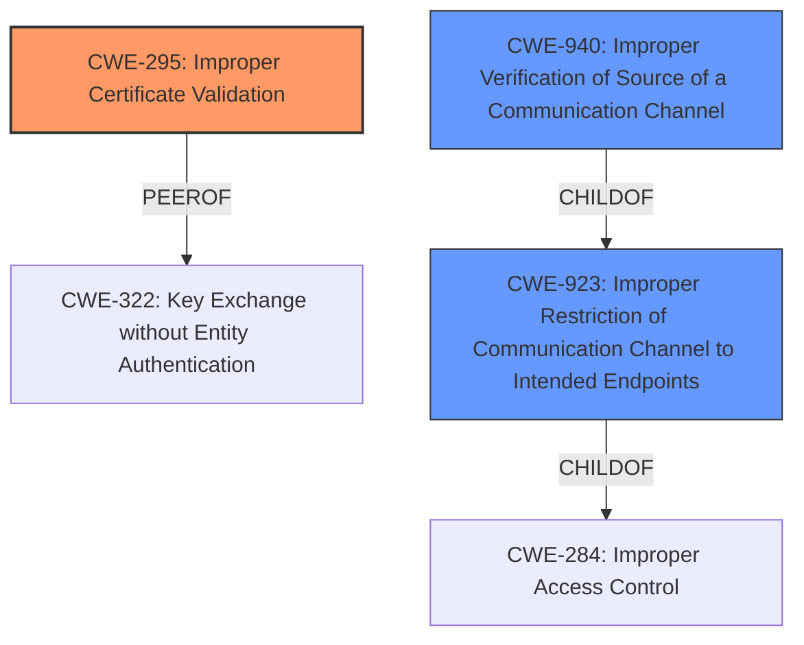

# Analysis Report for CVE-2021-44759

# Vulnerability Analysis Report: CVE-2021-44759

## Description


## Analysis (with Relationship Data)

# Summary
| CWE ID | CWE Name | Confidence | CWE Abstraction Level | CWE Vulnerability Mapping Label | CWE-Vulnerability Mapping Notes |
|---|---|---|---|---|---|
| CWE-295 | Improper Certificate Validation | 0.75 | Base | Allowed | Primary CWE |
| CWE-940 | Improper Verification of Source of a Communication Channel | 0.6 | Base | Allowed | Secondary Candidate |
| CWE-319 | Cleartext Transmission of Sensitive Information | 0.5 | Base | Allowed | Secondary Candidate |
| CWE-923 | Improper Restriction of Communication Channel to Intended Endpoints | 0.4 | Class | Allowed-with-Review | Secondary Candidate |

## Evidence and Confidence

*   **Confidence Score:** 0.7
*   **Evidence Strength:** MEDIUM

## Relationship Analysis
The primary relationship that influenced my decision was the peer relationship between CWE-295 and CWE-322. Also, the parent-child relationship between CWE-940 and CWE-923 was helpful. Since the **root cause** is **Improper Authentication**, and certificate validation is a specific aspect of authentication in TLS, CWE-295 is the best match. CWE-940 relates to communication channel verification, which is related but not as directly as certificate validation.



## Vulnerability Chain
The vulnerability chain starts with the **Improper Authentication** due to incorrect TLS origin validation (CWE-295), leading to a potential Man-in-the-Middle (MITM) attack.

## Summary of Analysis
The initial assessment identified **Improper Authentication** as the **root cause** of the vulnerability in Apache Traffic Server. This leads to a Man-in-the-Middle attack.

The evidence from the vulnerability description indicates that the vulnerability lies in the TLS origin validation process, which means the server is not correctly validating the certificate presented by the client or server it is communicating with.

Based on this evidence and the retriever results, the primary CWE is CWE-295, Improper Certificate Validation. This is because the vulnerability directly involves the **failure to properly validate certificates**, leading to potential MITM attacks. CWE-295 is a base-level CWE, which is the preferred level of abstraction.

The retriever results also suggest CWE-940, Improper Verification of Source of a Communication Channel. While this is related, it is less specific than CWE-295, which directly addresses the certificate validation issue.

CWE-319, Cleartext Transmission of Sensitive Information, was considered because MITM attacks often involve intercepting sensitive data transmitted in cleartext. However, the primary issue is the **lack of proper authentication** via certificate validation, not necessarily the transmission of data in cleartext.

CWE-923, Improper Restriction of Communication Channel to Intended Endpoints, is another related CWE, as it deals with ensuring communication occurs with the correct endpoint. However, this is a class-level CWE, and CWE-295 provides a more specific description of the vulnerability.

The final decision is based on the principle of selecting the most specific CWE that accurately describes the **root cause** of the vulnerability. In this case, CWE-295 directly addresses the **improper certificate validation**, making it the best choice.

Relevant CWE Information:

## Enhanced Context (25 CWEs)
The following CWEs were identified as potentially relevant to this vulnerability:

## CWE-319: Cleartext Transmission of Sensitive Information
**Abstraction Level**: Base
**Similarity Score**: 0.78
**Source**: dense

**Description**:
The product transmits sensitive or security-critical data in cleartext in a communication channel that can be sniffed by unauthorized actors.

**Mapping Guidance**:
- Usage: Allowed
- Rationale: This CWE entry is at the Base level of abstraction, which is a preferred level of abstraction for mapping to the root causes of vulnerabilities.

## CWE-538: Insertion of Sensitive Information into Externally-Accessible File or Directory
**Abstraction Level**: Base
**Similarity Score**: 0.77
**Source**: dense

**Description**:
The product places sensitive information into files or directories that are accessible to actors who are allowed to have access to the files, but not to the sensitive information.

**Mapping Guidance**:
- Usage: Allowed
- Rationale: This CWE entry is at the Base level of abstraction, which is a preferred level of abstraction for mapping to the root causes of vulnerabilities.

## CWE-212: Improper Removal of Sensitive Information Before Storage or Transfer
**Abstraction Level**: Base
**Similarity Score**: 0.76
**Source**: dense

**Description**:
The product stores, transfers, or shares a resource that contains sensitive information, but it does not properly remove that information before the product makes the resource available to unauthorized actors.

**Mapping Guidance**:
- Usage: Allowed
- Rationale: This CWE entry is at the Base level of abstraction, which is a preferred level of abstraction for mapping to the root causes of vulnerabilities.

## CWE-312: Cleartext Storage of Sensitive Information
**Abstraction Level**: Base
**Similarity Score**: 0.76
**Source**: dense

**Description**:
The product stores sensitive information in cleartext within a resource that might be accessible to another control sphere.

**Mapping Guidance**:
- Usage: Allowed
- Rationale: This CWE entry is at the Base level of abstraction, which is a preferred level of abstraction for mapping to the root causes of vulnerabilities.

## CWE-345: Insufficient Verification of Data Authenticity
**Abstraction Level**: Class
**Similarity Score**: 0.76
**Source**: dense

**Description**:
The product does not sufficiently verify the origin or authenticity of data, in a way that causes it to accept invalid data.

**Mapping Guidance**:
- Usage: Discouraged
- Rationale: This CWE entry is a level-1 Class (i.e., a child of a Pillar). It might have lower-level children that would be more appropriate

## CWE-807: Reliance on Untrusted Inputs in a Security Decision
**Abstraction Level**: Base
**Similarity Score**: 0.76
**Source**: dense

**Description**:
The product uses a protection mechanism that relies on the existence or values of an input, but the input can be modified by an untrusted actor in a way that bypasses the protection mechanism.

**Mapping Guidance**:
- Usage: Allowed
- Rationale: This CWE entry is at the Base level of abstraction, which is a preferred level of abstraction for mapping to the root causes of vulnerabilities.

## CWE-1391: Use of Weak Credentials
**Abstraction Level**: Class
**Similarity Score**: 0.76
**Source**: dense

**Description**:
The product uses weak credentials (such as a default key or hard-coded password) that can be calculated, derived, reused, or guessed by an attacker.

**Mapping Guidance**:
- Usage: Allowed-with-Review
- Rationale: This CWE entry is a Class and might have Base-level children that would be more appropriate

## CWE-203: Observable Discrepancy
**Abstraction Level**: Base
**Similarity Score**: 0.76
**Source**: dense

**Description**:
The product behaves differently or sends different responses under different circumstances in a way that is observable to an unauthorized actor, which exposes security-relevant information about the state of the product, such as whether a particular operation was successful or not.

**Mapping Guidance**:
- Usage: Allowed
- Rationale: This CWE entry is at the Base level of abstraction, which is a preferred level of abstraction for mapping to the root causes of vulnerabilities.

## CWE-300: Channel Accessible by Non-Endpoint
**Abstraction Level**: Class
**Similarity Score**: 0.76
**Source**: dense

**Description**:
The product does not adequately verify the identity of actors at both ends of a communication channel, or does not adequately ensure the integrity of the channel, in a way that allows the channel to be accessed or influenced by an actor that is not an endpoint.

**Mapping Guidance**:
- Usage: Discouraged
- Rationale: CWE-300 is commonly misused for vulnerabilities in which the prerequisites for exploitation require the adversary to be in a privileged "in-the-middle" position.

## CWE-311: Missing


## CWE Relationship Analysis

Current CWEs represent these abstraction levels: .


### Vulnerability Chain Analysis

**Chain starting from CWE-940:**
- 940 (Improper Verification of Source of a Communication Channel) - ROOT


**Chain starting from CWE-284:**
- 284 (Improper Access Control) - ROOT


### CWE Relationship Diagram

```mermaid
graph TD
    classDef primary fill:#f96,stroke:#333,stroke-width:2px
    classDef secondary fill:#69f,stroke:#333
    classDef tertiary fill:#9e9,stroke:#333
```


*Report generated on 2025-04-02 14:24:39*
