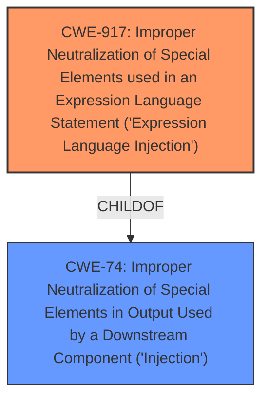

# Analysis Report for CVE-2021-44832

# Vulnerability Analysis Report: CVE-2021-44832

## Description


## Analysis (with Relationship Data)

# Summary
| CWE ID | CWE Name | Confidence | CWE Abstraction Level | CWE Vulnerability Mapping Label | CWE-Vulnerability Mapping Notes |
|---|---|---|---|---|---|
| CWE-917 | Improper Neutralization of Special Elements used in an Expression Language Statement ('Expression Language Injection') | 0.9 | Base | Allowed | Primary CWE |
| CWE-74 | Improper Neutralization of Special Elements in Output Used by a Downstream Component ('Injection') | 0.6 | Class | Discouraged | Secondary Candidate |

## Evidence and Confidence

*   **Confidence Score:** 0.9
*   **Evidence Strength:** HIGH

## Relationship Analysis
The primary CWE selected is CWE-917, which is a Base level CWE. It is related to CWE-74 (Improper Neutralization of Special Elements in Output Used by a Downstream Component ('Injection')), as it is a ChildOf. CWE-74 is a Class level CWE, making CWE-917 more specific and a better fit for the vulnerability. The other CWEs do not fit as well since the root cause is expression language injection.



## Vulnerability Chain
The vulnerability chain starts with the **insufficient validation** of JNDI data source names in the JDBC Appender, leading to the **improper neutralization** of special elements in an expression language statement, which results in remote code execution.

## Summary of Analysis
The primary CWE identified is CWE-917 (Improper Neutralization of Special Elements used in an Expression Language Statement ('Expression Language Injection')). This is based on the vulnerability description, which states that "Apache Log4j2 versions 2.0-beta7 through 2.17.0 (excluding security fix releases 2.3.2 and 2.12.4) are vulnerable to a remote code execution (RCE) attack when a configuration uses a JDBC Appender with a JNDI LDAP data source URI when an attacker has control of the target LDAP server." The CVE Reference Links Content Summary further clarifies that the root cause is the **improper restriction** of JNDI data source names, allowing an attacker to use a JNDI URI to execute remote code.

The retriever results also list CWE-917 as the top combined result, reinforcing its relevance. The description of CWE-917 aligns with the vulnerability: "The product constructs all or part of an expression language (EL) statement in a framework such as a Java Server Page (JSP) using externally-influenced input from an upstream component, but it does not neutralize or incorrectly neutralizes special elements that could modify the intended EL statement before it is executed."

CWE-74 (Improper Neutralization of Special Elements in Output Used by a Downstream Component ('Injection')) was also considered but is a higher-level Class and therefore less specific than CWE-917. While the vulnerability involves injection, the specific type of injection is expression language injection, making CWE-917 a more accurate and detailed classification.

The evidence supports the selection of CWE-917 as the primary CWE due to its direct relevance to the root cause of the vulnerability, which is the **improper neutralization** of special elements in an expression language statement. The confidence level is high (0.9) due to the clear alignment between the vulnerability description, the CVE Reference Links Content Summary, and the CWE description.


## CWE Relationship Analysis

Current CWEs represent these abstraction levels: .


### Vulnerability Chain Analysis

**Chain starting from CWE-74:**
- 74 (Improper Neutralization of Special Elements in Output Used by a Downstream Component ('Injection')) - ROOT


**Chain starting from CWE-917:**
- 917 (Improper Neutralization of Special Elements used in an Expression Language Statement ('Expression Language Injection')) - ROOT


### CWE Relationship Diagram

```mermaid
graph TD
    classDef primary fill:#f96,stroke:#333,stroke-width:2px
    classDef secondary fill:#69f,stroke:#333
    classDef tertiary fill:#9e9,stroke:#333
```


*Report generated on 2025-04-01 22:59:03*
