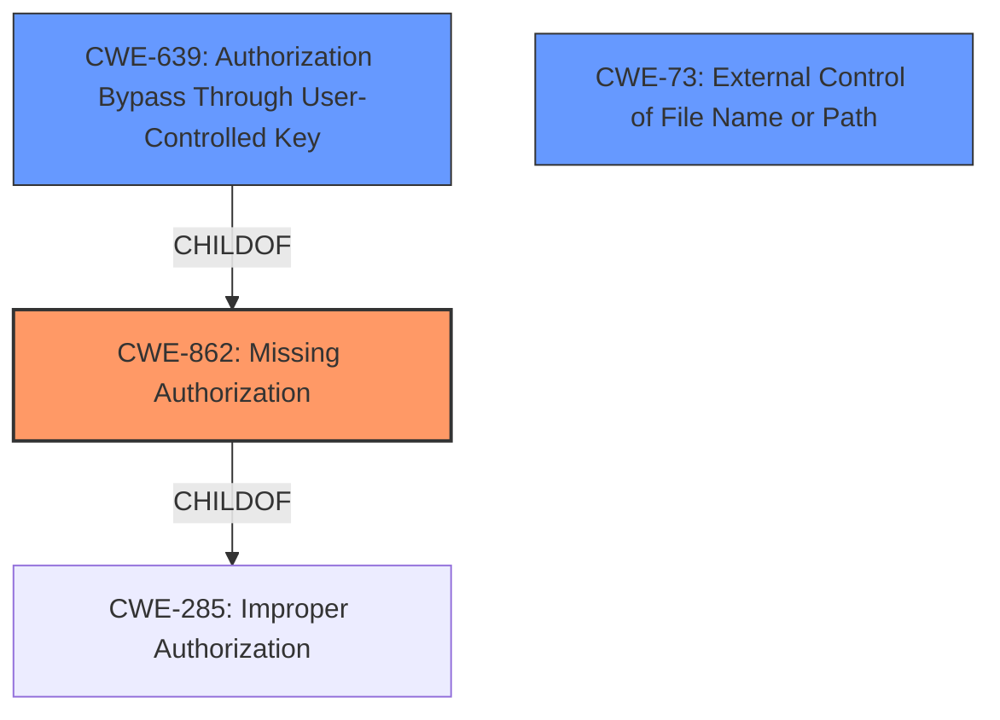

# Analysis Report for CVE-2021-44840

# Vulnerability Analysis Report: CVE-2021-44840

## Description


## Analysis (with Relationship Data)

# Summary
| CWE ID  | CWE Name                                                                                       | Confidence | CWE Abstraction Level | CWE Vulnerability Mapping Label | CWE-Vulnerability Mapping Notes |
| :-------- | :--------------------------------------------------------------------------------------------- | :---------- | :----------------------- | :-------------------------------- | :-------------------------------- |
| CWE-862   | Missing Authorization                                                                        | 0.9         | Class                    | Primary CWE                       | Allowed-with-Review               |
| CWE-639   | Authorization Bypass Through User-Controlled Key                                             | 0.7         | Base                     | Secondary Candidate               | Allowed                           |
| CWE-73 | External Control of File Name or Path | 0.6 | Base | Secondary Candidate | Allowed |

## Evidence and Confidence

*   **Confidence Score:** 0.8
*   **Evidence Strength:** HIGH

## Relationship Analysis
The primary weakness identified is the **lack of authorization** when accessing or modifying risk labels.

CWE-862 (Missing Authorization) is a class-level CWE, while CWE-639 (Authorization Bypass Through User-Controlled Key) and CWE-73 (External Control of File Name or Path) are base-level CWEs.
CWE-862 is the parent of CWE-639.
CWE-285 (Improper Authorization) is the parent of CWE-862 and CWE-863 (Incorrect Authorization).

I am choosing the Class CWE-862 as the primary because the report does not indicate there was any attempt to perform an authorization check.



## Vulnerability Chain
The vulnerability chain involves a **lack of authorization** leading to the unauthorized manipulation of risk labels. The chain includes:
1.  **Missing Authorization (CWE-862)**: The application lacks proper authorization checks.
2.  **External Control of File Name or Path (CWE-73)**: The application allows user-controlled input to influence file names or paths.
3.  **Authorization Bypass Through User-Controlled Key (CWE-639)**: Users can bypass authorization by manipulating keys identifying the data.
4.  **Impact**: This results in unauthorized modification of risk labels, data manipulation, and potential system instability.

## Summary of Analysis
The initial assessment identified several potential CWEs based on the provided vulnerability description and the retriever results. The primary focus was on authorization-related weaknesses, as the core issue revolves around the **lack of proper access control**.

The final decision was based on the following:
*   **CWE-862 (Missing Authorization)**: This CWE accurately reflects the primary issue, where the application **does not perform any authorization checks** before allowing users to modify risk labels. The "CVE Reference Links Content Summary" section supports this by stating: "**Missing Authorization Checks**: The application fails to properly validate the user's role and permissions before executing actions on risk labels."
*   **CWE-639 (Authorization Bypass Through User-Controlled Key)**: This CWE is a secondary factor. The vulnerability allows manipulation of parameters like `tableUid` and `datas[query]` to access and modify resources. The "CVE Reference Links Content Summary" section supports this by stating: "**Insecure Direct Object Reference (IDOR)**: Unprivileged users can manipulate parameters like `tableUid` and `datas[query]` to directly access and modify resources (risk labels) they should not have permission to."
*   **CWE-73 (External Control of File Name or Path)**: This CWE is also a secondary factor. The vulnerability allows user-controlled input to influence file names or paths. The "CVE Reference Links Content Summary" section supports this by stating: "**Lack of Input Validation:** The application does not properly validate the input data in the request body, allowing unprivileged users to create, edit, and delete labels by injecting malicious payloads."

The selected CWEs are at the optimal level of specificity. CWE-862 is a class-level CWE that accurately describes the **lack of authorization**. CWE-639 is a base-level CWE that provides further details on how the authorization bypass is achieved. CWE-73 is also a base-level CWE that describes how the lack of input validation contributes to the vulnerability.

Relevant CWE Information:

# Enhanced Context (25 CWEs)
The following CWEs were identified as potentially relevant to this vulnerability:

## CWE-23: Relative Path Traversal
**Abstraction Level**: Base
**Similarity Score**: 0.80
**Source**: dense

**Description**:
The product uses external input to construct a pathname that should be within a restricted directory, but it does not properly neutralize sequences such as ".." that can resolve to a location that is outside of that directory.

**Mapping Guidance**:
- Usage: Allowed
- Rationale: This CWE entry is at the Base level of abstraction, which is a preferred level of abstraction for mapping to the root causes of vulnerabilities.

**Why it was not selected**: This CWE is related to path traversal, but the vulnerability is not about accessing files outside of a restricted directory.

## CWE-36: Absolute Path Traversal
**Abstraction Level**: Base
**Similarity Score**: 0.80
**Source**: dense

**Description**:
The product uses external input to construct a pathname that should be within a restricted directory, but it does not properly neutralize absolute path sequences such as "/abs/path" that can resolve to a location that is outside of that directory.

**Mapping Guidance**:
- Usage: Allowed
- Rationale: This CWE entry is at the Base level of abstraction, which is a preferred level of abstraction for mapping to the root causes of vulnerabilities.

**Why it was not selected**: This CWE is related to path traversal, but the vulnerability is not about accessing files outside of a restricted directory.

## CWE-41: Improper Resolution of Path Equivalence
**Abstraction Level**: Base
**Similarity Score**: 0.78
**Source**: dense

**Description**:
The product is vulnerable to file system contents disclosure through path equivalence. Path equivalence involves the use of special characters in file and directory names. The associated manipulations are intended to generate multiple names for the same object.

**Mapping Guidance**:
- Usage: Allowed
- Rationale: This CWE entry is at the Base level of abstraction, which is a preferred level of abstraction for mapping to the root causes of vulnerabilities.

**Why it was not selected**: This CWE is related to path equivalence, but the vulnerability is not about file system contents disclosure.

## CWE-24: Path Traversal: '../filedir'
**Abstraction Level**: Variant
**Similarity Score**: 0.76
**Source**: dense

**Description**:
The product uses external input to construct a pathname that should be within a restricted directory, but it does not properly neutralize "../" sequences that can resolve to a location that is outside of that directory.

**Mapping Guidance**:
- Usage: Allowed
- Rationale: This CWE entry is at the Variant level of abstraction, which is a preferred level of abstraction for mapping to the root causes of vulnerabilities.

**Why it was not selected**: This CWE is related to path traversal, but the vulnerability is not about accessing files outside of a restricted directory.

## CWE-59: Improper Link Resolution Before File Access ('Link Following')
**Abstraction Level**: Base
**Similarity Score**: 0.76
**Source**: dense

**Description**:
The product attempts to access a file based on the filename, but it does not properly prevent that filename from identifying a link or shortcut that resolves to an unintended resource.

**Mapping Guidance**:
- Usage: Allowed
- Rationale: This CWE entry is at the Base level of abstraction, which is a preferred level of abstraction for mapping to the root causes of vulnerabilities.

**Why it was not selected**: This CWE is related to link resolution, but the vulnerability is not about accessing files through links or shortcuts.

## CWE-74: Improper Neutralization of Special Elements in Output Used by a Downstream Component ('Injection')
**Abstraction Level**: Class
**Similarity Score**: 0.75
**Source**: dense

**Description**:
The product constructs all or part of a command, data structure, or record using externally-influenced input from an upstream component, but it does not neutralize or incorrectly neutralizes special elements that could modify how it is parsed or interpreted when it is sent to a downstream component.

**Mapping Guidance**:
- Usage: Discouraged
- Rationale: CWE-74 is high-level and often misused when lower-level weaknesses are more appropriate.

**Why it was not selected**: This CWE is related to injection, but the vulnerability is primarily about missing


## CWE Relationship Analysis

Current CWEs represent these abstraction levels: .


### Vulnerability Chain Analysis

**Chain starting from CWE-36:**
- 36 (Absolute Path Traversal) - ROOT


**Chain starting from CWE-862:**
- 862 (Missing Authorization) - ROOT


### CWE Relationship Diagram

```mermaid
graph TD
    classDef primary fill:#f96,stroke:#333,stroke-width:2px
    classDef secondary fill:#69f,stroke:#333
    classDef tertiary fill:#9e9,stroke:#333
```


*Report generated on 2025-04-02 12:39:48*
