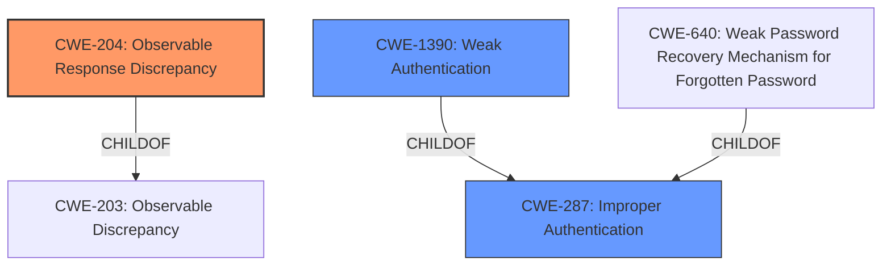

# Raw Analyzer Response for CVE-2021-44848

# Summary
| CWE ID | CWE Name | Confidence | CWE Abstraction Level | CWE Vulnerability Mapping Label | CWE-Vulnerability Mapping Notes |
|---|---|---|---|---|---|
| CWE-204 | Observable Response Discrepancy | 1.0 | Base | Primary | Allowed |
| CWE-1390 | Weak Authentication | 0.6 | Class | Secondary | Allowed-with-Review |
| CWE-287 | Improper Authentication | 0.5 | Class | Secondary | Discouraged |

## Evidence and Confidence

*   **Confidence Score:** 0.9
*   **Evidence Strength:** HIGH

## Relationship Analysis
The primary CWE selected is CWE-204 (**Observable Response Discrepancy**), which is at the Base level. It's a child of CWE-203 (**Observable Discrepancy**). CWE-1390 (**Weak Authentication**) and CWE-287 (**Improper Authentication**) are considered as secondary CWEs because the vulnerability allows an attacker to determine valid usernames, which can be seen as a form of **weak authentication**.

## Vulnerability Chain
The vulnerability chain starts with the **incorrect** handling of authentication requests by the `/changePassword` endpoint, leading to an **observable response discrepancy**. This allows for user enumeration, which **weakens** the overall authentication mechanism.

## Summary of Analysis
Initially, the analysis focused on identifying the root cause of the vulnerability, which is the server's different responses for valid vs. invalid usernames. The evidence from the "CVE Reference Links Content Summary" section strongly supports this: "The application's response to requests sent to the `/changePassword` endpoint reveals if a username exists on the system." This aligns perfectly with the description of CWE-204 (**Observable Response Discrepancy**), which states: "The product provides different responses to incoming requests in a way that reveals internal state information to an unauthorized actor outside of the intended control sphere."

The retriever results also listed CWE-204 as the top candidate with a score of 0.074.

CWE-1390 (**Weak Authentication**) was considered because user enumeration could be seen as **weakening** the authentication process. However, it's a class-level CWE, and CWE-204 provides a more specific description of the underlying issue.

CWE-287 (**Improper Authentication**) was also considered but deemed less appropriate because the core issue isn't a complete failure of authentication but rather a subtle **weakness** that allows enumeration.

The final decision was based on the specificity of CWE-204 and its direct relevance to the vulnerability description.

Relevant CWE Information:

# Enhanced Context (25 CWEs)

## CWE-1390: Weak Authentication
**Abstraction Level**: Class
**Similarity Score**: 0.77
**Source**: dense

**Description**:
The product uses an authentication mechanism to restrict access to specific users or identities, but the mechanism does not sufficiently prove that the claimed identity is correct.

**Mapping Guidance**:
- Usage: Allowed-with-Review
- Rationale: This CWE entry is a Class and might have Base-level children that would be more appropriate

## CWE-287: Improper Authentication
**Abstraction Level**: Class
**Similarity Score**: 0.030
**Source**: sparse

**Description**:
When an actor claims to have a given identity, the product does not prove or insufficiently proves that the claim is correct.

**Mapping Guidance**:
- Usage: Discouraged
- Rationale: This CWE entry might be misused when lower-level CWE entries are likely to be applicable. It is a level-1 Class (i.e., a child of a Pillar).
- Comments: Consider children or descendants, beginning with CWE-1390: Weak Authentication or CWE-306: Missing Authentication for Critical Function.
- Suggested Alternatives:
  - CWE-1390: Weak Authentication
  - CWE-306: Missing Authentication for Critical Function

## CWE-204: Observable Response Discrepancy
**Abstraction Level**: Base
**Similarity Score**: 0.074
**Source**: sparse

**Description**:
The product provides different responses to incoming requests in a way that reveals internal state information to an unauthorized actor outside of the intended control sphere.

**Mapping Guidance**:
- Usage: Allowed
- Rationale: This CWE entry is at the Base level of abstraction, which is a preferred level of abstraction for mapping to the root causes of vulnerabilities.