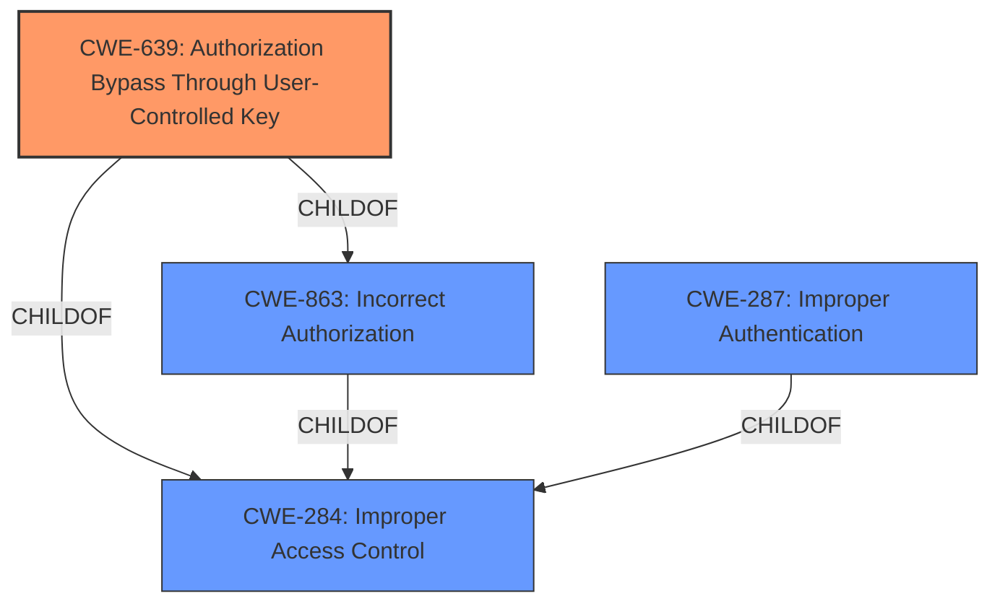

# Enhanced Analysis for CVE-2021-44877

# Summary
| CWE ID | CWE Name | Confidence | CWE Abstraction Level | CWE Vulnerability Mapping Label | CWE-Vulnerability Mapping Notes |
|---|---|---|---|---|---|
| CWE-639 | Authorization Bypass Through User-Controlled Key | 0.9 | Base | Allowed | Primary CWE: The application's authorization **fails to prevent** unauthorized access to data by **modifying a user-controlled key**, as it uses a temporary JWT token to grant access. |
| CWE-287 | Improper Authentication | 0.7 | Class | Discouraged | Secondary CWE: Although authentication is bypassed, the root cause is how the JWT token mechanism is used, rather than a complete lack of authentication. |
| CWE-863 | Incorrect Authorization | 0.6 | Class | Allowed-with-Review | Secondary CWE: This is a broader class, and while authorization is incorrect, CWE-639 better captures the specific mechanism. |

## Evidence and Confidence

*   **Confidence Score:** 0.9
*   **Evidence Strength:** HIGH

## Relationship Analysis
The primary CWE is CWE-639 (Authorization Bypass Through User-Controlled Key), a Base-level weakness detailing authorization failures due to user-controlled keys. It is a child of CWE-863 (Incorrect Authorization) and CWE-284 (Improper Access Control), both of which are broader Class and Pillar level CWEs, respectively. CWE-287 (Improper Authentication) is also relevant, as the vulnerability allows bypassing authentication; however, it is not the primary issue.



## Vulnerability Chain
The vulnerability chain starts with the application generating a temporary JWT token. This token is intended to provide access to resources related to the correct tenant before authentication. However, due to **broken access control**, an unauthenticated attacker can obtain a valid token and use it to access system configuration parameters. This leads to **sensitive information exposure**, including SMTP credentials if they are configured for the tenant.

## Summary of Analysis
Initially, several CWEs related to access control and authentication were considered. However, after analyzing the vulnerability description and available evidence, CWE-639 (Authorization Bypass Through User-Controlled Key) emerged as the most specific and accurate classification. The vulnerability stems from the application's failure to properly authorize access based on a user-controlled key (the temporary JWT token). This allows an unauthenticated attacker to bypass authorization checks and access sensitive information.

The vulnerability description clearly states: "A **broken access control** vulnerability has been found while using a temporary generated token in order to consume api resources. The vulnerability allows an unauthenticated attacker to use an api endpoint to generate a temporary JWT token that is designed to reference the correct tenant prior to authentication, to request system configuration parameters using direct api requests." This statement directly supports the selection of CWE-639, as it describes a scenario where an attacker can manipulate a key (the JWT token) to gain unauthorized access.

CWE-287 (Improper Authentication) and CWE-863 (Incorrect Authorization) were also considered, but they are more general classifications. While the vulnerability involves bypassing authentication, the root cause is the improper authorization mechanism that relies on a user-controlled key.

The decision to map the vulnerability to CWE-639 is based on the principle of selecting the most specific CWE that accurately represents the weakness. CWE-639 is at the Base level of abstraction and directly addresses the authorization bypass through a user-controlled key, making it the most appropriate choice.


## CWE Relationship Analysis

Current CWEs represent these abstraction levels: .


### Vulnerability Chain Analysis

**Chain starting from CWE-287:**
- 287 (Improper Authentication) - ROOT


**Chain starting from CWE-284:**
- 284 (Improper Access Control) - ROOT


### CWE Relationship Diagram

```mermaid
graph TD
    classDef primary fill:#f96,stroke:#333,stroke-width:2px
    classDef secondary fill:#69f,stroke:#333
    classDef tertiary fill:#9e9,stroke:#333
```