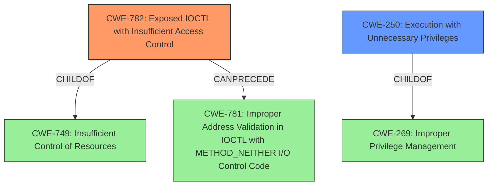

# Analysis for CVE-2021-44899

# Summary
| CWE ID  | CWE Name                                       | Confidence | CWE Abstraction Level | CWE Vulnerability Mapping Label | CWE-Vulnerability Mapping Notes |
| :-------- | :--------------------------------------------- | :--------- | :-------------------- | :------------------------------ | :------------------------------ |
| CWE-782   | Exposed IOCTL with Insufficient Access Control | 0.9        | Variant               | Allowed                         | Primary CWE                     |
| CWE-250   | Execution with Unnecessary Privileges        | 0.7        | Base                  | Allowed                         | Secondary CWE                   |

## Evidence and Confidence

*   **Confidence Score:** 0.8
*   **Evidence Strength:** HIGH

## Relationship Analysis
The primary CWE, CWE-782 (Exposed IOCTL with Insufficient Access Control), is a Variant of CWE-749, indicating a specific type of weakness related to IOCTLs. It can precede CWE-781 (Improper Address Validation in IOCTL with METHOD_NEITHER I/O Control Code), suggesting a potential chain where insufficient access control leads to address validation issues. CWE-250 (Execution with Unnecessary Privileges) is a Base CWE and a child of CWE-269, which is about improperly managing privileges. It suggests that the IOCTLs are running with higher privileges than necessary.

## Vulnerability Chain
The vulnerability chain starts with the **exposed IOCTLs** (**CWE-782**) that lack proper access control. This can lead to the execution of code with unnecessary privileges (**CWE-250**), as the IOCTLs might be running with elevated permissions. If the **IOCTLs** use METHOD_NEITHER, this can lead to **Improper Address Validation** (**CWE-781**) as well, although there is not enough evidence for that in this particular instance. The final impact is privilege escalation.

## Summary of Analysis
The initial assessment based on the vulnerability description and key phrases pointed towards privilege escalation vulnerabilities triggered by specific IOCTL requests. The retriever results highlighted **CWE-782 (Exposed IOCTL with Insufficient Access Control)** as the top candidate, which aligns well with the vulnerability details. The evidence from the CVE reference links confirms that the root cause involves vulnerable driver components allowing privilege escalation via IOCTL requests.

The selection of **CWE-782** is justified by the fact that the drivers expose IOCTLs that should be restricted, but they **do not properly enforce access control**. This allows attackers to leverage these IOCTLs for malicious purposes. The mapping guidance for **CWE-782** allows its usage, especially since it is at the Variant level of abstraction.

**CWE-250 (Execution with Unnecessary Privileges)** is also considered as a secondary CWE because the vulnerable IOCTLs likely operate with unnecessary high privileges, exacerbating the impact of the vulnerability.

The other CWEs were considered but ultimately not selected because they either represent a higher level of abstraction (e.g., **CWE-284, CWE-20, CWE-269, CWE-285**) or do not directly address the root cause (e.g., **CWE-121, CWE-367**).

In summary, the selected CWEs are at the optimal level of specificity, accurately represent the root cause, and are supported by the available evidence. The confidence in the mapping is high (0.8) due to the clear alignment between the vulnerability description, the retriever results, and the CWE specifications.

Relevant CWE Information:

# Enhanced Context (25 CWEs)

## CWE-367: Time-of-check Time-of-use (TOCTOU) Race Condition
**Abstraction Level**: Base
**Similarity Score**: 0.78
**Source**: dense

**Description**:
The product checks the state of a resource before using that resource, but the resource's state can change between the check and the use in a way that invalidates the results of the check. This can cause the product to perform invalid actions when the resource is in an unexpected state.

**Mapping Guidance**:
- Usage: Allowed
- Rationale: This CWE entry is at the Base level of abstraction, which is a preferred level of abstraction for mapping to the root causes of vulnerabilities.

## CWE-667: Improper Locking
**Abstraction Level**: Class
**Similarity Score**: 0.76
**Source**: dense

**Description**:
The product does not properly acquire or release a lock on a resource, leading to unexpected resource state changes and behaviors.

**Mapping Guidance**:
- Usage: Allowed-with-Review
- Rationale: This CWE entry is a Class and might have Base-level children that would be more appropriate

## CWE-404: Improper Resource Shutdown or Release
**Abstraction Level**: Class
**Similarity Score**: 0.75
**Source**: dense

**Description**:
The product does not release or incorrectly releases a resource before it is made available for re-use.

**Mapping Guidance**:
- Usage: Allowed-with-Review
- Rationale: This CWE entry is a Class and might have Base-level children that would be more appropriate

## CWE-362: Concurrent Execution using Shared Resource with Improper Synchronization ('Race Condition')
**Abstraction Level**: Class
**Similarity Score**: 0.75
**Source**: dense

**Description**:
The product contains a concurrent code sequence that requires temporary, exclusive access to a shared resource, but a timing window exists in which the shared resource can be modified by another code sequence operating concurrently.

**Mapping Guidance**:
- Usage: Allowed-with-Review
- Rationale: This CWE entry is a Class and might have Base-level children that would be more appropriate

## CWE-754: Improper Check for Unusual or Exceptional Conditions
**Abstraction Level**: Class
**Similarity Score**: 0.75
**Source**: dense

**Description**:
The product does not check or incorrectly checks for unusual or exceptional conditions that are not expected to occur frequently during day to day operation of the product.

**Mapping Guidance**:
- Usage: Allowed-with-Review
- Rationale: This CWE entry is a Class and might have Base-level children that would be more appropriate

## CWE-41: Improper Resolution of Path Equivalence
**Abstraction Level**: Base
**Similarity Score**: 0.75
**Source**: dense

**Description**:
The product is vulnerable to file system contents disclosure through path equivalence. Path equivalence involves the use of special characters in file and directory names. The associated manipulations are intended to generate multiple names for the same object.

**Mapping Guidance**:
- Usage: Allowed
- Rationale: This CWE entry is at the Base level of abstraction, which is a preferred level of abstraction for mapping to the root causes of vulnerabilities.

## CWE-59: Improper Link Resolution Before File Access ('Link Following')
**Abstraction Level**: Base
**Similarity Score**: 0.75
**Source**: dense

**Description**:
The product attempts to access a file based on the filename, but it does not properly prevent that filename from identifying a link or shortcut that resolves to an unintended resource.

**Mapping Guidance**:
- Usage: Allowed
- Rationale: This CWE entry is at the Base level of abstraction, which is a preferred level of abstraction for mapping to the root causes of vulnerabilities.

## CWE-1289: Improper Validation of Unsafe Equivalence in Input
**Abstraction Level**: Base
**Similarity Score**: 0.74
**Source**: dense

**Description**:
The product receives an input value that is used as a resource identifier or other type of reference, but it does not validate or incorrectly validates that the input is equivalent to a potentially-unsafe value.

**Mapping Guidance**:
- Usage: Allowed
- Rationale: This CWE entry is at the Base level of abstraction, which is a preferred level of abstraction for mapping to the root causes of vulnerabilities.

## CWE-653: Improper Isolation or Compartmentalization
**Abstraction Level**: Class
**Similarity Score**: 0.74
**Source**: dense

**Description**:
The product does not properly compartmentalize or isolate functionality, processes, or resources that require different privilege levels, rights, or permissions.

**