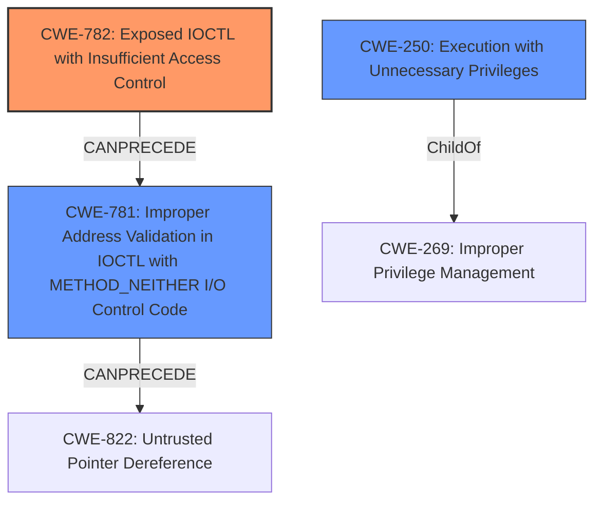

# Raw Analyzer Response for CVE-2021-44900

# Summary
| CWE ID | CWE Name | Confidence | CWE Abstraction Level | CWE Vulnerability Mapping Label | CWE-Vulnerability Mapping Notes |
|---|---|---|---|---|---|
| CWE-782 | Exposed IOCTL with Insufficient Access Control | 0.9 | Variant | Allowed | Primary CWE |
| CWE-781 | Improper Address Validation in IOCTL with METHOD_NEITHER I/O Control Code | 0.7 | Variant | Allowed | Secondary Candidate |
| CWE-250 | Execution with Unnecessary Privileges | 0.6 | Base | Allowed | Secondary Candidate |

## Evidence and Confidence

*   **Confidence Score:** 0.8
*   **Evidence Strength:** HIGH

## Relationship Analysis
The primary CWE selected is CWE-782 **[CWE-782: Exposed IOCTL with Insufficient Access Control]**, a Variant-level weakness indicating that the IOCTL is exposed but lacks proper access control. This maps directly to the vulnerability description that mentions IOCTL requests. The relationship between CWE-782 and CWE-781 **[CWE-781: Improper Address Validation in IOCTL with METHOD_NEITHER I/O Control Code]** via `CANPRECEDE` indicates a potential chain where insufficient access control (CWE-782) may lead to address validation issues (CWE-781) if METHOD_NEITHER is used. CWE-250 **[CWE-250: Execution with Unnecessary Privileges]** is added because the exploitation leads to privilege escalation to `NT AUTHORITY\SYSTEM`.

## Vulnerability Chain
The vulnerability chain starts with the **exposed IOCTL with insufficient access control** (CWE-782), which could then lead to **improper address validation** in IOCTL (CWE-781). Exploitation results in **execution with unnecessary privileges** (CWE-250), as the attacker gains elevated privileges (`NT AUTHORITY\SYSTEM`).

## Summary of Analysis
The initial assessment focused on the **vector: specific IOCTL requests** and **component: NTIOLib_X64.sys and BstkDrv_msi2.sys drivers components**. The Retriever Results and Complete CWE Specifications provided suitable candidates.

The primary weakness is CWE-782 **[CWE-782: Exposed IOCTL with Insufficient Access Control]**, as the vulnerability is triggered by sending specific IOCTL requests to the driver components, and the driver does not properly enforce access control for the IOCTL. The **Root Cause of Vulnerability:** section and **Weaknesses/Vulnerabilities Present:** sections from "CVE Reference Links Content Summary" section indicates the driver allows direct interaction with physical memory and permits reading and writing to Model-Specific Registers (MSRs) using IOCTL requests. The "Vulnerability Description" mentions that the **impact** is Privilege Escalation (LPE/EoP).

CWE-781 **[CWE-781: Improper Address Validation in IOCTL with METHOD_NEITHER I/O Control Code]** is a secondary candidate because if the IOCTL uses METHOD_NEITHER for I/O, and the addresses are not validated, then it could lead to code execution or denial of service.

CWE-250 **[CWE-250: Execution with Unnecessary Privileges]** is added because the exploitation leads to privilege escalation to `NT AUTHORITY\SYSTEM`.

CWE-20 **[CWE-20: Improper Input Validation]** was considered, but the vulnerability is more specific than just improper input validation; it is related to insufficient access control for IOCTL requests and addresses. Therefore, it was not selected.

The selected CWEs are at the optimal level of specificity because they accurately represent the weakness in the driver component related to handling IOCTL requests and privilege escalation.