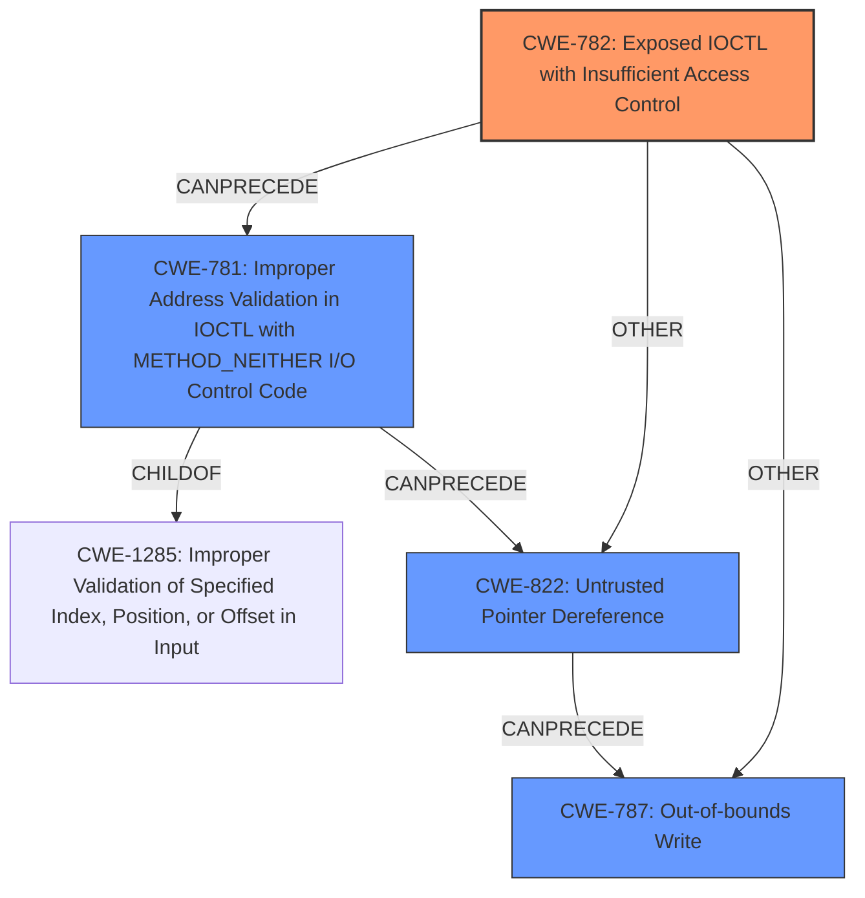

# Analysis Report for CVE-2021-44901

# Vulnerability Analysis Report: CVE-2021-44901

## Description


## Analysis (with Relationship Data)

# Summary
| CWE ID | CWE Name | Confidence | CWE Abstraction Level | CWE Vulnerability Mapping Label | CWE-Vulnerability Mapping Notes |
|---|---|---|---|---|---|
| CWE-782 | Exposed IOCTL with Insufficient Access Control | 0.9 | Variant | Allowed | Primary CWE |
| CWE-781 | Improper Address Validation in IOCTL with METHOD_NEITHER I/O Control Code | 0.7 | Variant | Allowed | Secondary Candidate |
| CWE-822 | Untrusted Pointer Dereference | 0.6 | Base | Allowed | Secondary Candidate |
| CWE-787 | Out-of-bounds Write | 0.6 | Base | Allowed | Secondary Candidate |

## Evidence and Confidence

*   **Confidence Score:** 0.8
*   **Evidence Strength:** HIGH

## Relationship Analysis
The primary CWE selected is CWE-782, which describes the root cause of the vulnerability: an IOCTL with insufficient access control. This is a Variant level CWE, providing a good level of specificity.

CWE-781, CWE-822, and CWE-787 are also considered, as they relate to potential consequences of the exposed IOCTL. CWE-781 (Improper Address Validation in IOCTL with METHOD_NEITHER I/O Control Code) is a child of CWE-1285 (Improper Validation of Specified Index, Position, or Offset in Input), indicating a validation issue, which is a possible attack vector given the ability to send IOCTL requests. CWE-822 (Untrusted Pointer Dereference) and CWE-787 (Out-of-bounds Write) represent potential exploitable conditions.



## Vulnerability Chain
The vulnerability chain starts with the exposed IOCTL (CWE-782). Because of the insufficient access control, attackers can send specific IOCTL requests. If the IOCTL uses METHOD_NEITHER and doesn't validate addresses (CWE-781), this could lead to untrusted pointer dereferences (CWE-822) or out-of-bounds writes (CWE-787), ultimately resulting in privilege escalation.

## Summary of Analysis
The analysis indicates that the primary weakness is the **Exposed IOCTL with Insufficient Access Control (CWE-782)**. The vulnerability description explicitly states that the vulnerabilities are triggered by sending specific IOCTL requests, and the CVE Reference Links Content Summary highlights that the drivers do not properly validate or sanitize these requests. The **impact** is Privilege Escalation, which suggests successful exploitation of the **weakness**.

The supporting evidence is: "All the vulnerabilities are triggered by sending specific IOCTL requests" and "These drivers **do not properly validate** or sanitize these requests, which allows for unauthorized memory access and manipulation."

While the other CWEs (CWE-781, CWE-822, and CWE-787) could be involved in the exploitation process, they are not the root cause of the vulnerability. They represent potential consequences stemming from the initial weakness in access control. I considered the retriever results and graph relationships in making my decision. I favored a more specific Variant level CWE-782 over the Class level CWE-285.

Relevant CWE Information:

# Enhanced Context (25 CWEs)
The following CWEs were identified as potentially relevant to this vulnerability:

## CWE-1289: Improper Validation of Unsafe Equivalence in Input
**Abstraction Level**: Base
**Similarity Score**: 0.76
**Source**: dense

**Description**:
The product receives an input value that is used as a resource identifier or other type of reference, but it does not validate or incorrectly validates that the input is equivalent to a potentially-unsafe value.

**Mapping Guidance**:
- Usage: Allowed
- Rationale: This CWE entry is at the Base level of abstraction, which is a preferred level of abstraction for mapping to the root causes of vulnerabilities.


## CWE-274: Improper Handling of Insufficient Privileges
**Abstraction Level**: Base
**Similarity Score**: 0.76
**Source**: dense

**Description**:
The product does not handle or incorrectly handles when it has insufficient privileges to perform an operation, leading to resultant weaknesses.

**Mapping Guidance**:
- Usage: Discouraged
- Rationale: This CWE entry could be deprecated in a future version of CWE.


## CWE-653: Improper Isolation or Compartmentalization
**Abstraction Level**: Class
**Similarity Score**: 0.76
**Source**: dense

**Description**:
The product does not properly compartmentalize or isolate functionality, processes, or resources that require different privilege levels, rights, or permissions.

**Mapping Guidance**:
- Usage: Allowed
- Rationale: This CWE entry is at the Base level of abstraction, which is a preferred level of abstraction for mapping to the root causes of vulnerabilities.


## CWE-280: Improper Handling of Insufficient Permissions or Privileges 
**Abstraction Level**: Base
**Similarity Score**: 0.76
**Source**: dense

**Description**:
The product does not handle or incorrectly handles when it has insufficient privileges to access resources or functionality as specified by their permissions. This may cause it to follow unexpected code paths that may leave the product in an invalid state.

**Mapping Guidance**:
- Usage: Allowed
- Rationale: This CWE entry is at the Base level of abstraction, which is a preferred level of abstraction for mapping to the root causes of vulnerabilities.


## CWE-807: Reliance on Untrusted Inputs in a Security Decision
**Abstraction Level**: Base
**Similarity Score**: 0.75
**Source**: dense

**Description**:
The product uses a protection mechanism that relies on the existence or values of an input, but the input can be modified by an untrusted actor in a way that bypasses the protection mechanism.

**Mapping Guidance**:
- Usage: Allowed
- Rationale: This CWE entry is at the Base level of abstraction, which is a preferred level of abstraction for mapping to the root causes of vulnerabilities.


## CWE-266: Incorrect Privilege Assignment
**Abstraction Level**: Base
**Similarity Score**: 0.75
**Source**: dense

**Description**:
A product incorrectly assigns a privilege to a particular actor, creating an unintended sphere of control for that actor.

**Mapping Guidance**:
- Usage: Allowed
- Rationale: This CWE entry is at the Base level of abstraction, which is a preferred level of abstraction for mapping to the root causes of vulnerabilities.


## CWE-267: Privilege Defined With Unsafe Actions
**Abstraction Level**: Base
**Similarity Score**: 0.75
**Source**: dense

**Description**:
A particular privilege, role, capability, or right can be used to perform unsafe actions that were not intended, even when it is assigned to the correct entity.

**Mapping Guidance**:
- Usage: Allowed
- Rationale: This CWE entry is at the Base level of abstraction, which is a preferred level of abstraction for mapping to the root causes of vulnerabilities.


## CWE-183: Permissive List of Allowed Inputs
**Abstraction Level**: Base
**Similarity Score**: 0.74
**Source**: dense

**Description**:
The product implements a protection mechanism that relies on a list of inputs (or properties of inputs) that are explicitly allowed by policy because the inputs are assumed to be safe, but the list is too permissive - that is, it allows an input that is unsafe, leading to resultant weaknesses.

**Mapping Guidance**:
- Usage: Allowed
- Rationale: This CWE entry is at the Base level of abstraction, which is a preferred level of abstraction for mapping to the root causes of vulnerabilities.


## CWE-1220: Insufficient Granularity of Access Control
**Abstraction Level**: Base
**Similarity Score**: 0.74
**Source**: dense

**Description**:
The product implements access controls via a policy or other feature with the intention to disable or restrict accesses (reads and/or writes) to assets


## CWE Relationship Analysis

Current CWEs represent these abstraction levels: .


### Vulnerability Chain Analysis

**Chain starting from CWE-787:**
- 787 (Out-of-bounds Write) - ROOT


**Chain starting from CWE-782:**
- 782 (Exposed IOCTL with Insufficient Access Control) - ROOT


### CWE Relationship Diagram

```mermaid
graph TD
    classDef primary fill:#f96,stroke:#333,stroke-width:2px
    classDef secondary fill:#69f,stroke:#333
    classDef tertiary fill:#9e9,stroke:#333
```


*Report generated on 2025-04-02 07:05:44*
