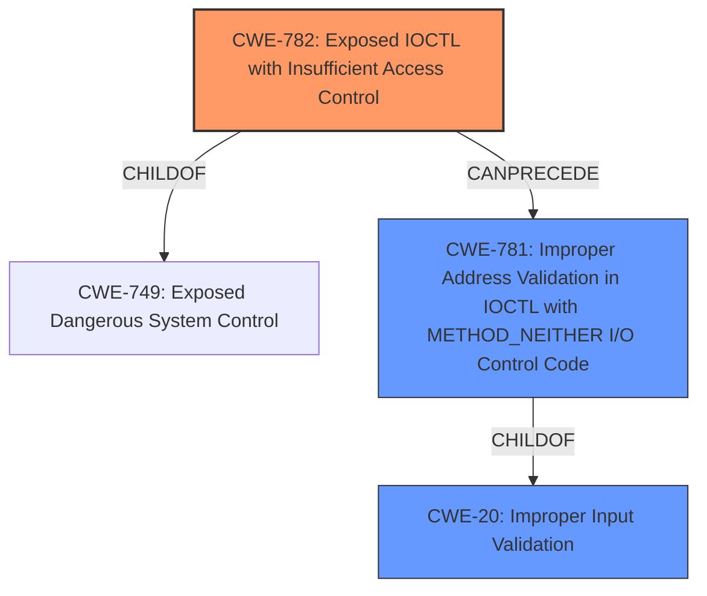

# Analysis for CVE-2021-44903

# Summary
| CWE ID | CWE Name | Confidence | CWE Abstraction Level | CWE Vulnerability Mapping Label | CWE-Vulnerability Mapping Notes |
|---|---|---|---|---|---|
| CWE-782 | Exposed IOCTL with Insufficient Access Control | 0.9 | Variant | Allowed | Primary CWE |
| CWE-781 | Improper Address Validation in IOCTL with METHOD_NEITHER I/O Control Code | 0.7 | Variant | Allowed | Secondary Candidate |
| CWE-20 | Improper Input Validation | 0.5 | Class | Discouraged | Secondary Candidate |

## Evidence and Confidence

*   **Confidence Score:** 0.8
*   **Evidence Strength:** HIGH

## Relationship Analysis
The primary CWE, CWE-782, is a Variant of CWE-749, indicating a specific type of weakness related to IOCTL exposure. CWE-782 can precede CWE-781, suggesting a potential chain where an exposed IOCTL lacks proper address validation. The relationships suggest a path: expose the IOCTL with insufficient access control, then fail to properly validate the addresses supplied to it. CWE-20, Improper Input Validation, is a more general Class-level weakness that could contribute to the issue but is less specific than CWE-782 in this case.

## Vulnerability Chain
The vulnerability chain begins with the exposure of an IOCTL without sufficient access control (CWE-782). This can then lead to **improper input validation** (CWE-20) issues and specifically, **improper address validation** (CWE-781) when using `METHOD_NEITHER`. Finally, this allows attackers to achieve privilege escalation.

## Summary of Analysis
The initial assessment identified several potential CWEs, but after reviewing the vulnerability description, the CVE Reference Links Content Summary, and the Retriever Results, the primary focus shifted to the **improper handling of IOCTL requests**. The key evidence is the vulnerability description stating that the vulnerabilities are triggered by sending specific IOCTL requests, combined with the CVE Reference Links Content Summary indicating "insecure handling of IOCTL requests".

The final decision heavily relies on the provided evidence, especially the CVE Reference Links Content Summary, which explicitly mentions the root cause being the **insecure handling of IOCTL requests**. This is a strong indicator of CWE-782, as it directly addresses the **exposure of IOCTLs with insufficient access control**.

The selection of CWE-782 is at the optimal level of specificity because it directly reflects the root cause: the IOCTLs are exposed and lack proper access control. This is more specific than a general **improper input validation** (CWE-20) issue. While **improper input validation** is present and can be a contributing factor, the root cause is the exposed IOCTL functionality. CWE-781 could also occur depending on the implementation details of the IOCTL.

Relevant CWE Information:

# Enhanced Context (25 CWEs)

## CWE-782: Exposed IOCTL with Insufficient Access Control
**Abstraction Level**: Variant
**Similarity Score**: 0.78
**Source**: dense

**Description**:
The product implements an IOCTL with functionality that should be restricted, but it does not properly enforce access control for the IOCTL.

**Mapping Guidance**:
- Usage: Allowed
- Rationale: This CWE entry is at the Variant level of abstraction, which is a preferred level of abstraction for mapping to the root causes of vulnerabilities.

## CWE-20: Improper Input Validation
**Abstraction Level**: Class
**Similarity Score**: 0.77
**Source**: dense

**Description**:
The product receives input or data, but it does
        not validate or incorrectly validates that the input has the
        properties that are required to process the data safely and
        correctly.

**Mapping Guidance**:
- Usage: Discouraged
- Rationale: CWE-20 is commonly misused in low-information vulnerability reports when lower-level CWEs could be used instead, or when more details about the vulnerability are available [REF-1287]. It is not useful for trend analysis. It is also a level-1 Class (i.e., a child of a Pillar).

## CWE-781: Improper Address Validation in IOCTL with METHOD_NEITHER I/O Control Code
**Abstraction Level**: variant
**Similarity Score**: 3.88
**Source**: graph

**Description**:
CWE-781: Improper Address Validation in IOCTL with METHOD_NEITHER I/O Control Code

**Mapping Guidance**:
- Usage: Allowed
- Rationale: This CWE entry is at the Variant level of abstraction, which is a preferred level of abstraction for mapping to the root causes of vulnerabilities.