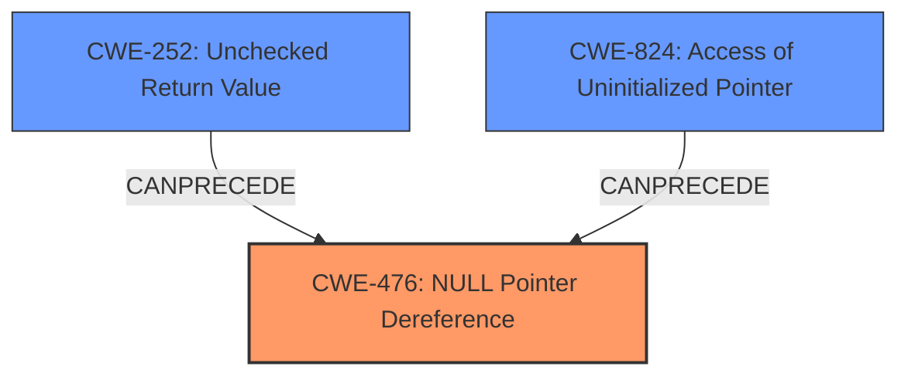

# Raw Analyzer Response for CVE-2021-44974

# Summary
| CWE ID | CWE Name | Confidence | CWE Abstraction Level | CWE Vulnerability Mapping Label | CWE-Vulnerability Mapping Notes |
|---|---|---|---|---|---|
| CWE-476 | NULL Pointer Dereference | 1.0 | Base | Allowed | Primary CWE |
| CWE-252 | Unchecked Return Value | 0.7 | Base | Allowed | Secondary Candidate |
| CWE-824 | Access of Uninitialized Pointer | 0.6 | Base | Allowed | Secondary Candidate |

## Evidence and Confidence

*   **Confidence Score:** 0.9
*   **Evidence Strength:** HIGH

## Relationship Analysis
The primary relationship that influenced the CWE selection was the direct match of the **NULL Pointer Dereference** to the vulnerability description. This is further supported by the CVE Reference Links Content Summary. CWE-252 and CWE-824 are related because an unchecked return value can lead to an uninitialized pointer, which in turn can lead to a **NULL Pointer Dereference**.

## Vulnerability Chain
The vulnerability chain starts with a potentially **unvalidated** or **improperly sanitized** binary file leading to a **NULL** value in the `element->symbols` array. This **NULL** value is then dereferenced, resulting in a crash.

*   **Root Cause:** Possibly **Improper Input Validation** (not explicitly stated, but inferred)
*   **Weakness:** **CWE-476: NULL Pointer Dereference**

## Summary of Analysis
The initial analysis identified **CWE-476: NULL Pointer Dereference** as the primary weakness based on the vulnerability description and the CVE reference summary, which explicitly states a "NULL pointer dereference within the `symbols()` function". The content also mentions a "Lack of Input Sanitization" allowing the pointer to be controlled by an attacker. The retriever results also strongly suggest **CWE-476: NULL Pointer Dereference** as the top candidate.

The final decision is heavily based on the explicit mention of **NULL Pointer Dereference** in both the vulnerability description and the CVE reference summary. The relationships between CWEs, specifically the potential for **CWE-252: Unchecked Return Value** or **CWE-824: Access of Uninitialized Pointer** to lead to a **CWE-476: NULL Pointer Dereference**, support the selection of CWE-476 as the primary weakness, with CWE-252 and CWE-824 as potential contributing factors, depending on the specific code implementation. The selected CWE is at the Base level of abstraction, which is appropriate according to the MITRE mapping guidance.

Relevant CWE Information:

# Enhanced Context (25 CWEs)

## CWE-476: NULL Pointer Dereference
**Abstraction:** Base
**Similarity Score**: 0.80
**Source**: dense

**Description**:
The product dereferences a pointer that it expects to be valid but is NULL.

**Mapping Guidance**:
- Usage: Allowed
- Rationale: This CWE entry is at the Base level of abstraction, which is a preferred level of abstraction for mapping to the root causes of vulnerabilities.

## CWE-252: Unchecked Return Value
**Abstraction:** Base
**Similarity Score**: 0.78
**Source**: dense

**Description**:
The product does not check the return value from a method or function, which can prevent it from detecting unexpected states and conditions.

**Mapping Guidance**:
- Usage: Allowed
- Rationale: This CWE entry is at the Base level of abstraction, which is a preferred level of abstraction for mapping to the root causes of vulnerabilities.

## CWE-824: Access of Uninitialized Pointer
**Abstraction:** Base
**Similarity Score**: 0.79
**Source**: dense

**Description**:
The product accesses or uses a pointer that has not been initialized.

**Mapping Guidance**:
- Usage: Allowed
- Rationale: This CWE entry is at the Base level of abstraction, which is a preferred level of abstraction for mapping to the root causes of vulnerabilities.

CWEs considered but not used:

*   CWE-822: Untrusted Pointer Dereference - While the data is adversary controlled, it's not explicitly an untrusted pointer *value* being used as a pointer. The pointer itself is NULL.
*   CWE-665: Improper Initialization - While initialization might be a factor, the direct cause is the dereference of a NULL pointer.
*   CWE-690: Unchecked Return Value to NULL Pointer Dereference - While this *could* be the case, there is no explicit evidence of an unchecked return value, so the more direct CWE-476 is chosen.
*   CWE-788: Access of Memory Location After End of Buffer - This doesn't apply as the issue is not related to accessing memory beyond a buffer, but rather dereferencing a NULL pointer.
*   CWE-1325: Improperly Controlled Sequential Memory Allocation - Not related to allocation limits but the dereference of a null pointer.
*   CWE-456: Missing Initialization of a Variable - Possible, but less direct than the NULL dereference itself.
*   CWE-395: Use of NullPointerException Catch to Detect NULL Pointer Dereference - This CWE is specific to how exceptions are handled and not the root cause.
*   CWE-789: Memory Allocation with Excessive Size Value - No evidence of memory allocation issues.
*   CWE-120: Buffer Copy without Checking Size of Input ('Classic Buffer Overflow') - Not related to buffer overflows.
*   CWE-89: Improper Neutralization of Special Elements used in an SQL Command ('SQL Injection') - Not related to SQL injection.
*   CWE-190: Integer Overflow or Wraparound - Not related to integer overflows.
*   CWE-770: Allocation of Resources Without Limits or Throttling - Not related to resource allocation limits.
*   CWE-98: Improper Control of Filename for Include/Require Statement in PHP Program ('PHP Remote File Inclusion') - Not related to PHP file inclusion.
*   CWE-781: Improper Address Validation in IOCTL with METHOD_NEITHER I/O Control Code - Not related to IOCTL.