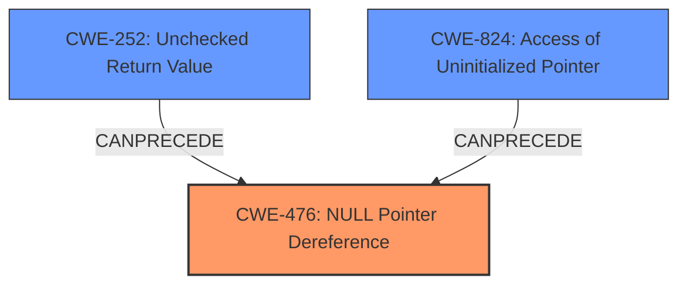

# Analysis for CVE-2021-44974

# Summary
| CWE ID | CWE Name | Confidence | CWE Abstraction Level | CWE Vulnerability Mapping Label | CWE-Vulnerability Mapping Notes |
|---|---|---|---|---|---|
| CWE-476 | NULL Pointer Dereference | 1.0 | Base | Allowed | Primary CWE |
| CWE-252 | Unchecked Return Value | 0.7 | Base | Allowed | Secondary Candidate |
| CWE-824 | Access of Uninitialized Pointer | 0.6 | Base | Allowed | Secondary Candidate |

## Evidence and Confidence

*   **Confidence Score:** 0.9
*   **Evidence Strength:** HIGH

## Relationship Analysis
The primary relationship that influenced the CWE selection was the direct match of the **NULL Pointer Dereference** to the vulnerability description. This is further supported by the CVE Reference Links Content Summary. CWE-252 and CWE-824 are related because an unchecked return value can lead to an uninitialized pointer, which in turn can lead to a **NULL Pointer Dereference**.

## Vulnerability Chain
The vulnerability chain starts with a potentially **unvalidated** or **improperly sanitized** binary file leading to a **NULL** value in the `element->symbols` array. This **NULL** value is then dereferenced, resulting in a crash.

*   **Root Cause:** Possibly **Improper Input Validation** (not explicitly stated, but inferred)
*   **Weakness:** **CWE-476: NULL Pointer Dereference**

## Summary of Analysis
The initial analysis identified **CWE-476: NULL Pointer Dereference** as the primary weakness based on the vulnerability description and the CVE reference summary, which explicitly states a "NULL pointer dereference within the `symbols()` function". The content also mentions a "Lack of Input Sanitization" allowing the pointer to be controlled by an attacker. The retriever results also strongly suggest **CWE-476: NULL Pointer Dereference** as the top candidate.

The final decision is heavily based on the explicit mention of **NULL Pointer Dereference** in both the vulnerability description and the CVE reference summary. The relationships between CWEs, specifically the potential for **CWE-252: Unchecked Return Value** or **CWE-824: Access of Uninitialized Pointer** to lead to a **CWE-476: NULL Pointer Dereference**, support the selection of CWE-476 as the primary weakness, with CWE-252 and CWE-824 as potential contributing factors, depending on the specific code implementation. The selected CWE is at the Base level of abstraction, which is appropriate according to the MITRE mapping guidance.

Relevant CWE Information:

# Enhanced Context (25 CWEs)

## CWE-476: NULL Pointer Dereference
**Abstraction:** Base
**Similarity Score**: 0.80
**Source**: dense

**Description**:
The product dereferences a pointer that it expects to be valid but is NULL.

**Mapping Guidance**:
- Usage: Allowed
- Rationale: This CWE entry is at the Base level of abstraction, which is a preferred level of abstraction for mapping to the root causes of vulnerabilities.

## CWE-252: Unchecked Return Value
**Abstraction:** Base
**Similarity Score**: 0.78
**Source**: dense

**Description**:
The product does not check the return value from a method or function, which can prevent it from detecting unexpected states and conditions.

**Mapping Guidance**:
- Usage: Allowed
- Rationale: This CWE entry is at the Base level of abstraction, which is a preferred level of abstraction for mapping to the root causes of vulnerabilities.

## CWE-824: Access of Uninitialized Pointer
**Abstraction:** Base
**Similarity Score**: 0.79
**Source**: dense

**Description**:
The product accesses or uses a pointer that has not been initialized.

**Mapping Guidance**:
- Usage: Allowed
- Rationale: This CWE entry is at the Base level of abstraction, which is a preferred level of abstraction for mapping to the root causes of vulnerabilities.

CWEs considered but not used:

*   CWE-822: Untrusted Pointer Dereference - While the data is adversary controlled, it's not explicitly an untrusted pointer *value* being used as a pointer. The pointer itself is NULL.
*   CWE-665: Improper Initialization - While initialization might be a factor, the direct cause is the dereference of a NULL pointer.
*   CWE-690: Unchecked Return Value to NULL Pointer Dereference - While this *could* be the case, there is no explicit evidence of an unchecked return value, so the more direct CWE-476 is chosen.
*   CWE-788: Access of Memory Location After End of Buffer - This doesn't apply as the issue is not related to accessing memory beyond a buffer, but rather dereferencing a NULL pointer.
*   CWE-1325: Improperly Controlled Sequential Memory Allocation - Not related to allocation limits but the dereference of a null pointer.
*   CWE-456: Missing Initialization of a Variable - Possible, but less direct than the NULL dereference itself.
*   CWE-395: Use of NullPointerException Catch to Detect NULL Pointer Dereference - This CWE is specific to how exceptions are handled and not the root cause.
*   CWE-789: Memory Allocation with Excessive Size Value - No evidence of memory allocation issues.
*   CWE-120: Buffer Copy without Checking Size of Input ('Classic Buffer Overflow') - Not related to buffer overflows.
*   CWE-89: Improper Neutralization of Special Elements used in an SQL Command ('SQL Injection') - Not related to SQL injection.
*   CWE-190: Integer Overflow or Wraparound - Not related to integer overflows.
*   CWE-770: Allocation of Resources Without Limits or Throttling - Not related to resource allocation limits.
*   CWE-98: Improper Control of Filename for Include/Require Statement in PHP Program ('PHP Remote File Inclusion') - Not related to PHP file inclusion.
*   CWE-781: Improper Address Validation in IOCTL with METHOD_NEITHER I/O Control Code - Not related to IOCTL.

# Enhanced Query for CVE-2021-44974

## Vulnerability Description
radareorg radare2 version 5.5.2 is vulnerable to **NULL Pointer Dereference** via libr/bin/p/bin_symbols.c binary symbol parser.

### Vulnerability Description Key Phrases
- **rootcause:** **NULL Pointer Dereference**
- **product:** radare2
- **version:** 5.5.2
- **component:** libr/bin/p/bin_symbols.c binary symbol parser

## CVE Reference Links Content Summary
Based on the provided content, here's an analysis of CVE-2021-44974:

**Root Cause of Vulnerability:**

The root cause is a NULL pointer dereference within the `symbols()` function in `/radare2/libr/bin/bin_symbols.c`. This function parses symbol information from binary files. The vulnerability occurs when the `element->symbols` array (which holds symbol data) contains a NULL pointer, leading to a crash when the code attempts to access the `paddr` member of a symbol.

**Weaknesses/Vulnerabilities Present:**

*   **NULL Pointer Dereference (CWE-476):** The primary vulnerability is the direct dereference of a potentially NULL pointer. The code doesn't check if `element->symbols[i]` is valid before attempting to access its members, leading to a crash when this pointer is NULL.
*   **Lack of Input Sanitization**: The vulnerability lies in the fact that the `bf` structure (describing a binary file) reaches the `symbols` function without being properly sanitized and validated and thus the element that controls the pointer can be controlled by an attacker.

**Impact of Exploitation:**

*   **Denial of Service (DoS):** The most immediate impact is a crash of the `radare2` application, resulting in a denial of service. An attacker can trigger the crash by crafting a malicious binary file with specific symbol table entries.

**Attack Vectors:**

*   **Malicious Binary:** An attacker can exploit this vulnerability by crafting a specially formed binary file that, when loaded by radare2, triggers the NULL pointer dereference in the `symbols()` function.
*   **File Input:** The primary attack vector involves loading the malicious binary file through radare2.

**Required Attacker Capabilities/Position:**

*   **Ability to provide a binary file:** The attacker needs to be able to provide a binary file for radare2 to analyze.
*   **No special privileges required:** The vulnerability is triggerable without any special privileges, because radare2 can be run by a normal user.

**Additional Details:**

*   The vulnerability was discovered by Angelos T. Kalaitzidis of CENSUS.
*   It was fixed in `radare2` version 5.5.4.
*   The vulnerability is present in `radareorg radare2` version 5.5.2.
*   The provided github issue #19478 also includes a crash.zip which was the crafted binary that reproduces the vulnerability.
*   The provided fix commit 7b9ac972996a7d0809c79b1132b03848e057eafe provides the actual fix for the issue.

**Summary of vulnerability from census-labs.com:**

>   A NULL pointer dereference vulnerability exists in the symbols() function of /radare2/libr/bin/bin\_symbols.c.
>
>   As illustrated in the code snippet above, the element pointer points to adversary-controlled data (as bf->o->bin\_obj essentially points to data of the binary file). The element->symbols array, is an array of symbols for an object of the file that is being loaded for analysis. In the case where the pointer element->symbols\[0] is NULL (which is possible as we are talking about adversary-controlled data) the sym pointer would also be set to NULL (see comment #1). Then in the next line sym is accessed through the sym->paddr expression and this leads to a NULL pointer dereference and a program crash.

The provided information gives a detailed explanation of the NULL pointer dereference vulnerability.

## Retriever Results

### Top Combined Results

| Rank | CWE ID | Name | Abstraction | Usage  | Retrievers | Individual Scores |
|------|--------|------|-------------|-------|------------|-------------------|
| 1 | 476 | NULL Pointer Dereference | Base | Allowed | sparse | 0.267 |
| 2 | 252 | Unchecked Return Value | Base | Allowed | sparse | 0.153 |
| 3 | 822 | Untrusted Pointer Dereference | Base | Allowed | sparse | 0.153 |
| 4 | 665 | Improper Initialization | Class | Discouraged | sparse | 0.139 |
| 5 | 690 | Unchecked Return Value to NULL Pointer Dereference | Compound | Discouraged | sparse | 0.137 |
| 6 | 788 | Access of Memory Location After End of Buffer | Base | Discouraged | dense | 0.504 |
| 7 | 1325 | Improperly Controlled Sequential Memory Allocation | Base | Allowed | graph | 0.003 |
| 8 | 456 | Missing Initialization of a Variable | Variant | Allowed | sparse | 0.128 |
| 9 | 395 | Use of NullPointerException Catch to Detect NULL Pointer Dereference | Base | Allowed | sparse | 0.124 |
| 10 | 824 | Access of Uninitialized Pointer | Base | Allowed | sparse | 0.122 |

# Complete CWE Specifications

## CWE-476: NULL Pointer Dereference
**Abstraction:** Base
**Status:** Stable

### Description
The product dereferences a pointer that it expects to be valid but is NULL.

### Extended Description
Not provided

### Alternative Terms
NPD: Common abbreviation for Null Pointer Dereference
null deref: Common abbreviation for Null Pointer Dereference
NPE: Common abbreviation for Null Pointer Exception
nil pointer dereference: used for access of nil in Go programs

### Relationships
ChildOf -> CWE-710
ChildOf -> CWE-754
ChildOf -> CWE-754

### Mapping Guidance
**Usage:** Allowed
**Rationale:** This CWE entry is at the Base level of abstraction, which is a preferred level of abstraction for mapping to the root causes of vulnerabilities.
**Comments:** Carefully read both the name and description to ensure that this mapping is an appropriate fit. Do not try to 'force' a mapping to a lower-level Base/Variant simply to comply with this preferred level of abstraction.
**Reasons:**
- Acceptable-Use

### Observed Examples
- **CVE-2005-3274:** race condition causes a table to be corrupted if a timer activates while it is being modified, leading to resultant NULL dereference; also involves locking.
- **CVE-2002-1912:** large number of packets leads to NULL dereference
- **CVE-2005-0772:** packet with invalid error status value triggers NULL dereference

## CWE-252: Unchecked Return Value
**Abstraction:** Base
**Status:** Draft

### Description
The product does not check the return value from a method or function, which can prevent it from detecting unexpected states and conditions.

### Extended Description
Two common programmer assumptions are "this function call can never fail" and "it doesn't matter if this function call fails". If an attacker can force the function to fail or otherwise return a value that is not expected, then the subsequent program logic could lead to a vulnerability, because the product is not in a state that the programmer assumes. For example, if the program calls a function to drop privileges but does not check the return code to ensure that privileges were successfully dropped, then the program will continue to operate with the higher privileges.

### Alternative Terms
None

### Relationships
ChildOf -> CWE-754
ChildOf -> CWE-754
CanPrecede -> CWE-476

### Mapping Guidance
**Usage:** Allowed
**Rationale:** This CWE entry is at the Base level of abstraction, which is a preferred level of abstraction for mapping to the root causes of vulnerabilities.
**Comments:** Carefully read both the name and description to ensure that this mapping is an appropriate fit. Do not try to 'force' a mapping to a lower-level Base/Variant simply to comply with this preferred level of abstraction.
**Reasons:**
- Acceptable-Use

### Observed Examples
- **CVE-2020-17533:** Chain: unchecked return value (CWE-252) of some functions for policy enforcement leads to authorization bypass (CWE-862)
- **CVE-2020-6078:** Chain: The return value of a function returning a pointer is not checked for success (CWE-252) resulting in the later use of an uninitialized variable (CWE-456) and a null pointer dereference (CWE-476)
- **CVE-2019-15900:** Chain: sscanf() call is used to check if a username and group exists, but the return value of sscanf() call is not checked (CWE-252), causing an uninitialized variable to be checked (CWE-457), returning success to allow authorization bypass for executing a privileged (CWE-863).

## CWE-822: Untrusted Pointer Dereference
**Abstraction:** Base
**Status:** Incomplete

### Description
The product obtains a value from an untrusted source, converts this value to a pointer, and dereferences the resulting pointer.

### Extended Description

An attacker can supply a pointer for memory locations that the product is not expecting. If the pointer is dereferenced for a write operation, the attack might allow modification of critical state variables, cause a crash, or execute code. If the dereferencing operation is for a read, then the attack might allow reading of sensitive data, cause a crash, or set a variable to an unexpected value (since the value will be read from an unexpected memory location).

There are several variants of this weakness, including but not necessarily limited to:

  - The untrusted value is directly invoked as a function call.

  - In OS kernels or drivers where there is a boundary between "userland" and privileged memory spaces, an untrusted pointer might enter through an API or system call (see CWE-781 for one such example).

  - Inadvertently accepting the value from an untrusted control sphere when it did not have to be accepted as input at all. This might occur when the code was originally developed to be run by a single user in a non-networked environment, and the code is then ported to or otherwise exposed to a networked environment.

### Alternative Terms
None

### Relationships
ChildOf -> CWE-119
ChildOf -> CWE-119
ChildOf -> CWE-119
CanPrecede -> CWE-125
CanPrecede -> CWE-787

### Mapping Guidance
**Usage:** Allowed
**Rationale:** This CWE entry is at the Base level of abstraction, which is a preferred level of abstraction for mapping to the root causes of vulnerabilities.
**Comments:** Carefully read both the name and description to ensure that this mapping is an appropriate fit. Do not try to 'force' a mapping to a lower-level Base/Variant simply to comply with this preferred level of abstraction.
**Reasons:**
- Acceptable-Use

### Additional Notes
**[Maintenance]** There are close relationships between incorrect pointer dereferences and other weaknesses related to buffer operations. There may not be sufficient community agreement regarding these relationships. Further study is needed to determine when these relationships are chains, composites, perspective/layering, or other types of relationships. As of September 2010, most of the relationships are being captured as chains.

**[Terminology]** Many weaknesses related to pointer dereferences fall under the general term of "memory corruption" or "memory safety." As of September 2010, there is no commonly-used terminology that covers the lower-level variants.

### Observed Examples
- **CVE-2007-5655:** message-passing framework interprets values in packets as pointers, causing a crash.
- **CVE-2010-2299:** labeled as a "type confusion" issue, also referred to as a "stale pointer." However, the bug ID says "contents are simply interpreted as a pointer... renderer ordinarily doesn't supply this pointer directly". The "handle" in the untrusted area is replaced in one function, but not another - thus also, effectively, exposure to wrong sphere (CWE-668).
- **CVE-2009-1719:** Untrusted dereference using undocumented constructor.

## CWE-665: Improper Initialization
**Abstraction:** Class
**Status:** Draft

### Description
The product does not initialize or incorrectly initializes a resource, which might leave the resource in an unexpected state when it is accessed or used.

### Extended Description
This can have security implications when the associated resource is expected to have certain properties or values, such as a variable that determines whether a user has been authenticated or not.

### Alternative Terms
None

### Relationships
ChildOf -> CWE-664

### Mapping Guidance
**Usage:** Discouraged
**Rationale:** This CWE entry is a level-1 Class (i.e., a child of a Pillar). It might have lower-level children that would be more appropriate
**Comments:** Examine children of this entry to see if there is a better fit
**Reasons:**
- Abstraction

### Observed Examples
- **CVE-2001-1471:** chain: an invalid value prevents a library file from being included, skipping initialization of key variables, leading to resultant eval injection.
- **CVE-2008-3637:** Improper error checking in protection mechanism produces an uninitialized variable, allowing security bypass and code execution.
- **CVE-2008-4197:** Use of uninitialized memory may allow code execution.

## CWE-690: Unchecked Return Value to NULL Pointer Dereference
**Abstraction:** Compound
**Status:** Draft

### Description
The product does not check for an error after calling a function that can return with a NULL pointer if the function fails, which leads to a resultant NULL pointer dereference.

### Extended Description
While unchecked return value weaknesses are not limited to returns of NULL pointers (see the examples in CWE-252), functions often return NULL to indicate an error status. When this error condition is not checked, a NULL pointer dereference can occur.

### Alternative Terms
None

### Relationships
StartsWith -> CWE-252
ChildOf -> CWE-252

### Mapping Guidance
**Usage:** Discouraged
**Rationale:** This CWE entry is a named chain, which combines multiple weaknesses.
**Comments:** Mapping to each separate weakness in the chain would be more precise.
**Reasons:**
- Other

### Observed Examples
- **CVE-2008-1052:** Large Content-Length value leads to NULL pointer dereference when malloc fails.
- **CVE-2006-6227:** Large message length field leads to NULL pointer dereference when malloc fails.
- **CVE-2006-2555:** Parsing routine encounters NULL dereference when input is missing a colon separator.

## CWE-788: Access of Memory Location After End of Buffer
**Abstraction:** Base
**Status:** Incomplete

### Description
The product reads or writes to a buffer using an index or pointer that references a memory location after the end of the buffer.

### Extended Description
This typically occurs when a pointer or its index is incremented to a position after the buffer; or when pointer arithmetic results in a position after the buffer.

### Alternative Terms
None

### Relationships
ChildOf -> CWE-119
ChildOf -> CWE-119
ChildOf -> CWE-119

### Mapping Guidance
**Usage:** Discouraged
**Rationale:** The CWE entry might be misused when lower-level CWE entries might be available. It also overlaps existing CWE entries and might be deprecated in the future.
**Comments:** If the "Access" operation is known to be a read or a write, then investigate children of entries such as CWE-787: Out-of-bounds Write and CWE-125: Out-of-bounds Read.
**Reasons:**
- Potential Deprecation
- Frequent Misuse

### Observed Examples
- **CVE-2009-2550:** Classic stack-based buffer overflow in media player using a long entry in a playlist
- **CVE-2009-2403:** Heap-based buffer overflow in media player using a long entry in a playlist
- **CVE-2009-0689:** large precision value in a format string triggers overflow

## CWE-1325: Improperly Controlled Sequential Memory Allocation
**Abstraction:** Base
**Status:** Incomplete

### Description
The product manages a group of objects or resources and performs a separate memory allocation for each object, but it does not properly limit the total amount of memory that is consumed by all of the combined objects.

### Extended Description

While the product might limit the amount of memory that is allocated in a single operation for a single object (such as a malloc of an array), if an attacker can cause multiple objects to be allocated in separate operations, then this might cause higher total memory consumption than the developer intended, leading to a denial of service.

### Alternative Terms
Stack Exhaustion: When a weakness allocates excessive memory on the stack, it is often described as "stack exhaustion," which is a technical impact of the weakness. This technical impact is often encountered as a consequence of CWE-789 and/or CWE-1325.

### Relationships
ChildOf -> CWE-770
PeerOf -> CWE-789
CanPrecede -> CWE-476

### Mapping Guidance
**Usage:** Allowed
**Rationale:** This CWE entry is at the Base level of abstraction, which is a preferred level of abstraction for mapping to the root causes of vulnerabilities.
**Comments:** Carefully read both the name and description to ensure that this mapping is an appropriate fit. Do not try to 'force' a mapping to a lower-level Base/Variant simply to comply with this preferred level of abstraction.
**Reasons:**
- Acceptable-Use

### Observed Examples
- **CVE-2020-36049:** JavaScript-based packet decoder uses concatenation of many small strings, causing out-of-memory (OOM) condition
- **CVE-2019-20176:** Product allocates a new buffer on the stack for each file in a directory, allowing stack exhaustion
- **CVE-2013-1591:** Chain: an integer overflow (CWE-190) in the image size calculation causes an infinite loop (CWE-835) which sequentially allocates buffers without limits (CWE-1325) until the stack is full.

## CWE-456: Missing Initialization of a Variable
**Abstraction:** Variant
**Status:** Draft

### Description
The product does not initialize critical variables, which causes the execution environment to use unexpected values.

### Extended Description
Not provided

### Alternative Terms
None

### Relationships
ChildOf -> CWE-909
ChildOf -> CWE-665
ChildOf -> CWE-665
CanPrecede -> CWE-89
CanPrecede -> CWE-120
CanPrecede -> CWE-98
CanPrecede -> CWE-457

### Mapping Guidance
**Usage:** Allowed
**Rationale:** This CWE entry is at the Variant level of abstraction, which is a preferred level of abstraction for mapping to the root causes of vulnerabilities.
**Comments:** Carefully read both the name and description to ensure that this mapping is an appropriate fit. Do not try to 'force' a mapping to a lower-level Base/Variant simply to comply with this preferred level of abstraction.
**Reasons:**
- Acceptable-Use

### Additional Notes
**[Relationship]** This weakness is a major factor in a number of resultant weaknesses, especially in web applications that allow global variable initialization (such as PHP) with libraries that can be directly requested.

**[Research Gap]** It is highly likely that a large number of resultant weaknesses have missing initialization as a primary factor, but researcher reports generally do not provide this level of detail.

### Observed Examples
- **CVE-2020-6078:** Chain: The return value of a function returning a pointer is not checked for success (CWE-252) resulting in the later use of an uninitialized variable (CWE-456) and a null pointer dereference (CWE-476)
- **CVE-2009-2692:** Chain: Use of an unimplemented network socket operation pointing to an uninitialized handler function (CWE-456) causes a crash because of a null pointer dereference (CWE-476).
- **CVE-2020-20739:** A variable that has its value set in a conditional statement is sometimes used when the conditional fails, sometimes causing data leakage

## CWE-395: Use of NullPointerException Catch to Detect NULL Pointer Dereference
**Abstraction:** Base
**Status:** Draft

### Description
Catching NullPointerException should not be used as an alternative to programmatic checks to prevent dereferencing a null pointer.

### Extended Description

Programmers typically catch NullPointerException under three circumstances:

  - The program contains a null pointer dereference. Catching the resulting exception was easier than fixing the underlying problem.

  - The program explicitly throws a NullPointerException to signal an error condition.

  - The code is part of a test harness that supplies unexpected input to the classes under test.

Of these three circumstances, only the last is acceptable.

### Alternative Terms
None

### Relationships
ChildOf -> CWE-705
ChildOf -> CWE-755

### Mapping Guidance
**Usage:** Allowed
**Rationale:** This CWE entry is at the Base level of abstraction, which is a preferred level of abstraction for mapping to the root causes of vulnerabilities.
**Comments:** Carefully read both the name and description to ensure that this mapping is an appropriate fit. Do not try to 'force' a mapping to a lower-level Base/Variant simply to comply with this preferred level of abstraction.
**Reasons:**
- Acceptable-Use

## CWE-824: Access of Uninitialized Pointer
**Abstraction:** Base
**Status:** Incomplete

### Description
The product accesses or uses a pointer that has not been initialized.

### Extended Description

If the pointer contains an uninitialized value, then the value might not point to a valid memory location. This could cause the product to read from or write to unexpected memory locations, leading to a denial of service. If the uninitialized pointer is used as a function call, then arbitrary functions could be invoked. If an attacker can influence the portion of uninitialized memory that is contained in the pointer, this weakness could be leveraged to execute code or perform other attacks.

Depending on memory layout, associated memory management behaviors, and product operation, the attacker might be able to influence the contents of the uninitialized pointer, thus gaining more fine-grained control of the memory location to be accessed.

### Alternative Terms
None

### Relationships
ChildOf -> CWE-119
ChildOf -> CWE-119
ChildOf -> CWE-119
ChildOf -> CWE-119
CanPrecede -> CWE-125
CanPrecede -> CWE-787

### Mapping Guidance
**Usage:** Allowed
**Rationale:** This CWE entry is at the Base level of abstraction, which is a preferred level of abstraction for mapping to the root causes of vulnerabilities.
**Comments:** Carefully read both the name and description to ensure that this mapping is an appropriate fit. Do not try to 'force' a mapping to a lower-level Base/Variant simply to comply with this preferred level of abstraction.
**Reasons:**
- Acceptable-Use

### Additional Notes
**[Maintenance]** There are close relationships between incorrect pointer dereferences and other weaknesses related to buffer operations. There may not be sufficient community agreement regarding these relationships. Further study is needed to determine when these relationships are chains, composites, perspective/layering, or other types of relationships. As of September 2010, most of the relationships are being captured as chains.

**[Terminology]** Many weaknesses related to pointer dereferences fall under the general term of "memory corruption" or "memory safety." As of September 2010, there is no commonly-used terminology that covers the lower-level variants.

### Observed Examples
- **CVE-2024-32878:** LLM product has a free of an uninitialized pointer
- **CVE-2010-0211:** chain: unchecked return value (CWE-252) leads to free of invalid, uninitialized pointer (CWE-824).
- **CVE-2009-2768:** Pointer in structure is not initialized, leading to NULL pointer dereference (CWE-476) and system crash.

