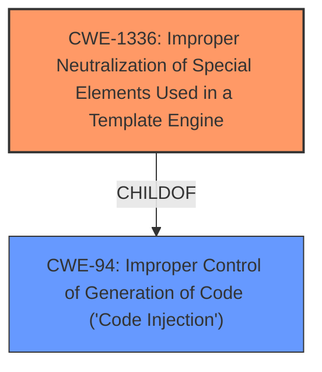

# Analysis for CVE-2021-44978

# Summary
| CWE ID | CWE Name | Confidence | CWE Abstraction Level | CWE Vulnerability Mapping Label | CWE-Vulnerability Mapping Notes |
|---|---|---|---|---|---|
| CWE-1336 | Improper Neutralization of Special Elements Used in a Template Engine | 1.0 | Base | Allowed | Primary CWE |

## Evidence and Confidence

*   **Confidence Score:** 1.0
*   **Evidence Strength:** HIGH

## Relationship Analysis
The primary relationship that influenced the decision was the ChildOf relationship between CWE-1336 and CWE-94, indicating that template engine issues are a specific type of code generation problem. There aren't any chain relationships present.

## Vulnerability Chain
The vulnerability chain starts with the **SSJI injection** weakness, leading to remote code execution.
  - The root cause is the **improper neutralization** of special elements used in the template engine (CWE-1336).
  - The impact is remote code execution due to the ability to inject and execute arbitrary code.

## Summary of Analysis
The initial analysis identified the **SSJI injection** as the primary **weakness**, leading to remote code execution. This is based on the **Vulnerability Description Key Phrases** which calls out "SSJI injection".

The retriever results pointed to several CWEs related to injection and improper neutralization. The graph relationships and retriever scores helped prioritize CWE-1336, as it specifically addresses template engine vulnerabilities.

The final selection of CWE-1336 is based on its direct relevance to the vulnerability description, its base level of abstraction which is preferred by the mapping guidance, and the evidence provided.

Relevant CWE Information:

# Enhanced Context (25 CWEs)

## CWE-1336: Improper Neutralization of Special Elements Used in a Template Engine
**Abstraction:** Base
**Similarity Score**: 0.192 (sparse)

**Description**:
The product uses a template engine to insert or process externally-influenced input, but it does not neutralize or incorrectly neutralizes special elements or syntax that can be interpreted as template expressions or other code directives when processed by the engine.

**Mapping Guidance**:
- Usage: Allowed
- Rationale: This CWE entry is at the Base level of abstraction, which is a preferred level of abstraction for mapping to the root causes of vulnerabilities.

**Justification:** This CWE accurately describes the vulnerability where the product uses a template engine but fails to properly neutralize special elements, leading to potential injection attacks. The description clearly aligns with the vulnerability, and the usage is "Allowed".

## CWE-94: Improper Control of Generation of Code ('Code Injection')
**Abstraction:** Base
**Similarity Score**: 0.104 (sparse)

**Description**:
The product constructs all or part of a code segment using externally-influenced input from an upstream component, but it does not neutralize or incorrectly neutralizes special elements that could modify the syntax or behavior of the intended code segment.

**Mapping Guidance**:
- Usage: Allowed-with-Review
- Rationale: This entry is frequently misused for vulnerabilities with a technical impact of "code execution," which does not by itself indicate a root cause weakness, since dozens of weaknesses can enable code execution.

**Justification:** While code injection is a consequence of this vulnerability, CWE-94 is too general. The more specific CWE-1336 pinpoints the **weakness** related to template engines, so this is not the best fit.

## CWE-95: Improper Neutralization of Directives in Dynamically Evaluated Code ('Eval Injection')
**Abstraction:** Variant
**Similarity Score**: 0.100 (sparse)

**Description**:
The product receives input from an upstream component, but it does not neutralize or incorrectly neutralizes code syntax before using the input in a dynamic evaluation call (e.g. "eval").

**Mapping Guidance**:
- Usage: Allowed
- Rationale: This CWE entry is at the Variant level of abstraction, which is a preferred level of abstraction for mapping to the root causes of vulnerabilities.

**Justification:** Eval injection is a specific type of code injection that involves the use of "eval" functions. While this could be related, the vulnerability description focuses on template engines, making CWE-1336 a more precise match.

## Other Considered CWEs:
- CWE-78, CWE-79, CWE-96, CWE-97, CWE-1236, CWE-184, CWE-287, CWE-407, CWE-426, CWE-613, CWE-625, CWE-790: These CWEs were considered but deemed less relevant as they did not directly address the core issue of template engine injection. They cover different types of injection or other weaknesses not directly related to the **SSJI injection** in the template engine.