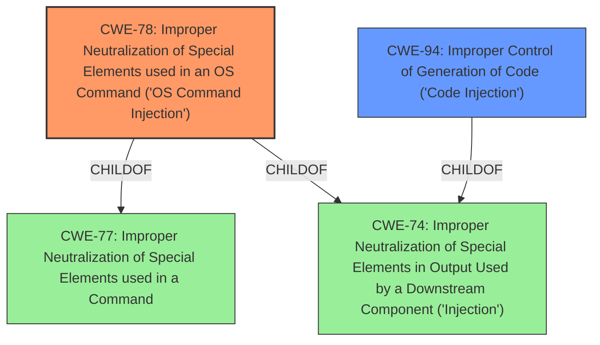

# Analysis Report for CVE-2021-44981

# Vulnerability Analysis Report: CVE-2021-44981

## Description


## Analysis (with Relationship Data)

# Summary
| CWE ID | CWE Name | Confidence | CWE Abstraction Level | CWE Vulnerability Mapping Label | CWE-Vulnerability Mapping Notes |
|---|---|---|---|---|---|
| CWE-78 | Improper Neutralization of Special Elements used in an OS Command ('OS Command Injection') | 1.0 | Base | Allowed | Primary CWE |
| CWE-94 | Improper Control of Generation of Code ('Code Injection') | 0.7 | Base | Allowed-with-Review | Secondary CWE |

## Evidence and Confidence

*   **Confidence Score:** 0.9
*   **Evidence Strength:** HIGH

## Relationship Analysis
The primary weakness is CWE-78, which is a base-level CWE that describes the **improper neutralization** of special elements used in an OS command. This aligns directly with the vulnerability description, which mentions the **lack of proper sanitization** before passing a GET parameter into a `shell_exec()` function. CWE-78 is a child of CWE-77 (Improper Neutralization of Special Elements used in a Command) and CWE-74 (Improper Neutralization of Special Elements in Output Used by a Downstream Component ('Injection')).

CWE-94 (Improper Control of Generation of Code ('Code Injection')) is considered as a secondary CWE because the `shell_exec()` function dynamically generates code based on the GET parameter. CWE-94 is a child of CWE-74 as well.



## Vulnerability Chain
The vulnerability chain starts with the **improper input sanitization**, leading to OS command injection and remote code execution. Because the media server runs as root, this further leads to privilege escalation.

Improper Input Sanitization -> OS Command Injection -> Remote Code Execution -> Privilege Escalation

## Summary of Analysis
The primary focus of this analysis is to identify the root cause of the vulnerability described in the provided text. The vulnerability allows for remote code execution and privilege escalation due to **improper input sanitization** when a GET parameter is passed to a `shell_exec()` function.

The evidence for this is present in the vulnerability description: "the config.php file has a variable which takes a GET parameter value and parses it into a shell_exec() function **without properly sanitizing** any shell arguments, therefore remote code execution is possible." The CVE Reference Links Content Summary also confirms this: "The config.php file has a variable which takes a GET parameter value and parses it into a `shell_exec('');` function **without proper sanitization**."

The graph relationships support the decision to choose CWE-78 as the primary weakness, as it directly addresses the **improper neutralization** of special elements in an OS command. The retriever results also show CWE-78 as the top candidate.

CWE-78 is selected as the primary CWE because it is the most specific and accurate representation of the vulnerability. The weakness lies in the **improper handling** of input before it is used in an OS command, allowing an attacker to inject malicious commands.

CWE-94 (Improper Control of Generation of Code ('Code Injection')) is also considered since `shell_exec()` can be seen as generating code. However, it is not a direct fit, so it is a secondary consideration.

Other CWEs Considered and Rejected:

*   CWE-80: Improper Neutralization of Script-Related HTML Tags in a Web Page (Basic XSS) - This is not relevant as the vulnerability is not related to web page generation or XSS.
*   CWE-74: Improper Neutralization of Special Elements in Output Used by a Downstream Component ('Injection') - This is a more general CWE, and CWE-78 is a more specific child of this.
*   CWE-184: Incomplete List of Disallowed Inputs - This might be a contributing factor, but the core issue is the lack of sanitization, not an incomplete list of disallowed inputs.
*   CWE-138: Improper Neutralization of Special Elements - This is a more general CWE, and CWE-78 is more specific.
*   CWE-116: Improper Encoding or Escaping of Output - This is a broader category related to output handling, but CWE-78 specifically deals with OS command injection.
*   CWE-1289: Improper Validation of Unsafe Equivalence in Input - Not directly applicable as the issue is not about validating equivalence.
*   CWE-838: Inappropriate Encoding for Output Context - Not applicable as the issue is not about encoding context.
*   CWE-88: Improper Neutralization of Argument Delimiters in a Command ('Argument Injection') - While argument injection could be a factor, the primary issue is the overall **lack of sanitization** before executing the command.
*   CWE-917: Improper Neutralization of Special Elements used in an Expression Language Statement ('Expression Language Injection') - Not applicable as the vulnerability does not involve expression language injection.
*   CWE-134: Use of Externally-Controlled Format String - Not applicable as the vulnerability does not involve format string usage.
*   CWE-553: Command Shell in Externally Accessible Directory - While the attack involves code execution, this CWE focuses on the presence of a shell in a directory, which is not the primary issue here.
*   CWE-79: Improper Neutralization of Input During Web Page Generation ('Cross-site Scripting') - This is not relevant as the vulnerability is not related to web page generation or XSS.
*   CWE-306: Missing Authentication for Critical Function - While privilege escalation is part of the impact, the root cause is the **improper sanitization** of input, not missing authentication.
*   CWE-434: Unrestricted Upload of File with Dangerous Type - This is not related to file uploads.
*   CWE-494: Download of Code Without Integrity Check - Not applicable as the vulnerability does not involve downloading code.
*   CWE-625: Permissive Regular Expression - Not applicable as there is no evidence of a permissive regular expression being the root cause.
*   CWE-430: Deployment of Wrong Handler - Not applicable to the described vulnerability.
*   CWE-351: Insufficient Type Distinction - Not applicable to the described vulnerability.
*   CWE-183: Permissive List of Allowed Inputs - This might be a contributing factor, but the core issue is the lack of sanitization, not a permissive list.


## CWE Relationship Analysis

Current CWEs represent these abstraction levels: .


### Vulnerability Chain Analysis

**Chain starting from CWE-116:**
- 116 (Improper Encoding or Escaping of Output) - ROOT


**Chain starting from CWE-434:**
- 434 (Unrestricted Upload of File with Dangerous Type) - ROOT


### CWE Relationship Diagram

```mermaid
graph TD
    classDef primary fill:#f96,stroke:#333,stroke-width:2px
    classDef secondary fill:#69f,stroke:#333
    classDef tertiary fill:#9e9,stroke:#333
```


*Report generated on 2025-04-02 01:37:41*
