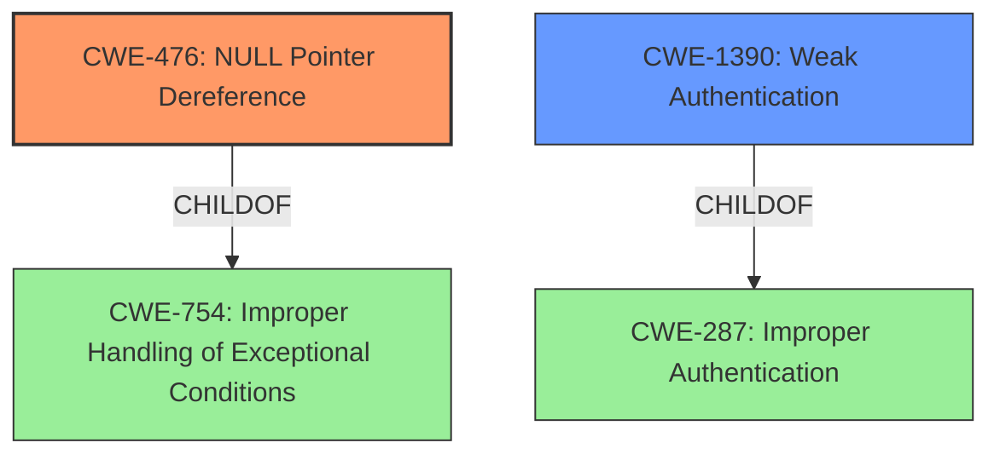

# Analysis Report for CVE-2021-45079

# Vulnerability Analysis Report: CVE-2021-45079

## Description


## Analysis (with Relationship Data)

# Summary
| CWE ID | CWE Name | Confidence | CWE Abstraction Level | CWE Vulnerability Mapping Label | CWE-Vulnerability Mapping Notes |
|---|---|---|---|---|---|
| CWE-476 | NULL Pointer Dereference | 0.9 | Base | Primary | Allowed |
| CWE-1390 | Weak Authentication | 0.7 | Class | Secondary | Allowed-with-Review |

## Evidence and Confidence

*   **Confidence Score:** 0.8
*   **Evidence Strength:** HIGH

## Relationship Analysis
The primary relationship that influenced the decision was the ChildOf relationship between CWE-476 and CWE-754 (Improper Handling of Exceptional Conditions). CWE-476 is a specific case of CWE-754, which means that the vulnerability is a type of improper handling of exceptional conditions that leads to a NULL pointer dereference.

The weakness occurs because the client **fails to verify** the existence of an EAP method instance before attempting to access the MSK. This **missing check** results in a **NULL pointer dereference** when trying to retrieve the MSK.

The other relationship that influenced the decision was the ChildOf relationship between CWE-1390 and CWE-287 (Improper Authentication), specifically how the **early sending of an EAP-Success message** without proper authentication leads to a bypass of authentication.



## Vulnerability Chain
The vulnerability chain starts with the **incorrect assumption** that an EAP method instance exists.

1.  **Incorrect Assumption/Missing Check:** The strongSwan client **fails to verify** the existence of an EAP method instance before attempting to access the MSK.
2.  **NULL Pointer Dereference (CWE-476):** This **missing check** results in a **NULL pointer dereference** when trying to retrieve the MSK.
3.  **Authentication Bypass (CWE-1390):** By sending an early EAP-Success message, an attacker can bypass client and potentially server authentication, particularly in EAP-only authentication setups. The client could accept the connection without a proper authentication process.
4.  **Denial of Service:** Sending a very early EAP-Success message can cause the IKE daemon to crash due to a NULL pointer dereference.
5.  **Man-in-the-Middle Attack:** A successful authentication bypass could allow a rogue server to intercept and potentially decrypt traffic sent by the client via the VPN tunnel.
6.  **Access to Protected Networks:** In certain configurations (like TNC with mutual attestation), an attacker could also potentially access hosts behind the client, if its traffic selector included local subnets.

## Summary of Analysis
The initial assessment identified both CWE-476 and CWE-1390 as potential candidates based on the vulnerability description and retriever results. After reviewing the details of the vulnerability and the CWE specifications, both CWEs were deemed applicable, with CWE-476 being the primary weakness and CWE-1390 being a secondary weakness.

The evidence supporting CWE-476 is strong, as the vulnerability description clearly states that the client attempts to access the MSK from an EAP method instance without verifying its existence, leading to a crash. The evidence is clearly visible in the "CVE Reference Links Content Summary" section:

"The client improperly assumed the existence of an EAP method instance upon receiving an EAP-Success message. This assumption led to a NULL pointer dereference when trying to retrieve the Master Session Key (MSK) in cases where no EAP method was initiated or completed."

This is a direct match to the description of CWE-476: "The product dereferences a pointer that it expects to be valid but is NULL."

The evidence supporting CWE-1390 is also present as the attacker can bypass authentication by sending an early EAP-Success message:

"Authentication Bypass: By sending an early EAP-Success message, an attacker can bypass client and potentially server authentication, particularly in EAP-only authentication setups. The client could accept the connection without a proper authentication process."

This also aligns with the description of CWE-1390: "The product uses an authentication mechanism to restrict access to specific users or identities, but the mechanism does not sufficiently prove that the claimed identity is correct."

The selected CWEs are at the optimal level of specificity because they accurately represent the root cause of the vulnerability. CWE-476 is a Base-level CWE that directly describes the NULL pointer dereference, and CWE-1390 is a Class-level CWE that describes the weak authentication mechanism.

Relevant CWE Information:

# Enhanced Context (25 CWEs)
The following CWEs were identified as potentially relevant to this vulnerability:

## CWE-472: External Control of Assumed-Immutable Web Parameter
**Abstraction Level**: Base
**Similarity Score**: 0.80
**Source**: dense

**Description**:
The web application does not sufficiently verify inputs that are assumed to be immutable but are actually externally controllable, such as hidden form fields.

**Mapping Guidance**:
- Usage: Allowed
- Rationale: This CWE entry is at the Base level of abstraction, which is a preferred level of abstraction for mapping to the root causes of vulnerabilities.

## CWE-807: Reliance on Untrusted Inputs in a Security Decision
**Abstraction Level**: Base
**Similarity Score**: 0.80
**Source**: dense

**Description**:
The product uses a protection mechanism that relies on the existence or values of an input, but the input can be modified by an untrusted actor in a way that bypasses the protection mechanism.

**Mapping Guidance**:
- Usage: Allowed
- Rationale: This CWE entry is at the Base level of abstraction, which is a preferred level of abstraction for mapping to the root causes of vulnerabilities.

## CWE-302: Authentication Bypass by Assumed-Immutable Data
**Abstraction Level**: Base
**Similarity Score**: 0.79
**Source**: dense

**Description**:
The authentication scheme or implementation uses key data elements that are assumed to be immutable, but can be controlled or modified by the attacker.

**Mapping Guidance**:
- Usage: Allowed
- Rationale: This CWE entry is at the Base level of abstraction, which is a preferred level of abstraction for mapping to the root causes of vulnerabilities.

## CWE-1289: Improper Validation of Unsafe Equivalence in Input
**Abstraction Level**: Base
**Similarity Score**: 0.79
**Source**: dense

**Description**:
The product receives an input value that is used as a resource identifier or other type of reference, but it does not validate or incorrectly validates that the input is equivalent to a potentially-unsafe value.

**Mapping Guidance**:
- Usage: Allowed
- Rationale: This CWE entry is at the Base level of abstraction, which is a preferred level of abstraction for mapping to the root causes of vulnerabilities.

## CWE-303: Incorrect Implementation of Authentication Algorithm
**Abstraction Level**: Base
**Similarity Score**: 0.78
**Source**: dense

**Description**:
The requirements for the product dictate the use of an established authentication algorithm, but the implementation of the algorithm is incorrect.

**Mapping Guidance**:
- Usage: Allowed
- Rationale: This CWE entry is at the Base level of abstraction, which is a preferred level of abstraction for mapping to the root causes of vulnerabilities.

## CWE-345: Insufficient Verification of Data Authenticity
**Abstraction Level**: Class
**Similarity Score**: 0.78
**Source**: dense

**Description**:
The product does not sufficiently verify the origin or authenticity of data, in a way that causes it to accept invalid data.

**Mapping Guidance**:
- Usage: Discouraged
- Rationale: This CWE entry is a level-1 Class (i.e., a child of a Pillar). It might have lower-level children that would be more appropriate

## CWE-1391: Use of Weak Credentials
**Abstraction Level**: Class
**Similarity Score**: 0.78
**Source**: dense

**Description**:
The product uses weak credentials (such as a default key or hard-coded password) that can be calculated, derived, reused, or guessed by an attacker.

**Mapping Guidance**:
- Usage: Allowed-with-Review
- Rationale: This CWE entry is a Class and might have Base-level children that would be more appropriate

## CWE-1390: Weak Authentication
**Abstraction Level**: Class
**Similarity Score**: 0.77
**Source**: dense


## CWE Relationship Analysis

Current CWEs represent these abstraction levels: .


### Vulnerability Chain Analysis

**Chain starting from CWE-476:**
- 476 (NULL Pointer Dereference) - ROOT


**Chain starting from CWE-754:**
- 754 (Improper Check for Unusual or Exceptional Conditions) - ROOT


### CWE Relationship Diagram

```mermaid
graph TD
    classDef primary fill:#f96,stroke:#333,stroke-width:2px
    classDef secondary fill:#69f,stroke:#333
    classDef tertiary fill:#9e9,stroke:#333
```


*Report generated on 2025-04-02 06:36:58*
