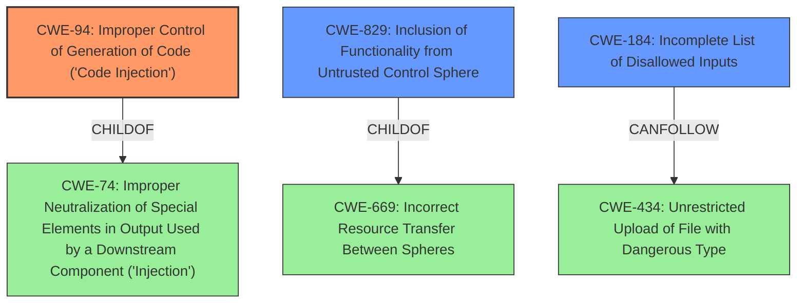

# Enhanced Analysis for CVE-2021-45082

# Summary
| CWE ID | CWE Name | Confidence | CWE Abstraction Level | CWE Vulnerability Mapping Label | CWE-Vulnerability Mapping Notes |
|---|---|---|---|---|---|
| CWE-94 | Improper Control of Generation of Code ('Code Injection') | 0.9 | Base | Allowed-with-Review | Primary CWE |
| CWE-829 | Inclusion of Functionality from Untrusted Control Sphere | 0.7 | Base | Allowed | Secondary Candidate |
| CWE-184 | Incomplete List of Disallowed Inputs | 0.6 | Base | Allowed | Secondary Candidate |

## Evidence and Confidence

*   **Confidence Score:** 0.8
*   **Evidence Strength:** HIGH

## Relationship Analysis
The primary CWE, CWE-94, is a base-level weakness that describes the improper control of code generation, which aligns directly with the vulnerability's root cause. The secondary CWEs, CWE-829 and CWE-184, represent related aspects: the inclusion of untrusted functionality and the incomplete input validation respectively.



## Vulnerability Chain
The vulnerability chain starts with **incomplete input validation** (**CWE-184**) in the `check_for_invalid_imports` function, which fails to block `#from MODULE import ...`. This leads to **improper control of code generation** (**CWE-94**), allowing the injection of arbitrary Python code. The attacker exploits this by **including functionality from an untrusted control sphere** (**CWE-829**). The final impact is **remote code execution**, which is facilitated by the injected code.

## Summary of Analysis
The initial analysis strongly points to **CWE-94 (Improper Control of Generation of Code ('Code Injection'))** as the primary weakness. The `check_for_invalid_imports` function in `templar.py` **fails to properly sanitize** template code, allowing attackers to inject arbitrary Python code via `#from` statements. This directly aligns with CWE-94's description: "The product constructs all or part of a code segment using externally-influenced input... but it does not neutralize or incorrectly neutralizes special elements that could modify the syntax or behavior of the intended code segment."

The evidence from the "CVE Reference Links Content Summary" is crucial: "The vulnerability stems from **incomplete sanitization** of template code... Specifically, the function `check_for_invalid_imports` was designed to prevent the inclusion of arbitrary Python modules... However, it only checked for lines starting with `#import`, while failing to block the use of `#from MODULE import ...`"

**CWE-829 (Inclusion of Functionality from Untrusted Control Sphere)** is a secondary candidate because the injected code effectively introduces untrusted functionality into the system. The description of CWE-829 states: "The product imports, requires, or includes executable functionality (such as a library) from a source that is outside of the intended control sphere."

**CWE-184 (Incomplete List of Disallowed Inputs)** is a secondary candidate because the function `check_for_invalid_imports` was intended to block certain imports but **failed to include** the `#from` syntax. The description of CWE-184 states: "The product implements a protection mechanism that relies on a list of inputs (or properties of inputs) that are not allowed by policy... but the list is incomplete."

Other CWEs were considered but deemed less appropriate:

*   CWE-74 (Improper Neutralization of Special Elements in Output Used by a Downstream Component ('Injection')): While related, CWE-94 is more specific to code injection.
*   CWE-116 (Improper Encoding or Escaping of Output): This is more relevant to scenarios where data is not properly encoded for output, which is not the primary issue here.
*   CWE-434 (Unrestricted Upload of File with Dangerous Type): This is more relevant to file upload vulnerabilities and is not the primary issue here.

The selection of CWE-94, CWE-829 and CWE-184 is at the optimal level of specificity, providing a clear and accurate representation of the vulnerability's root cause and related factors.

Relevant CWE Information:

# Enhanced Context (25 CWEs)
The following CWEs were identified as potentially relevant to this vulnerability:

## CWE-184: Incomplete List of Disallowed Inputs
**Abstraction Level**: Base
**Similarity Score**: 0.78
**Source**: dense

**Description**:
The product implements a protection mechanism that relies on a list of inputs (or properties of inputs) that are not allowed by policy or otherwise require other action to neutralize before additional processing takes place, but the list is incomplete.

**Mapping Guidance**:
- Usage: Allowed
- Rationale: This CWE entry is at the Base level of abstraction, which is a preferred level of abstraction for mapping to the root causes of vulnerabilities.


## CWE-74: Improper Neutralization of Special Elements in Output Used by a Downstream Component ('Injection')
**Abstraction Level**: Class
**Similarity Score**: 0.78
**Source**: dense

**Description**:
The product constructs all or part of a command, data structure, or record using externally-influenced input from an upstream component, but it does not neutralize or incorrectly neutralizes special elements that could modify how it is parsed or interpreted when it is sent to a downstream component.

**Mapping Guidance**:
- Usage: Discouraged
- Rationale: CWE-74 is high-level and often misused when lower-level weaknesses are more appropriate.


## CWE-138: Improper Neutralization of Special Elements
**Abstraction Level**: Class
**Similarity Score**: 0.78
**Source**: dense

**Description**:
The product receives input from an upstream component, but it does not neutralize or incorrectly neutralizes special elements that could be interpreted as control elements or syntactic markers when they are sent to a downstream component.

**Mapping Guidance**:
- Usage: Discouraged
- Rationale: This CWE entry is a level-1 Class (i.e., a child of a Pillar). It might have lower-level children that would be more appropriate


## CWE-1289: Improper Validation of Unsafe Equivalence in Input
**Abstraction Level**: Base
**Similarity Score**: 0.77
**Source**: dense

**Description**:
The product receives an input value that is used as a resource identifier or other type of reference, but it does not validate or incorrectly validates that the input is equivalent to a potentially-unsafe value.

**Mapping Guidance**:
- Usage: Allowed
- Rationale: This CWE entry is at the Base level of abstraction, which is a preferred level of abstraction for mapping to the root causes of vulnerabilities.


## CWE-212: Improper Removal of Sensitive Information Before Storage or Transfer
**Abstraction Level**: Base
**Similarity Score**: 0.76
**Source**: dense

**Description**:
The product stores, transfers, or shares a resource that contains sensitive information, but it does not properly remove that information before the product makes the resource available to unauthorized actors.

**Mapping Guidance**:
- Usage: Allowed
- Rationale: This CWE entry is at the Base level of abstraction, which is a preferred level of abstraction for mapping to the root causes of vulnerabilities.


## CWE-150: Improper Neutralization of Escape, Meta, or Control Sequences
**Abstraction Level**: Variant
**Similarity Score**: 0.76
**Source**: dense

**Description**:
The product receives input from an upstream component, but it does not neutralize or incorrectly neutralizes special elements that could be interpreted as escape, meta, or control character sequences when they are sent to a downstream component.

**Mapping Guidance**:
- Usage: Allowed
- Rationale: This CWE entry is at the Variant level of abstraction, which is a preferred level of abstraction for mapping to the root causes of vulnerabilities.


## CWE-134: Use of Externally-Controlled Format String
**Abstraction Level**: Base
**Similarity Score**: 0.76
**Source**: dense

**Description**:
The product uses a function that accepts a format string as an argument, but the format string originates from an


## CWE Relationship Analysis

Current CWEs represent these abstraction levels: .


### Vulnerability Chain Analysis

**Chain starting from CWE-134:**
- 134 (Use of Externally-Controlled Format String) - ROOT


**Chain starting from CWE-1289:**
- 1289 (Improper Validation of Unsafe Equivalence in Input) - ROOT


### CWE Relationship Diagram

```mermaid
graph TD
    classDef primary fill:#f96,stroke:#333,stroke-width:2px
    classDef secondary fill:#69f,stroke:#333
    classDef tertiary fill:#9e9,stroke:#333
```