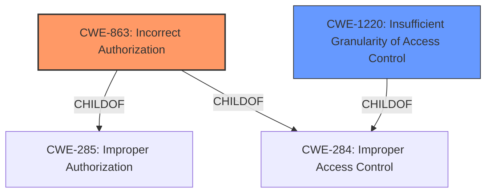

# Enhanced Analysis for CVE-2021-45091

# Summary
| CWE ID | CWE Name | Confidence | CWE Abstraction Level | CWE Vulnerability Mapping Label | CWE-Vulnerability Mapping Notes |
|---|---|---|---|---|---|
| CWE-863 | Incorrect Authorization | 0.9 | Class | Primary | Allowed-with-Review |
| CWE-1220 | Insufficient Granularity of Access Control | 0.7 | Base | Secondary | Allowed |

## Evidence and Confidence

*   **Confidence Score:** 0.8
*   **Evidence Strength:** HIGH

## Relationship Analysis
The primary CWE is CWE-863 **Incorrect Authorization** (Class). CWE-863 is a child of CWE-285 **Improper Authorization** (Class) and CWE-284 **Improper Access Control** (Pillar). The secondary CWE is CWE-1220 **Insufficient Granularity of Access Control** (Base) which is a child of CWE-284 **Improper Access Control** (Pillar).



## Vulnerability Chain
The vulnerability chain starts with **incorrect access control** (**ROOTCAUSE**), leading to the ability to forge system logs. This allows an attacker to inject incorrect system logs, which has a low impact on integrity.

## Summary of Analysis
The vulnerability description states that Stormshield Endpoint Security from 2.1.0 to 2.1.1 has **Incorrect Access Control**. The CVE Reference Links Content Summary further elaborates that the **ROOT CAUSE** is an unspecified vulnerability that allows an authenticated user to forge system logs, achieved by bypassing an access check.

The Retriever Results identify several candidate CWEs. The primary candidate is CWE-863 **Incorrect Authorization** (Class), with a high relevance score. The description of CWE-863, "The product performs an authorization check when an actor attempts to access a resource or perform an action, but it does not correctly perform the check," aligns well with the vulnerability where an access check is bypassed. The next candidate is CWE-1220 **Insufficient Granularity of Access Control** (Base) with a high relevance score. The description of CWE-1220, "The product implements access controls via a policy or other feature with the intention to disable or restrict accesses (reads and/or writes) to assets in a system from untrusted agents. However, implemented access controls lack required granularity, which renders the control policy too broad because it allows accesses from unauthorized agents to the security-sensitive assets" also aligns well.

CWE-284 **Improper Access Control** (Pillar) is too high-level as it is a pillar CWE. Although the vulnerability description contains the term "**incorrect access control**", the Retriever Results suggest more specific CWEs. CWE-306 **Missing Authentication for Critical Function** (Base) does not fit since the attacker is authenticated. CWE-732 **Incorrect Permission Assignment for Critical Resource** (Class) doesn't fit the vulnerability description.

Based on the analysis, the primary CWE is CWE-863 **Incorrect Authorization** (Class) because the authorization check is not correctly performed, allowing a bypass. The secondary CWE is CWE-1220 **Insufficient Granularity of Access Control** (Base). This provides more detail about the access control, and is often set by BIOS/bootloader.

Relevant CWE Information:
- CWE-863: Incorrect Authorization
- CWE-1220: Insufficient Granularity of Access Control


## CWE Relationship Analysis

Current CWEs represent these abstraction levels: .


### Vulnerability Chain Analysis

**Chain starting from CWE-732:**
- 732 (Incorrect Permission Assignment for Critical Resource) - ROOT


**Chain starting from CWE-306:**
- 306 (Missing Authentication for Critical Function) - ROOT


### CWE Relationship Diagram

```mermaid
graph TD
    classDef primary fill:#f96,stroke:#333,stroke-width:2px
    classDef secondary fill:#69f,stroke:#333
    classDef tertiary fill:#9e9,stroke:#333
```