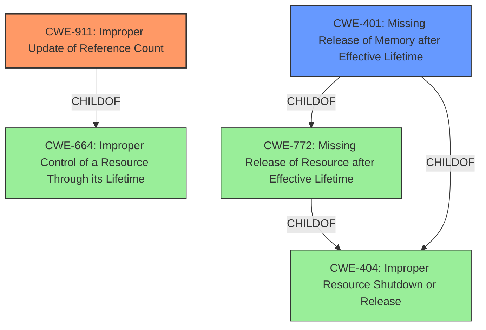

# Enhanced Analysis for CVE-2021-45095

# Summary
| CWE ID  | CWE Name                                                                               | Confidence | CWE Abstraction Level | CWE Vulnerability Mapping Label | CWE-Vulnerability Mapping Notes |
| :-------- | :--------------------------------------------------------------------------------------- | :---------- | :---------------------- | :------------------------------ | :------------------------------ |
| CWE-911   | Improper Update of Reference Count                                                     | 1          | Base                    | Primary                         | Allowed                         |
| CWE-401   | Missing Release of Memory after Effective Lifetime                                     | 0.7        | Variant                 | Secondary                       | Allowed                         |

## Evidence and Confidence

*   **Confidence Score:** 0.85
*   **Evidence Strength:** HIGH

## Relationship Analysis
The primary CWE is CWE-911, which is a Base level CWE and a child of CWE-664 (Improper Control of a Resource Through its Lifetime). CWE-401 is a Variant of CWE-772 (Missing Release of Resource after Effective Lifetime) and CWE-404 (Improper Resource Shutdown or Release). The relationship analysis shows that CWE-911 is the more direct cause of the vulnerability, and CWE-401 is a related impact of the missing resource release.



## Vulnerability Chain
The vulnerability chain starts with a **refcount leak** due to a missing decrement in the reference count when `pep_accept_conn()` fails within the `pep_sock_accept()` function. This leads to a resource leak, which, if repeatedly exploited, can result in resource exhaustion and a denial of service.

## Summary of Analysis
The primary weakness is the **refcount leak** due to the **improper update of the reference count**. This is supported by the vulnerability description, which clearly states "**refcount leak**" and the CVE Reference Links Content Summary, which states "A socket's reference count is incremented... However, in certain error scenarios... the corresponding decrement... is missing. This leads to a reference count leak."

CWE-911 (Improper Update of Reference Count) accurately describes this root cause. The reference count is not correctly decremented, leading to the leak.

CWE-401 (Missing Release of Memory after Effective Lifetime) is a consequence of the **refcount leak**, as the memory associated with the socket is not released when it should be.

The selection of CWE-911 as primary and CWE-401 as secondary is based on the specific details provided in the vulnerability description and the CVE Reference Links Content Summary. The evidence strongly supports that the **improper update of the reference count** is the root cause, leading to the memory not being released.
CWE-911 is a base level CWE, and CWE-401 is a variant, which is the optimal level of specificity.

Other CWEs Considered:
- CWE-415 (Double Free): While related to memory management, this vulnerability does not involve freeing the same memory twice, but rather failing to release memory that should be freed.
- CWE-772 (Missing Release of Resource after Effective Lifetime): While related, CWE-401 is a more specific variant of this CWE that deals specifically with memory, making it a better fit as a secondary CWE.
- CWE-362 (Concurrent Execution using Shared Resource with Improper Synchronization ('Race Condition')): This CWE is not relevant as there is no mention of concurrency or synchronization issues in the description.
- CWE-665 (Improper Initialization) and CWE-909 (Missing Initialization of Resource): These are not relevant as the vulnerability is related to releasing a resource and not its initialization.
Relevant CWE Information:

# Enhanced Context (25 CWEs)
The following CWEs were identified as potentially relevant to this vulnerability:

## CWE-208: Observable Timing Discrepancy
**Abstraction Level**: Base
**Similarity Score**: 0.80
**Source**: dense

**Description**:
Two separate operations in a product require different amounts of time to complete, in a way that is observable to an actor and reveals security-relevant information about the state of the product, such as whether a particular operation was successful or not.

**Mapping Guidance**:
- Usage: Allowed
- Rationale: This CWE entry is at the Base level of abstraction, which is a preferred level of abstraction for mapping to the root causes of vulnerabilities.


## CWE-667: Improper Locking
**Abstraction Level**: Class
**Similarity Score**: 0.78
**Source**: dense

**Description**:
The product does not properly acquire or release a lock on a resource, leading to unexpected resource state changes and behaviors.

**Mapping Guidance**:
- Usage: Allowed-with-Review
- Rationale: This CWE entry is a Class and might have Base-level children that would be more appropriate


## CWE-362: Concurrent Execution using Shared Resource with Improper Synchronization ('Race Condition')
**Abstraction Level**: Class
**Similarity Score**: 0.77
**Source**: dense

**Description**:
The product contains a concurrent code sequence that requires temporary, exclusive access to a shared resource, but a timing window exists in which the shared resource can be modified by another code sequence operating concurrently.

**Mapping Guidance**:
- Usage: Allowed-with-Review
- Rationale: This CWE entry is a Class and might have Base-level children that would be more appropriate


## CWE-226: Sensitive Information in Resource Not Removed Before Reuse
**Abstraction Level**: Base
**Similarity Score**: 0.77
**Source**: dense

**Description**:
The product releases a resource such as memory or a file so that it can be made available for reuse, but it does not clear or "zeroize" the information contained in the resource before the product performs a critical state transition or makes the resource available for reuse by other entities.

**Mapping Guidance**:
- Usage: Allowed
- Rationale: This CWE entry is at the Base level of abstraction, which is a preferred level of abstraction for mapping to the root causes of vulnerabilities.


## CWE-404: Improper Resource Shutdown or Release
**Abstraction Level**: Class
**Similarity Score**: 0.77
**Source**: dense

**Description**:
The product does not release or incorrectly releases a resource before it is made available for re-use.

**Mapping Guidance**:
- Usage: Allowed-with-Review
- Rationale: This CWE entry is a Class and might have Base-level children that would be more appropriate


## CWE-662: Improper Synchronization
**Abstraction Level**: Class
**Similarity Score**: 0.77
**Source**: dense

**Description**:
The product utilizes multiple threads or processes to allow temporary access to a shared resource that can only be exclusive to one process at a time, but it does not properly synchronize these actions, which might cause simultaneous accesses of this resource by multiple threads or processes.

**Mapping Guidance**:
- Usage: Discouraged
- Rationale: This CWE entry is a level-1 Class (i.e., a child of a Pillar). It might have lower-level children that would be more appropriate


## CWE-131: Incorrect Calculation of Buffer Size
**Abstraction Level**: Base
**Similarity Score**: 0.76
**Source**: dense

**Description**:
The product does not correctly calculate the size to be used when allocating a buffer, which could lead to a buffer overflow.

**Mapping Guidance**:
- Usage: Allowed
- Rationale: This CWE entry is at the Base level of abstraction, which is a preferred level of abstraction for mapping to the root causes of vulnerabilities.


## CWE-203: Observable Discrepancy
**Abstraction Level**: Base
**Similarity Score**: 0.76
**Source**: dense

**Description**:
The product behaves differently or sends different responses under different circumstances in a way that is observable to an unauthorized actor, which exposes security-relevant information about the state of the product, such as whether a particular operation was successful or not.

**Mapping Guidance**:
- Usage: Allowed
- Rationale: This CWE entry is at the Base level of abstraction, which is a preferred level of abstraction for mapping to the root causes of vulnerabilities.


## CWE-754: Improper Check for Unusual or


## CWE Relationship Analysis

Current CWEs represent these abstraction levels: .


### Vulnerability Chain Analysis

**Chain starting from CWE-667:**
- 667 (Improper Locking) - ROOT


**Chain starting from CWE-415:**
- 415 (Double Free) - ROOT


### CWE Relationship Diagram

```mermaid
graph TD
    classDef primary fill:#f96,stroke:#333,stroke-width:2px
    classDef secondary fill:#69f,stroke:#333
    classDef tertiary fill:#9e9,stroke:#333
```