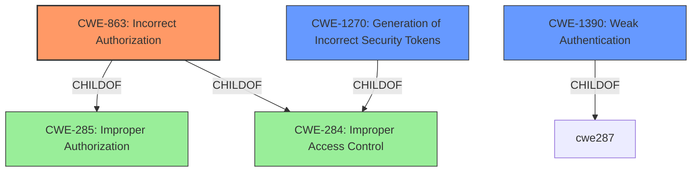

# Raw Analyzer Response for CVE-2021-45102

# Summary
| CWE ID | CWE Name | Confidence | CWE Abstraction Level | CWE Vulnerability Mapping Label | CWE-Vulnerability Mapping Notes |
|---|---|---|---|---|---|
| **CWE-863** | **Incorrect Authorization** | 0.9 | Class | Primary | Allowed-with-Review |
| CWE-1270 | Generation of Incorrect Security Tokens | 0.7 | Base | Secondary | Allowed |
| CWE-1390 | Weak Authentication | 0.6 | Class | Secondary | Allowed-with-Review |

## Evidence and Confidence

*   **Confidence Score:** 0.8
*   **Evidence Strength:** HIGH

## Relationship Analysis
The primary CWE is CWE-863 (Incorrect Authorization), which is a Class-level CWE. While there are potential Base-level CWEs such as CWE-1270 (Generation of Incorrect Security Tokens), the evidence suggests that the core issue is an authorization **check** that is performed incorrectly, rather than a problem with token generation *per se*.

CWE-863 is a child of CWE-285 (Improper Authorization) and CWE-284 (Improper Access Control). This indicates a hierarchical relationship where CWE-863 is a more specific type of improper access control.

CWE-1390 (Weak Authentication) is also considered because authentication is a prerequisite for authorization. However, the vulnerability description focuses on incorrect authorization after authentication, making CWE-863 a more direct fit.

## Vulnerability Chain
The vulnerability chain starts with the **improper interpretation** of SciToken attributes, leading to **incorrect authorization**, and ultimately resulting in **unauthorized access** to resources.

Root Cause: **Improper interpretation** of SciToken attributes.
Weakness: **Incorrect Authorization (CWE-863)**.
Impact: Granted authorizations beyond what the token should allow.

## Summary of Analysis
The initial analysis strongly points to **CWE-863 (Incorrect Authorization)** as the primary weakness. The vulnerability description states that "a user may be granted authorizations beyond what the token should allow," which directly aligns with the definition of CWE-863: "The product performs an authorization check when an actor attempts to access a resource or perform an action, but it does not correctly perform the check."

The **CVE Reference Links Content Summary** section reinforces this by stating that the root cause is "Improper authorization checks when using SciTokens for authentication." It also highlights that the HTCondor daemon "grants authorizations beyond what the token should allow."

While other CWEs like CWE-1270 (Generation of Incorrect Security Tokens) and CWE-1390 (Weak Authentication) were considered, they don't fully capture the essence of the vulnerability. The issue isn't necessarily with the token generation itself (CWE-1270), but rather with how HTCondor **interprets** and **enforces** the authorizations encoded in the token (CWE-863). Similarly, while weak authentication *could* be a factor, the core issue is that even after authentication, the authorization is flawed.

The selection of CWE-863 is at the optimal level of specificity because it directly addresses the incorrect authorization check. The other candidate CWEs were considered, but determined to be less accurate representations of the vulnerability based on the available evidence.

Relevant CWE Information:

# Enhanced Context (25 CWEs)
The following CWEs were identified as potentially relevant to this vulnerability:

## CWE-274: Improper Handling of Insufficient Privileges
**Abstraction Level**: Base
**Similarity Score**: 0.78
**Source**: dense

**Description**:
The product does not handle or incorrectly handles when it has insufficient privileges to perform an operation, leading to resultant weaknesses.

**Mapping Guidance**:
- Usage: Discouraged
- Rationale: This CWE entry could be deprecated in a future version of CWE.

## CWE-266: Incorrect Privilege Assignment
**Abstraction Level**: Base
**Similarity Score**: 0.78
**Source**: dense

**Description**:
A product incorrectly assigns a privilege to a particular actor, creating an unintended sphere of control for that actor.

**Mapping Guidance**:
- Usage: Allowed
- Rationale: This CWE entry is at the Base level of abstraction, which is a preferred level of abstraction for mapping to the root causes of vulnerabilities.

## CWE-280: Improper Handling of Insufficient Permissions or Privileges
**Abstraction Level**: Base
**Similarity Score**: 0.77
**Source**: dense

**Description**:
The product does not handle or incorrectly handles when it has insufficient privileges to access resources or functionality as specified by their permissions. This may cause it to follow unexpected code paths that may leave the product in an invalid state.

**Mapping Guidance**:
- Usage: Allowed
- Rationale: This CWE entry is at the Base level of abstraction, which is a preferred level of abstraction for mapping to the root causes of vulnerabilities.

## CWE-653: Improper Isolation or Compartmentalization
**Abstraction Level**: Class
**Similarity Score**: 0.76
**Source**: dense

**Description**:
The product does not properly compartmentalize or isolate functionality, processes, or resources that require different privilege levels, rights, or permissions.

**Mapping Guidance**:
- Usage: Allowed
- Rationale: This CWE entry is at the Base level of abstraction, which is a preferred level of abstraction for mapping to the root causes of vulnerabilities.

## CWE-267: Privilege Defined With Unsafe Actions
**Abstraction Level**: Base
**Similarity Score**: 0.75
**Source**: dense

**Description**:
A particular privilege, role, capability, or right can be used to perform unsafe actions that were not intended, even when it is assigned to the correct entity.

**Mapping Guidance**:
- Usage: Allowed
- Rationale: This CWE entry is at the Base level of abstraction, which is a preferred level of abstraction for mapping to the root causes of vulnerabilities.

## CWE-303: Incorrect Implementation of Authentication Algorithm
**Abstraction Level**: Base
**Similarity Score**: 0.75
**Source**: dense

**Description**:
The requirements for the product dictate the use of an established authentication algorithm, but the implementation of the algorithm is incorrect.

**Mapping Guidance**:
- Usage: Allowed
- Rationale: This CWE entry is at the Base level of abstraction, which is a preferred level of abstraction for mapping to the root causes of vulnerabilities.

## CWE-807: Reliance on Untrusted Inputs in a Security Decision
**Abstraction Level**: Base
**Similarity Score**: 0.75
**Source**: dense

**Description**:
The product uses a protection mechanism that relies on the existence or values of an input, but the input can be modified by an untrusted actor in a way that bypasses the protection mechanism.

**Mapping Guidance**:
- Usage: Allowed
- Rationale: This CWE entry is at the Base level of abstraction, which is a preferred level of abstraction for mapping to the root causes of vulnerabilities.

## CWE-1390: Weak Authentication
**Abstraction Level**: Class
**Similarity Score**: 0.75
**Source**: dense

**Description**:
The product uses an authentication mechanism to restrict access to specific users or identities, but the mechanism does not sufficiently prove that the claimed identity is correct.

**Mapping Guidance**:
- Usage: Allowed-with-Review
- Rationale: This CWE entry is a Class and might have Base-level children that would be more appropriate

## CWE-668: Exposure of Resource to Wrong Sphere
**Abstraction Level**: Class
**Similarity Score**: 0.75
**Source**: dense

**Description**:
The product exposes a resource to the wrong control sphere, providing unintended actors with inappropriate access to the resource.

**Mapping Guidance**:
- Usage: Discouraged
- Rationale: CWE-668 is high-level and is often misused as a catch-all when lower-level CWE IDs might be applicable. It is sometimes used for low-information vulnerability reports [REF-1287]. It is a level-1 Class (i.e., a child of a Pillar). It is not useful for trend