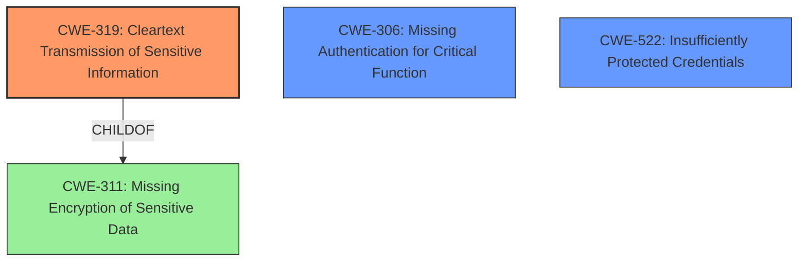

# Enhanced Analysis for CVE-2021-45104

# Summary
| CWE ID | CWE Name | Confidence | CWE Abstraction Level | CWE Vulnerability Mapping Label | CWE-Vulnerability Mapping Notes |
|---|---|---|---|---|---|
| CWE-319 | Cleartext Transmission of Sensitive Information | 1.0 | Base | Allowed | Primary CWE |
| CWE-306 | Missing Authentication for Critical Function | 0.7 | Base | Allowed | Secondary Candidate |
| CWE-522 | Insufficiently Protected Credentials | 0.6 | Class | Allowed-with-Review | Secondary Candidate |

## Evidence and Confidence

*   **Confidence Score:** 0.9
*   **Evidence Strength:** HIGH

## Relationship Analysis
The primary relationship influencing the decision is the ChildOf relationship between CWE-319 and CWE-311 (Improperly Protected Communication Channel). While CWE-311 is a parent class, CWE-319 is more specific and directly addresses the core issue of transmitting sensitive information in cleartext. CWE-306 and CWE-522 were considered due to their relevance to authentication and credential protection, but CWE-319 was chosen as the primary CWE because the vulnerability description highlights the **cleartext transmission** as the most direct root cause.



## Vulnerability Chain
The chain of events leading to the vulnerability is as follows:
1.  **WEAKNESS**: Use of weaker encryption protocols (BLOWFISH or 3DES) and enabled match password authentication.
2.  **ROOTCAUSE**: Sensitive authentication information is transmitted over the network in cleartext.
3.  **IMPACT**: An attacker captures this data and manipulates user jobs, impersonates users, or controls resources.

CWE-319 directly represents the **ROOTCAUSE**. CWE-306 and CWE-522 represent potential related weaknesses due to missing/insufficient authentication and credential protection respectively but are secondary in this case.

## Summary of Analysis
The initial analysis focused on identifying the root cause of the vulnerability based on the provided evidence. The "CVE Reference Links Content Summary" section clearly states that the vulnerability stems from the **cleartext transmission** of secret information due to weaker encryption protocols and enabled match password authentication.

The primary evidence supporting CWE-319 is: "In such cases, secret information used for authentication is sent over the network in clear text."

The retriever results also support this, with CWE-319 being the top combined result.

CWE-306 (Missing Authentication for Critical Function) was considered, but ultimately deemed less accurate because the system does have authentication mechanisms in place; the problem is that these mechanisms are vulnerable due to the **cleartext transmission** of secrets. Similarly, CWE-522 (Insufficiently Protected Credentials) was considered because the credentials are not adequately protected during transmission. However, CWE-319 more directly addresses the core issue.

The final decision to map to CWE-319 is based on the direct evidence of **cleartext transmission** and its alignment with the CWE's description. This CWE is at the Base level of abstraction, which is appropriate for identifying the specific flaw in the system.

Relevant CWE Information:

# Enhanced Context (25 CWEs)

## CWE-74: Improper Neutralization of Special Elements in Output Used by a Downstream Component ('Injection')
**Abstraction Level**: Class
**Similarity Score**: 0.79
**Source**: dense

**Description**:
The product constructs all or part of a command, data structure, or record using externally-influenced input from an upstream component, but it does not neutralize or incorrectly neutralizes special elements that could modify how it is parsed or interpreted when it is sent to a downstream component.

**Mapping Guidance**:
- Usage: Discouraged
- Rationale: CWE-74 is high-level and often misused when lower-level weaknesses are more appropriate.

*Not Selected*: This CWE is too generic and does not accurately represent the specific vulnerability of transmitting sensitive information in cleartext.

## CWE-918: Server-Side Request Forgery (SSRF)
**Abstraction Level**: Base
**Similarity Score**: 0.78
**Source**: dense

**Description**:
The web server receives a URL or similar request from an upstream component and retrieves the contents of this URL, but it does not sufficiently ensure that the request is being sent to the expected destination.

**Mapping Guidance**:
- Usage: Allowed
- Rationale: This CWE entry is at the Base level of abstraction, which is a preferred level of abstraction for mapping to the root causes of vulnerabilities.

*Not Selected*: This CWE is not relevant to the vulnerability described, as it focuses on server-side request forgery, which is not the issue in this case.

## CWE-113: Improper Neutralization of CRLF Sequences in HTTP Headers ('HTTP Request/Response Splitting')
**Abstraction Level**: Variant
**Similarity Score**: 0.77
**Source**: dense

**Description**:
The product receives data from an HTTP agent/component (e.g., web server, proxy, browser, etc.), but it does not neutralize or incorrectly neutralizes CR and LF characters before the data is included in outgoing HTTP headers.

**Mapping Guidance**:
- Usage: Allowed
- Rationale: This CWE entry is at the Variant level of abstraction, which is a preferred level of abstraction for mapping to the root causes of vulnerabilities.

*Not Selected*: This CWE is not relevant, as the vulnerability does not involve improper neutralization of CRLF sequences.

## CWE-319: Cleartext Transmission of Sensitive Information
**Abstraction Level**: Base
**Similarity Score**: 0.77
**Source**: dense

**Description**:
The product transmits sensitive or security-critical data in cleartext in a communication channel that can be sniffed by unauthorized actors.

**Mapping Guidance**:
- Usage: Allowed
- Rationale: This CWE entry is at the Base level of abstraction, which is a preferred level of abstraction for mapping to the root causes of vulnerabilities.

*Selected*: This is the primary CWE as it directly addresses the vulnerability of transmitting sensitive information in cleartext.

## CWE-807: Reliance on Untrusted Inputs in a Security Decision
**Abstraction Level**: Base
**Similarity Score**: 0.76
**Source**: dense

**Description**:
The product uses a protection mechanism that relies on the existence or values of an input, but the input can be modified by an untrusted actor in a way that bypasses the protection mechanism.

**Mapping Guidance**:
- Usage: Allowed
- Rationale: This CWE entry is at the Base level of abstraction, which is a preferred level of abstraction for mapping to the root causes of vulnerabilities.

*Not Selected*: This CWE is not relevant, as the vulnerability does not primarily involve reliance on untrusted inputs for security decisions.

## CWE-41: Improper Resolution of Path Equivalence
**Abstraction Level**: Base
**Similarity Score**: 0.76
**Source**: dense

**Description**:
The product is vulnerable to file system contents disclosure through path equivalence. Path equivalence involves the use of special characters in file and directory names. The associated manipulations are intended to generate multiple names for the same object.

**Mapping Guidance**:
- Usage: Allowed
- Rationale: This CWE entry is at the Base level of abstraction, which is a preferred level of abstraction for mapping to the root causes of vulnerabilities.

*Not Selected*: This CWE is not relevant, as the vulnerability does not involve path equivalence issues.

## CWE-668: Exposure of Resource to Wrong Sphere
**Abstraction Level**: Class
**Similarity Score**: 0.76
**Source**: dense

**Description**:
The product exposes a resource to the wrong control sphere, providing unintended actors with inappropriate access to the resource.

**Mapping Guidance**:
- Usage: Discouraged
- Rationale: CWE-668 is high-level and is often misused as a catch-all when lower-level CWE IDs might be applicable. It is sometimes used for low-information vulnerability reports [REF-1287]. It is a level-1 Class (i.e., a child of a Pillar). It is not useful for trend analysis.

*Not Selected*: This CWE is too general and there are more specific CWEs that better describe the vulnerability.

## CWE-204: Observable Response Discrepancy
**Abstraction Level**: Base
**Similarity Score**: 0.76
**Source**: dense

**Description**:
The product provides different responses to incoming requests in a way that reveals internal state information to an unauthorized actor outside of the intended control sphere.

**Mapping Guidance**:
- Usage: Allowed
- Rationale: This


## CWE Relationship Analysis

Current CWEs represent these abstraction levels: .


### Vulnerability Chain Analysis

**Chain starting from CWE-113:**
- 113 (Improper Neutralization of CRLF Sequences in HTTP Headers ('HTTP Request/Response Splitting')) - ROOT


**Chain starting from CWE-306:**
- 306 (Missing Authentication for Critical Function) - ROOT


### CWE Relationship Diagram

```mermaid
graph TD
    classDef primary fill:#f96,stroke:#333,stroke-width:2px
    classDef secondary fill:#69f,stroke:#333
    classDef tertiary fill:#9e9,stroke:#333
```