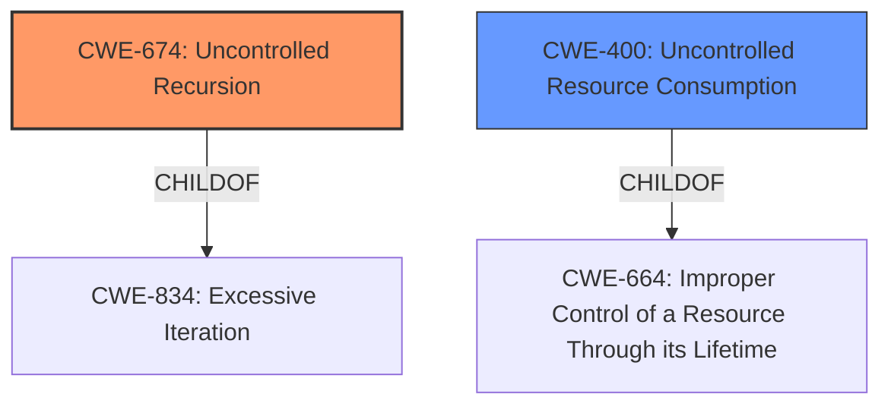

# Analysis for CVE-2021-45105

# Summary
| CWE ID | CWE Name | Confidence | CWE Abstraction Level | CWE Vulnerability Mapping Label | CWE-Vulnerability Mapping Notes |
|---|---|---|---|---|---|
| CWE-674 | Uncontrolled Recursion | 1.0 | Class | Allowed-with-Review | Primary CWE |
| CWE-400 | Uncontrolled Resource Consumption | 0.7 | Class | Discouraged | Secondary Candidate |

## Evidence and Confidence

*   **Confidence Score:** 0.9
*   **Evidence Strength:** HIGH

## Relationship Analysis
The primary CWE is CWE-674, which is a class-level CWE. It is related to CWE-834 (Excessive Iteration) through a ChildOf relationship. CWE-400 is also considered, having a ChildOf relationship with CWE-664. The vulnerability involves **uncontrolled recursion**, which directly aligns with CWE-674. The graph relationships show that uncontrolled recursion can lead to resource consumption, hence the consideration of CWE-400.

## Vulnerability Chain
The vulnerability chain starts with the **uncontrolled recursion** (**CWE-674**), which leads to excessive resource consumption, ultimately causing a denial of service.
  - Root Cause: **Uncontrolled Recursion** (CWE-674)
  - Impact: Denial of Service (DoS) through resource exhaustion, which can be mapped to **CWE-400**.

## Summary of Analysis
The initial analysis focused on identifying the root cause of the denial-of-service vulnerability in Apache Log4j2. The vulnerability description explicitly mentions **"uncontrolled recursion"** as the weakness.

The **CVE Reference Links Content Summary** confirms this: "Log4j versions 2.0-alpha1 through 2.16.0 (excluding 2.3.1 and 2.12.3) did not protect from **uncontrolled recursion** that can be implemented using self-referential lookups." It further clarifies that this leads to a `StackOverflowError`, resulting in a denial-of-service (DoS) attack.

The Retriever Results also highlight **CWE-674 (Uncontrolled Recursion)**.

Given the explicit mention of **uncontrolled recursion** and its direct link to the denial of service, **CWE-674** is the most appropriate primary CWE. While **CWE-400 (Uncontrolled Resource Consumption)** is a related impact, **CWE-674** represents the underlying cause. The **CWE-674** is at the Class level of abstraction, and the retriever results suggest reviewing children to see if a better fit exists. However, no child CWE directly represents recursion.

Therefore, **CWE-674** is selected as the primary CWE due to its direct relevance to the **uncontrolled recursion** vulnerability, and **CWE-400** is considered as a secondary candidate, representing the broader impact of resource consumption.

Other CWEs Considered but Not Used:

*   **CWE-789 (Memory Allocation with Excessive Size Value)**: While recursion can lead to stack exhaustion and excessive memory usage, the core issue is the lack of control over the recursion depth, not necessarily the size of memory allocated in each recursive call.
*   **CWE-770 (Allocation of Resources Without Limits or Throttling)**: Similar to CWE-789, this is related to resource management but not the primary cause of the vulnerability, which is the **uncontrolled recursion** itself.
*   **CWE-917 (Improper Neutralization of Special Elements used in an Expression Language Statement ('Expression Language Injection'))**: This CWE addresses expression language injection vulnerabilities, which is not the primary issue here. The vulnerability stems from how Log4j2 handles self-referential lookups, leading to recursion.
*   **CWE-1325 (Improperly Controlled Sequential Memory Allocation)**: Is a memory allocation issue, but not as tightly linked to recursion
*   **CWE-405 (Asymmetric Resource Consumption (Amplification))**: This CWE relates to amplification, but the primary issue is uncontrolled recursion rather than amplification.

Relevant CWE Information:
- CWE-674: Uncontrolled Recursion
- CWE-400: Uncontrolled Resource Consumption