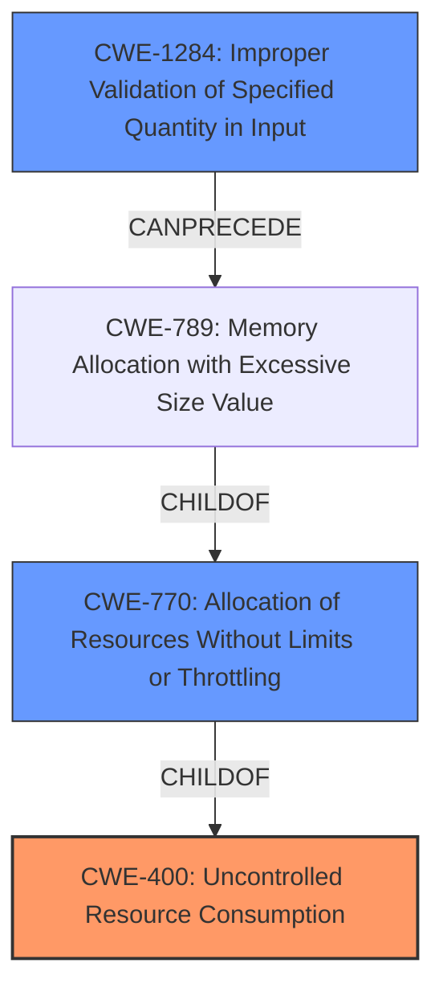

# Analysis Report for CVE-2021-45115

# Vulnerability Analysis Report: CVE-2021-45115

## Description


## Analysis (with Relationship Data)

# Summary
| CWE ID | CWE Name | Confidence | CWE Abstraction Level | CWE Vulnerability Mapping Label | CWE-Vulnerability Mapping Notes |
|---|---|---|---|---|---|
| CWE-400 | Uncontrolled Resource Consumption | 0.9 | Class | Primary | Discouraged |
| CWE-770 | Allocation of Resources Without Limits or Throttling | 0.8 | Base | Secondary | Allowed |
| CWE-1284 | Improper Validation of Specified Quantity in Input | 0.7 | Base | Secondary | Allowed |

## Evidence and Confidence

*   **Confidence Score:** 0.8
*   **Evidence Strength:** HIGH

## Relationship Analysis
The primary relationship influencing the selection is the hierarchical one. CWE-400 is a class-level CWE, with CWE-770 as a child (base) CWE. The analysis also considered CWE-1284 as it can precede CWE-789, which is a child of CWE-770, forming a potential chain. Since the vulnerability involves a large password leading to resource exhaustion, CWE-770 and CWE-1284 provide more specific details than the general CWE-400, but are still secondary because the description focuses on the uncontrolled aspect of the resource consumption more than the specific allocation or validation issues.



## Vulnerability Chain
The vulnerability chain starts with the user submitting a large password.
- The `UserAttributeSimilarityValidator` **fails to properly control or limit** the resources consumed when evaluating the password's similarity against user attributes (**ROOT CAUSE: CWE-400**).
- This leads to excessive resource allocation without limits (**CWE-770**)
- Possibly due to **improper validation of the password quantity** (**CWE-1284**).
- The uncontrolled resource consumption then causes a denial-of-service (**IMPACT**).

## Summary of Analysis
The initial analysis focused on the denial-of-service impact. However, further examination of the description and the reference links revealed the **ROOT CAUSE** to be the **uncontrolled resource consumption** within the `UserAttributeSimilarityValidator` component when handling an artificially large password. This led to the selection of CWE-400 as the primary CWE.

The vulnerability description states: "UserAttributeSimilarityValidator incurred significant overhead in evaluating a submitted password that was artificially large in relation to the comparison values. In a situation where access to user registration was unrestricted, this provided a potential vector for a denial-of-service attack."

The selection of CWE-400 is justified by the phrase "**significant overhead**" and the overall context of **uncontrolled resource consumption leading to denial-of-service**. CWE-400 is the best fit because the validator **fails to control** how much resource it consumes for large passwords.

CWE-770 (Allocation of Resources Without Limits or Throttling) and CWE-1284 (Improper Validation of Specified Quantity in Input) are included as secondary CWEs since the root cause is the lack of resource control (CWE-400), which could stem from a lack of limits when allocating resources (CWE-770) and/or a failure to validate the quantity/size of the input (CWE-1284).

The selected CWEs are at the optimal level of specificity because they represent the underlying weakness (CWE-400) and contributing factors (CWE-770, CWE-1284) that led to the denial-of-service.
While CWE-400 is Class level, the provided evidence focuses on the uncontrolled resource consumption aspect of the validator. If more information was provided about how memory was allocated or input was validated, then it would be possible to choose lower level CWEs.

Relevant CWE Information:

# Enhanced Context (25 CWEs)

## CWE-405: Asymmetric Resource Consumption (Amplification)
**Abstraction Level**: Class
**Similarity Score**: 0.79
**Source**: dense

**Description**:
The product does not properly control situations in which an adversary can cause the product to consume or produce excessive resources without requiring the adversary to invest equivalent work or otherwise prove authorization, i.e., the adversary's influence is "asymmetric."

**Mapping Guidance**:
- Usage: Allowed-with-Review
- Rationale: This CWE entry is a Class and might have Base-level children that would be more appropriate

**Why Not Used**: While the scenario involves amplification, the primary issue is the lack of control over resource consumption, not necessarily the asymmetric nature of the attack.

## CWE-799: Improper Control of Interaction Frequency
**Abstraction Level**: Class
**Similarity Score**: 0.76
**Source**: dense

**Description**:
The product does not properly limit the number or frequency of interactions that it has with an actor, such as the number of incoming requests.

**Mapping Guidance**:
- Usage: Allowed-with-Review
- Rationale: This CWE entry is a Class and might have Base-level children that would be more appropriate

**Why Not Used**: This CWE focuses on interaction frequency, which is not the primary issue in this vulnerability. The problem is the overhead in processing a single, large password, not the frequency of requests.

## CWE-404: Improper Resource Shutdown or Release
**Abstraction Level**: Class
**Similarity Score**: 0.75
**Source**: dense

**Description**:
The product does not release or incorrectly releases a resource before it is made available for re-use.

**Mapping Guidance**:
- Usage: Allowed-with-Review
- Rationale: This CWE entry is a Class and might have Base-level children that would be more appropriate

**Why Not Used**: The vulnerability description doesn't mention anything about resource release. The issue is the initial consumption, not the failure to release.

## CWE-226: Sensitive Information in Resource Not Removed Before Reuse
**Abstraction Level**: Base
**Similarity Score**: 0.74
**Source**: dense

**Description**:
The product releases a resource such as memory or a file so that it can be made available for reuse, but it does not clear or "zeroize" the information contained in the resource before the product performs a critical state transition or makes the resource available for reuse by other entities.

**Mapping Guidance**:
- Usage: Allowed
- Rationale: This CWE entry is at the Base level of abstraction, which is a preferred level of abstraction for mapping to the root causes of vulnerabilities.

**Why Not Used**: Not relevant, as the vulnerability doesn't involve sensitive information or resource reuse.

## CWE-1176: Inefficient CPU Computation
**Abstraction Level**: Class
**Similarity Score**: 0.74
**Source**: dense

**Description**:
The product performs CPU computations using
         algorithms that are not as efficient as they could be for the
         needs of the developer, i.e., the computations can be
         optimized further.

**Mapping Guidance**:
- Usage: Allowed-with-Review
- Rationale: This CWE entry is a Class and might have Base-level children that would be more appropriate

**Why Not Used**: While inefficiency is present, the core issue is the lack of control over resource consumption when processing a large input, which can be separate from the efficiency of the underlying algorithm.

## CWE-307: Improper Restriction of Excessive Authentication Attempts
**Abstraction Level**: Base
**Similarity Score**: 0.74
**Source**: dense

**Description**:
The product does not implement sufficient measures to prevent multiple failed authentication attempts within a short time frame.

**Mapping Guidance**:
- Usage: Allowed
- Rationale: This CWE entry is at the Base level of abstraction, which is a preferred level of abstraction for mapping to the root causes of vulnerabilities.

**Why Not Used**: The description does not focus on multiple failed authentication attempts. It describes a single, resource-intensive evaluation.

## CWE-407: Inefficient Algorithmic Complexity
**Abstraction Level**: Class
**Similarity Score**: 0.74
**Source**: dense

**Description**:
An algorithm in a product has an inefficient worst-case computational complexity that may be detrimental to system performance and can be triggered by an attacker, typically using crafted manipulations that ensure that the worst case is being reached.

**Mapping Guidance**:
- Usage: Allowed-with-Review
- Rationale: This CWE entry is a Class and might have Base-level children that would be more appropriate

**Why Not Used**:


## CWE Relationship Analysis

Current CWEs represent these abstraction levels: .


### Vulnerability Chain Analysis

**Chain starting from CWE-404:**
- 404 (Improper Resource Shutdown or Release) - ROOT


**Chain starting from CWE-1176:**
- 1176 (Inefficient CPU Computation) - ROOT


### CWE Relationship Diagram

```mermaid
graph TD
    classDef primary fill:#f96,stroke:#333,stroke-width:2px
    classDef secondary fill:#69f,stroke:#333
    classDef tertiary fill:#9e9,stroke:#333
```


*Report generated on 2025-04-02 11:52:07*
