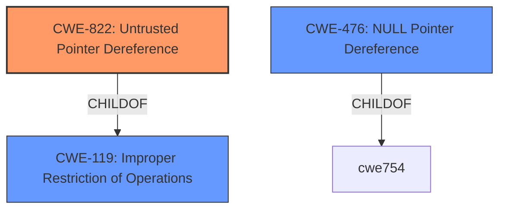

# Analysis Report for CVE-2021-45293

# Vulnerability Analysis Report: CVE-2021-45293

## Description


## Analysis (with Relationship Data)

# Summary
| CWE ID | CWE Name | Confidence | CWE Abstraction Level | CWE Vulnerability Mapping Label | CWE-Vulnerability Mapping Notes |
|---|---|---|---|---|---|
| CWE-822 | Untrusted Pointer Dereference | 0.9 | Base | Allowed | Primary CWE |
| CWE-476 | NULL Pointer Dereference | 0.7 | Base | Allowed | Secondary Candidate |
| CWE-119 | Improper Restriction of Operations within the Bounds of a Memory Buffer | 0.6 | Class | Discouraged | Secondary Candidate |

## Evidence and Confidence

*   **Confidence Score:** 0.9
*   **Evidence Strength:** HIGH

## Relationship Analysis
The primary CWE, CWE-822 **Untrusted Pointer Dereference**, is a base-level CWE with a direct connection to the vulnerability's root cause, **invalid memory address dereference**. It's a child of CWE-119, which represents a broader class of memory buffer errors. The relationship informs the selection of the base CWE instead of the class CWE. CWE-476 **NULL Pointer Dereference** is considered as a secondary CWE due to the potential for the invalid pointer to be a NULL pointer, though the description does not explicitly state this.



## Vulnerability Chain
The vulnerability chain begins with the **invalid memory address dereference** (CWE-822), leading directly to a denial of service. There isn't an explicit chain of weaknesses beyond the root cause and its immediate impact, but the potential for a null pointer dereference (CWE-476) exists if the invalid pointer is NULL.

## Summary of Analysis
The initial assessment strongly points towards CWE-822 **Untrusted Pointer Dereference** as the primary weakness, given the **invalid memory address dereference** reported in the vulnerability description and CVE Reference Links Content Summary. The code attempts to access memory at an address calculated using `rdx + 0x38`, where `rdx` could potentially be an invalid pointer. This aligns with the CWE's description: "The product obtains a value from an untrusted source, converts this value to a pointer, and dereferences the resulting pointer." The vulnerability leads to a denial-of-service (DoS) condition, which is a common impact of such memory access issues.

CWE-476 **NULL Pointer Dereference** and CWE-119 **Improper Restriction of Operations within the Bounds of a Memory Buffer** were considered. CWE-476 is plausible if the invalid pointer turns out to be NULL, but there is no explicit mention of NULL in the vulnerability description. CWE-119 is a broader category that encompasses out-of-bounds access, but CWE-822 is a more precise classification for the specific scenario of dereferencing an untrusted pointer.

The selection of CWE-822 is at the optimal level of specificity (Base). It directly reflects the **root cause** of the vulnerability, aligning with the CWE's guidelines and observed examples.


## CWE Relationship Analysis

Current CWEs represent these abstraction levels: .


### Vulnerability Chain Analysis

**Chain starting from CWE-822:**
- 822 (Untrusted Pointer Dereference) - ROOT


**Chain starting from CWE-119:**
- 119 (Improper Restriction of Operations within the Bounds of a Memory Buffer) - ROOT


### CWE Relationship Diagram

```mermaid
graph TD
    classDef primary fill:#f96,stroke:#333,stroke-width:2px
    classDef secondary fill:#69f,stroke:#333
    classDef tertiary fill:#9e9,stroke:#333
```


*Report generated on 2025-04-02 15:32:55*
