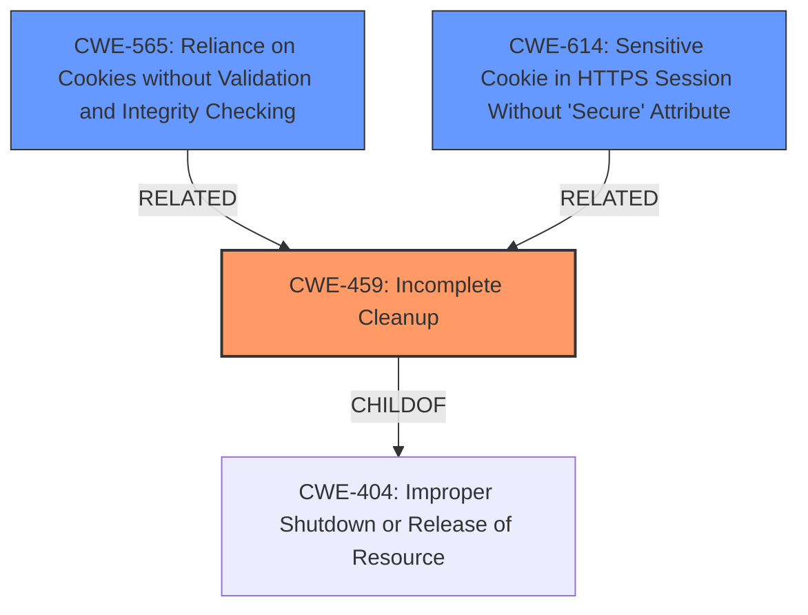

# Analysis for CVE-2021-45330

# Summary
| CWE ID | CWE Name | Confidence | CWE Abstraction Level | CWE Vulnerability Mapping Label | CWE-Vulnerability Mapping Notes |
|---|---|---|---|---|---|
| CWE-459 | Incomplete Cleanup | 0.9 | Base | Allowed | Primary CWE |
| CWE-565 | Reliance on Cookies without Validation and Integrity Checking | 0.6 | Base | Allowed | Secondary Candidate |
| CWE-614 | Sensitive Cookie in HTTPS Session Without 'Secure' Attribute | 0.5 | Variant | Allowed | Secondary Candidate |

## Evidence and Confidence

*   **Confidence Score:** 0.9
*   **Evidence Strength:** HIGH

## Relationship Analysis
The primary CWE, CWE-459 (Incomplete Cleanup), has a direct relationship with CWE-404 as a child, indicating a specific type of resource management issue. The secondary CWEs, CWE-565 and CWE-614, relate to cookie handling. CWE-565 is a broader issue of reliance on cookies without proper validation, while CWE-614 focuses on the missing 'Secure' attribute in HTTPS sessions, which relates to secure transmission.

## Vulnerability Chain
The vulnerability chain starts with the **failure to properly clean up** the server-side session after a user logs out (**CWE-459**). This leads to a situation where the session remains active on the server, even though the client-side cookies are deleted. If an attacker can then obtain and reuse the session identifier, they can gain unauthorized access.
  - **Root Cause:** **CWE-459** Incomplete Cleanup (server-side session not invalidated)
  - **Weakness:** Session remains active server-side
  - **Impact:** Unauthorized access if session identifier is compromised

## Summary of Analysis
The initial analysis focused on the **root cause**, which is the **client side cookies not being deleted** and the session remains valid on the server side for reuse, leading to potential privilege escalation. The primary CWE selected is CWE-459 (Incomplete Cleanup), because the **server-side session isn't properly terminated** when a user logs out, representing a **failure to properly clean up resources** after use. This aligns with the vulnerability description and key phrases.

The Retriever Results also suggested considering CWE-565 (Reliance on Cookies without Validation and Integrity Checking) and CWE-614 (Sensitive Cookie in HTTPS Session Without 'Secure' Attribute). While relevant, these are secondary because they focus more on cookie handling, whereas the **root cause** is the **server-side session management**.

The relationship analysis shows that CWE-459 is a child of CWE-404 (Improper Shutdown or Release of Resource), indicating that it's a specific type of resource management issue. The additional CWEs selected relate to handling of cookies.

Overall, the selected CWEs are at the optimal level of specificity because they directly address the **root cause** and contributing factors to the vulnerability, as supported by the evidence from the vulnerability description and CVE reference links. The highest confidence is assigned to CWE-459 because it best captures the **incomplete cleanup** aspect of the vulnerability.

Relevant CWE Information:

# Enhanced Context (25 CWEs)
The following CWEs were identified as potentially relevant to this vulnerability:

## CWE-807: Reliance on Untrusted Inputs in a Security Decision
**Abstraction Level**: Base
**Similarity Score**: 0.77
**Source**: dense

**Description**:
The product uses a protection mechanism that relies on the existence or values of an input, but the input can be modified by an untrusted actor in a way that bypasses the protection mechanism.

**Mapping Guidance**:
- Usage: Allowed
- Rationale: This CWE entry is at the Base level of abstraction, which is a preferred level of abstraction for mapping to the root causes of vulnerabilities.

## CWE-319: Cleartext Transmission of Sensitive Information
**Abstraction Level**: Base
**Similarity Score**: 0.76
**Source**: dense

**Description**:
The product transmits sensitive or security-critical data in cleartext in a communication channel that can be sniffed by unauthorized actors.

**Mapping Guidance**:
- Usage: Allowed
- Rationale: This CWE entry is at the Base level of abstraction, which is a preferred level of abstraction for mapping to the root causes of vulnerabilities.

## CWE-312: Cleartext Storage of Sensitive Information
**Abstraction Level**: Base
**Similarity Score**: 0.76
**Source**: dense

**Description**:
The product stores sensitive information in cleartext within a resource that might be accessible to another control sphere.

**Mapping Guidance**:
- Usage: Allowed
- Rationale: This CWE entry is at the Base level of abstraction, which is a preferred level of abstraction for mapping to the root causes of vulnerabilities.

## CWE-303: Incorrect Implementation of Authentication Algorithm
**Abstraction Level**: Base
**Similarity Score**: 0.75
**Source**: dense

**Description**:
The requirements for the product dictate the use of an established authentication algorithm, but the implementation of the algorithm is incorrect.

**Mapping Guidance**:
- Usage: Allowed
- Rationale: This CWE entry is at the Base level of abstraction, which is a preferred level of abstraction for mapping to the root causes of vulnerabilities.

## CWE-1390: Weak Authentication
**Abstraction Level**: Class
**Similarity Score**: 0.75
**Source**: dense

**Description**:
The product uses an authentication mechanism to restrict access to specific users or identities, but the mechanism does not sufficiently prove that the claimed identity is correct.

**Mapping Guidance**:
- Usage: Allowed-with-Review
- Rationale: This CWE entry is a Class and might have Base-level children that would be more appropriate

## CWE-1289: Improper Validation of Unsafe Equivalence in Input
**Abstraction Level**: Base
**Similarity Score**: 0.75
**Source**: dense

**Description**:
The product receives an input value that is used as a resource identifier or other type of reference, but it does not validate or incorrectly validates that the input is equivalent to a potentially-unsafe value.

**Mapping Guidance**:
- Usage: Allowed
- Rationale: This CWE entry is at the Base level of abstraction, which is a preferred level of abstraction for mapping to the root causes of vulnerabilities.

## CWE-212: Improper Removal of Sensitive Information Before Storage or Transfer
**Abstraction Level**: Base
**Similarity Score**: 0.75
**Source**: dense

**Description**:
The product stores, transfers, or shares a resource that contains sensitive information, but it does not properly remove that information before the product makes the resource available to unauthorized actors.

**Mapping Guidance**:
- Usage: Allowed
- Rationale: This CWE entry is at the Base level of abstraction, which is a preferred level of abstraction for mapping to the root causes of vulnerabilities.

## CWE-226: Sensitive Information in Resource Not Removed Before Reuse
**Abstraction Level**: Base
**Similarity Score**: 0.75
**Source**: dense

**Description**:
The product releases a resource such as memory or a file so that it can be made available for reuse, but it does not clear or "zeroize" the information contained in the resource before the product performs a critical state transition or makes the resource available for reuse by other entities.

**Mapping Guidance**:
- Usage: Allowed
- Rationale: This CWE entry is at the Base level of abstraction, which is a preferred level of abstraction for mapping to the root causes of vulnerabilities.

## CWE-1391: Use of Weak Credentials
**Abstraction Level**: Class
**Similarity Score**: 0.75
**Source**: dense

**Description**:
The product uses weak credentials (such as a default key or hard-coded password) that can be calculated, derived, reused, or guessed by an attacker.

**Mapping Guidance**:
- Usage: Allowed-with-Review
- Rationale: This CWE entry is a Class and might have Base-level children that would be more appropriate

## CWE-614: Sensitive Cookie in HTTPS Session Without 'Secure' Attribute
**Abstraction Level**: Variant
**Similarity Score**: 0.75
**Source**: dense

**Description**:
The Secure attribute for sensitive cookies in HTTPS sessions is not set, which could cause the user agent to send those cookies in plaintext over an HTTP session.

**Mapping Guidance**:
- Usage: Allowed