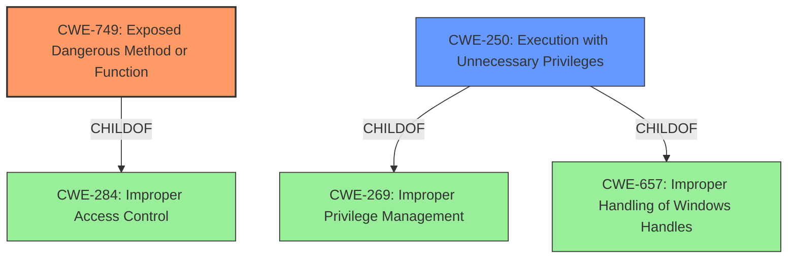

# Analysis Report for CVE-2021-45338

# Vulnerability Analysis Report: CVE-2021-45338

## Description


## Analysis (with Relationship Data)

# Summary
| CWE ID | CWE Name | Confidence | CWE Abstraction Level | CWE Vulnerability Mapping Label | CWE-Vulnerability Mapping Notes |
|---|---|---|---|---|---|
| CWE-749 | Exposed Dangerous Method or Function | 0.9 | Base | Allowed | Primary CWE |
| CWE-250 | Execution with Unnecessary Privileges | 0.7 | Base | Allowed | Secondary Candidate |

## Evidence and Confidence

*   **Confidence Score:** 0.8
*   **Evidence Strength:** MEDIUM

## Relationship Analysis
The primary CWE, CWE-749 (Exposed Dangerous Method or Function), is a base-level CWE that directly addresses the vulnerability of **unnecessarily powerful internal methods** being exposed. It is a child of CWE-284 (Improper Access Control), a high-level pillar. CWE-250 (Execution with Unnecessary Privileges) is also a child of both CWE-269 (Improper Privilege Management) and CWE-657 (Improper Handling of Windows Handles). The selection of CWE-749 is appropriate due to its direct relevance to the root cause and its base-level abstraction. CWE-250 is included as a secondary candidate because the **unnecessarily powerful internal methods** are being used with elevated privileges.



## Vulnerability Chain
The vulnerability chain starts with the existence of **unnecessarily powerful internal methods** within the Avast Antivirus service (root cause). These methods are accessible to local users, leading to privilege escalation and the ability to perform arbitrary file deletion, writing, and security resetting (impact).

## Summary of Analysis
The analysis focuses on the root cause, which is the exposure of **unnecessarily powerful internal methods**.

The vulnerability description states: "Multiple privilege escalation vulnerabilities in Avast Antivirus prior to 20.4 allow a local user to gain elevated privileges by calling **unnecessarily powerful internal methods** of the main antivirus service which could lead to the (1) arbitrary file delete, (2) write and (3) reset security."

CWE-749 (Exposed Dangerous Method or Function) aligns with this description because it addresses the scenario where a product's API includes a dangerous method that is not properly restricted. The retriever results list CWE-749 as the top candidate.

CWE-250 (Execution with Unnecessary Privileges) is a secondary consideration because the **unnecessarily powerful internal methods** are used with elevated privileges, which amplifies the consequences of the weakness.

The final decision is based on direct evidence from the vulnerability description, which highlights the exposure of **unnecessarily powerful internal methods**. The selected CWEs are at the optimal level of specificity, addressing the root cause and contributing factors.

Other CWEs Considered but Not Used:

*   CWE-269 (Improper Privilege Management): This CWE is too high-level and doesn't directly address the exposure of a dangerous method. The mapping guidance discourages its use when more specific CWEs are available.
*   CWE-782 (Exposed IOCTL with Insufficient Access Control): While related to exposed interfaces, this CWE is specific to IOCTLs, which isn't explicitly mentioned in the vulnerability description.
*   CWE-732 (Incorrect Permission Assignment for Critical Resource) & CWE-276 (Incorrect Default Permissions): These are related to permission assignments, but the root cause isn't directly related to file or resource permissions, but rather the dangerous functions being exposed.
*   CWE-20 (Improper Input Validation): This CWE is too generic and doesn't address the specific weakness of exposing dangerous methods.


## CWE Relationship Analysis

Current CWEs represent these abstraction levels: .


### Vulnerability Chain Analysis

**Chain starting from CWE-732:**
- 732 (Incorrect Permission Assignment for Critical Resource) - ROOT


**Chain starting from CWE-657:**
- 657 (Violation of Secure Design Principles) - ROOT


### CWE Relationship Diagram

```mermaid
graph TD
    classDef primary fill:#f96,stroke:#333,stroke-width:2px
    classDef secondary fill:#69f,stroke:#333
    classDef tertiary fill:#9e9,stroke:#333
```


*Report generated on 2025-04-01 16:10:33*
