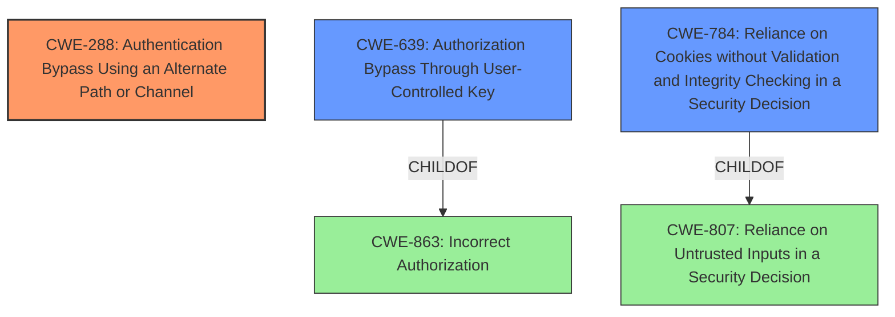

# Raw Analyzer Response for CVE-2021-45347

# Summary
| CWE ID | CWE Name | Confidence | CWE Abstraction Level | CWE Vulnerability Mapping Label | CWE-Vulnerability Mapping Notes |
|---|---|---|---|---|---|
| CWE-288 | Authentication Bypass Using an Alternate Path or Channel | 0.8 | Base | Allowed | Primary CWE |
| CWE-639 | Authorization Bypass Through User-Controlled Key | 0.7 | Base | Allowed | Secondary CWE |
| CWE-784 | Reliance on Cookies without Validation and Integrity Checking in a Security Decision | 0.6 | Variant | Allowed | Secondary CWE |

## Evidence and Confidence

*   **Confidence Score:** 0.8
*   **Evidence Strength:** HIGH

## Relationship Analysis
The primary CWE is CWE-288, which represents bypassing authentication through an alternate path. CWE-639 (Authorization Bypass Through User-Controlled Key) and CWE-784 (Reliance on Cookies without Validation and Integrity Checking in a Security Decision) are also relevant as they highlight the specific mechanisms involved in the bypass. CWE-639 is a child of CWE-863 (Incorrect Authorization), indicating an authorization issue stemming from a user-controlled key. CWE-784 is a variant of CWE-807 (Reliance on Untrusted Inputs in a Security Decision), showing reliance on untrusted cookie data. These relationships provide context to the authentication bypass vulnerability.

## Vulnerability Chain
The vulnerability chain starts with **incorrect access control**, leading to the ability to bypass authentication by manipulating the username in the cookie. The chain includes:

1.  **Incorrect Access Control**: The root cause, allowing unauthorized actions.
2.  Cookie Manipulation: Attacker changes the username stored in the cookie.
3.  Authentication Bypass: The system fails to validate the password against the modified username.
4.  Unauthorized Access: Successful login with any password for the spoofed username.

## Summary of Analysis
The vulnerability description highlights an **incorrect access control** issue in zzcms 8.2, which allows an attacker to bypass authentication by changing the username in the cookie. This directly matches the description of CWE-288 (Authentication Bypass Using an Alternate Path or Channel): "The product requires authentication, but the product has an alternate path or channel that does not require authentication." In this case, manipulating the username in the cookie represents an alternate path that bypasses the intended authentication process.

The "CVE Reference Links Content Summary" confirms this: "The vulnerability stems from a flaw in the authentication mechanism of the zzcms application. It appears the application relies on a username stored in a cookie for authentication, and **does not properly validate the associated password**." This lack of validation is the core issue enabling the bypass.

CWE-639 (Authorization Bypass Through User-Controlled Key) is also relevant, as the username in the cookie acts as a key that the attacker can control to gain access.

CWE-784 (Reliance on Cookies without Validation and Integrity Checking in a Security Decision) further specifies the issue by highlighting the lack of validation on the cookie data.

The final decision is to assign CWE-288 as the primary CWE because it best represents the overall vulnerability, with CWE-639 and CWE-784 as secondary CWEs to provide further context. These CWEs are at the appropriate level of specificity.

Relevant CWE Information:

# Enhanced Context (25 CWEs)
The following CWEs were identified as potentially relevant to this vulnerability:

## CWE-807: Reliance on Untrusted Inputs in a Security Decision
**Abstraction Level**: Base
**Similarity Score**: 0.78
**Source**: dense

**Description**:
The product uses a protection mechanism that relies on the existence or values of an input, but the input can be modified by an untrusted actor in a way that bypasses the protection mechanism.

**Mapping Guidance**:
- Usage: Allowed
- Rationale: This CWE entry is at the Base level of abstraction, which is a preferred level of abstraction for mapping to the root causes of vulnerabilities.

## CWE-302: Authentication Bypass by Assumed-Immutable Data
**Abstraction Level**: Base
**Similarity Score**: 0.77
**Source**: dense

**Description**:
The authentication scheme or implementation uses key data elements that are assumed to be immutable, but can be controlled or modified by the attacker.

**Mapping Guidance**:
- Usage: Allowed
- Rationale: This CWE entry is at the Base level of abstraction, which is a preferred level of abstraction for mapping to the root causes of vulnerabilities.

## CWE-472: External Control of Assumed-Immutable Web Parameter
**Abstraction Level**: Base
**Similarity Score**: 0.77
**Source**: dense

**Description**:
The web application does not sufficiently verify inputs that are assumed to be immutable but are actually externally controllable, such as hidden form fields.

**Mapping Guidance**:
- Usage: Allowed
- Rationale: This CWE entry is at the Base level of abstraction, which is a preferred level of abstraction for mapping to the root causes of vulnerabilities.

## CWE-639: Authorization Bypass Through User-Controlled Key
**Abstraction Level**: Base
**Similarity Score**: 0.76
**Source**: dense

**Description**:
The system's authorization functionality does not prevent one user from gaining access to another user's data or record by modifying the key value identifying the data.

**Mapping Guidance**:
- Usage: Allowed
- Rationale: This CWE entry is at the Base level of abstraction, which is a preferred level of abstraction for mapping to the root causes of vulnerabilities.

## CWE-1390: Weak Authentication
**Abstraction Level**: Class
**Similarity Score**: 0.75
**Source**: dense

**Description**:
The product uses an authentication mechanism to restrict access to specific users or identities, but the mechanism does not sufficiently prove that the claimed identity is correct.

**Mapping Guidance**:
- Usage: Allowed-with-Review
- Rationale: This CWE entry is a Class and might have Base-level children that would be more appropriate

## CWE-303: Incorrect Implementation of Authentication Algorithm
**Abstraction Level**: Base
**Similarity Score**: 0.75
**Source**: dense

**Description**:
The requirements for the product dictate the use of an established authentication algorithm, but the implementation of the algorithm is incorrect.

**Mapping Guidance**:
- Usage: Allowed
- Rationale: This CWE entry is at the Base level of abstraction, which is a preferred level of abstraction for mapping to the root causes of vulnerabilities.

## CWE-288: Authentication Bypass Using an Alternate Path or Channel
**Abstraction Level**: Base
**Similarity Score**: 0.75
**Source**: dense

**Description**:
The product requires authentication, but the product has an alternate path or channel that does not require authentication.

**Mapping Guidance**:
- Usage: Allowed
- Rationale: This CWE entry is at the Base level of abstraction, which is a preferred level of abstraction for mapping to the root causes of vulnerabilities.

## CWE-1289: Improper Validation of Unsafe Equivalence in Input
**Abstraction Level**: Base
**Similarity Score**: 0.74
**Source**: dense

**Description**:
The product receives an input value that is used as a resource identifier or other type of reference, but it does not validate or incorrectly validates that the input is equivalent to a potentially-unsafe value.

**Mapping Guidance**:
- Usage: Allowed
- Rationale: This CWE entry is at the Base level of abstraction, which is a preferred level of abstraction for mapping to the root causes of vulnerabilities.

## CWE-1391: Use of Weak Credentials
**Abstraction Level**: Class
**Similarity Score**: 0.74
**Source**: dense

**Description**:
The product uses weak credentials (such as a default key or hard-coded password) that can be calculated, derived, reused, or guessed by an attacker.

**Mapping Guidance**:
- Usage: Allowed-with-Review
- Rationale: This CWE entry is a Class and might have Base-level children that would be more appropriate

## CWE-274: Improper Handling of Insufficient Privileges
**Abstraction Level**: Base
**Similarity Score**: 0.74
**Source**: dense

**Description**:
The product does not handle or incorrectly handles when it has insufficient privileges to perform