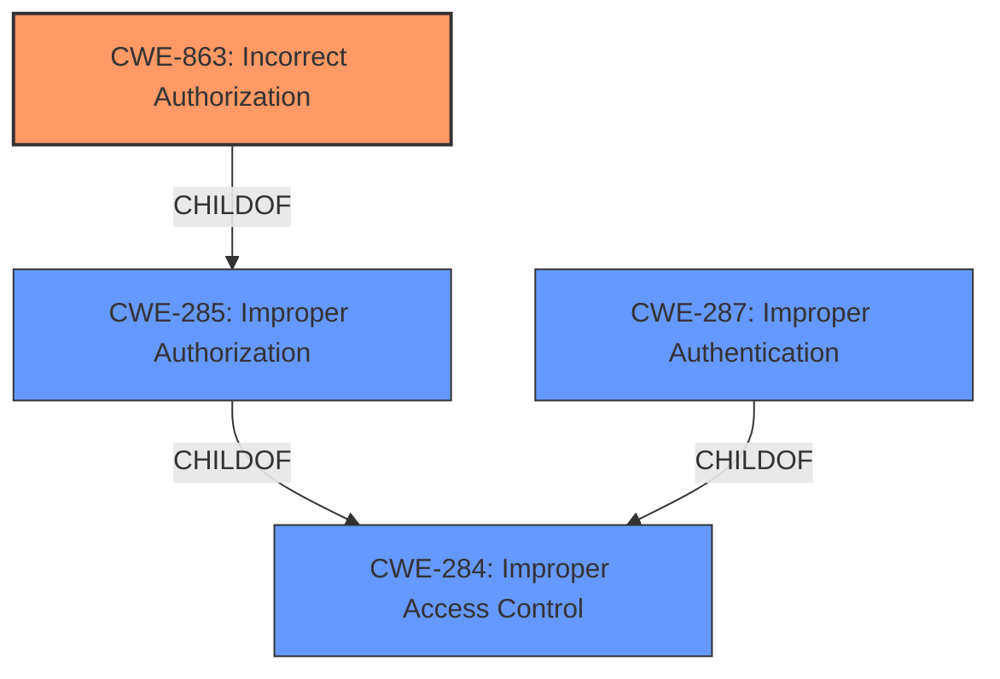

# Analysis for CVE-2021-45379

# Summary
| CWE ID | CWE Name | Confidence | CWE Abstraction Level | CWE Vulnerability Mapping Label | CWE-Vulnerability Mapping Notes |
|---|---|---|---|---|---|
| CWE-863 | Incorrect Authorization | 0.8 | Class | Primary | Allowed-with-Review |
| CWE-287 | Improper Authentication | 0.6 | Class | Secondary | Discouraged |

## Evidence and Confidence

*   **Confidence Score:** 0.8
*   **Evidence Strength:** HIGH

## Relationship Analysis
The primary CWE selected is CWE-863 (Incorrect Authorization), which is a Class-level CWE. It is related to CWE-285 (Improper Authorization) as a child, and both are children of CWE-284 (Improper Access Control). CWE-287 (Improper Authentication) is also a child of CWE-284. The vulnerability involves incorrect handling of user identity, leading to the possibility of logging in as another user without a password. While authentication is involved, the core issue is that the authorization process incorrectly validates the user's identity, allowing the bypass.

## Vulnerability Chain
The vulnerability chain starts with **incorrect access control**, leading to a failure in verifying user identity. This allows an attacker to bypass authentication and impersonate another user, resulting in unauthorized access.

## Summary of Analysis
The initial analysis focused on the **incorrect access control** vulnerability, which allows one user to attempt to log in as another user without a password. The evidence strongly supports the selection of CWE-863 (Incorrect Authorization) as the primary CWE. While CWE-287 (Improper Authentication) was considered, the core issue is that the authentication process itself isn't entirely missing or broken, but rather the authorization check that follows is **incorrect**. The vulnerability description and CVE reference links content summary both highlight that the system **fails to properly verify user identity** during authentication, which directly aligns with the characteristics of CWE-863.

The retriever results also point towards CWE-863. CWE-287 is listed as a possible candidate, but the description explicitly mentions that the core issue is **incorrect access control**, making CWE-863 a more accurate fit. The relationship analysis shows that CWE-863 is a child of CWE-285 (Improper Authorization), which is a child of CWE-284 (Improper Access Control), further solidifying the choice of CWE-863.

The CWE-863 is at the Class level of abstraction, and while there might be more specific base-level CWEs, the provided information doesn't provide enough details to narrow it down further. Therefore, CWE-863 is the most appropriate and specific CWE given the available evidence.

Relevant CWE Information:
- CWE-863: Incorrect Authorization, Class, Allowed-with-Review
- CWE-287: Improper Authentication, Class, Discouraged