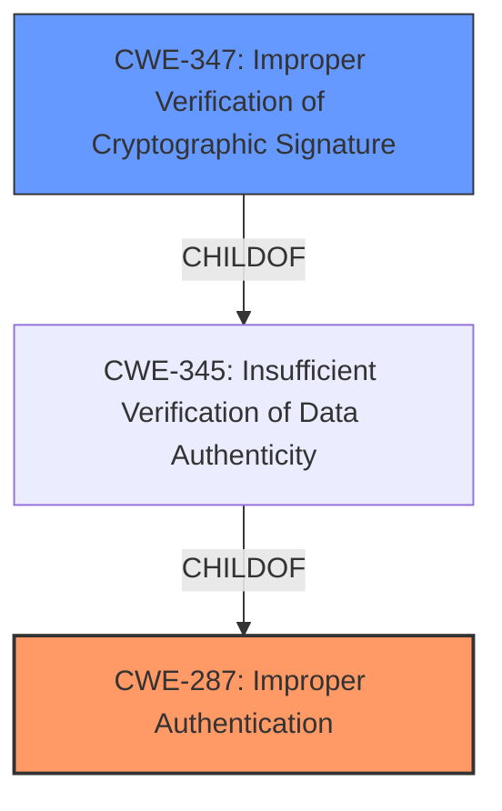

# Analysis for CVE-2021-45389

# Summary
| CWE ID | CWE Name | Confidence | CWE Abstraction Level | CWE Vulnerability Mapping Label | CWE-Vulnerability Mapping Notes |
|---|---|---|---|---|---|
| CWE-287 | Improper Authentication | 0.9 | Class | Primary | Discouraged |
| CWE-347 | Improper Verification of Cryptographic Signature | 0.8 | Base | Secondary | Allowed |

## Evidence and Confidence

*   **Confidence Score:** 0.9
*   **Evidence Strength:** HIGH

## Relationship Analysis
The primary CWE is CWE-287 **[CWE-287: Improper Authentication]**, a Class-level CWE. CWE-287 is related to CWE-347 **[CWE-347: Improper Verification of Cryptographic Signature]** through a parent-child relationship. Since the vulnerability involves **improper verification of the cryptographic signature**, CWE-347 is a more specific, Base-level CWE that is also included in the analysis. While CWE-287 is a Class, the overall context points to a specific authentication failure caused by signature validation, which is captured by the combination of CWE-287 and CWE-347.

## Vulnerability Chain
The vulnerability chain begins with the **improper validation of JWT signatures** (CWE-347), leading to an authentication bypass (CWE-287) and ultimately resulting in privilege escalation. The **self-signed JWT token injection** is the exploitation technique that utilizes the weakness.

## Summary of Analysis
The initial analysis identified CWE-287 **[CWE-287: Improper Authentication]** as a strong candidate due to the authentication bypass aspect of the vulnerability. However, further analysis revealed that the root cause lies in the **improper validation of JWT signatures**, as stated in the CVE Reference Links Content Summary: "The Update Manager in affected StarWind products allows authentication with a JWT (JSON Web Token) that can be signed with any key, including a self-signed key."

Therefore, CWE-347 **[CWE-347: Improper Verification of Cryptographic Signature]** was also selected to provide a more precise characterization of the vulnerability. The evidence supports mapping both CWEs, with CWE-287 representing the high-level authentication failure and CWE-347 detailing the underlying cause.

CWE-287 is a Class-level CWE, and the MITRE mapping guidance discourages its use when lower-level CWE entries are applicable. However, in this case, CWE-287 accurately describes the authentication bypass, while CWE-347 describes the specific mechanism that allows the bypass. Together, they provide a comprehensive view of the vulnerability.

The retriever results also showed CWE-807 **[CWE-807: Reliance on Untrusted Inputs in a Security Decision]** as a candidate. The vulnerability description states "A self-signed JWT token could be injected into the update manager and bypass the authentication process". While this sounds like an untrusted input is used in a security decision, JWT tokens are used specifically for authentication. The content is more specific to **improper verification of the signature**, so CWE-807 is not an ideal fit.

Relevant CWE Information:

# Enhanced Context (25 CWEs)
The following CWEs were identified as potentially relevant to this vulnerability:

## CWE-807: Reliance on Untrusted Inputs in a Security Decision
**Abstraction Level**: Base
**Similarity Score**: 0.77
**Source**: dense

**Description**:
The product uses a protection mechanism that relies on the existence or values of an input, but the input can be modified by an untrusted actor in a way that bypasses the protection mechanism.

**Mapping Guidance**:
- Usage: Allowed
- Rationale: This CWE entry is at the Base level of abstraction, which is a preferred level of abstraction for mapping to the root causes of vulnerabilities.

## CWE-347: Improper Verification of Cryptographic Signature
**Abstraction Level**: Base
**Similarity Score**: 4575.59
**Source**: sparse

**Description**:
The product does not verify, or incorrectly verifies, the cryptographic signature for data.

**Mapping Guidance**:
- Usage: Allowed
- Rationale: This CWE entry is at the Base level of abstraction, which is a preferred level of abstraction for mapping to the root causes of vulnerabilities.