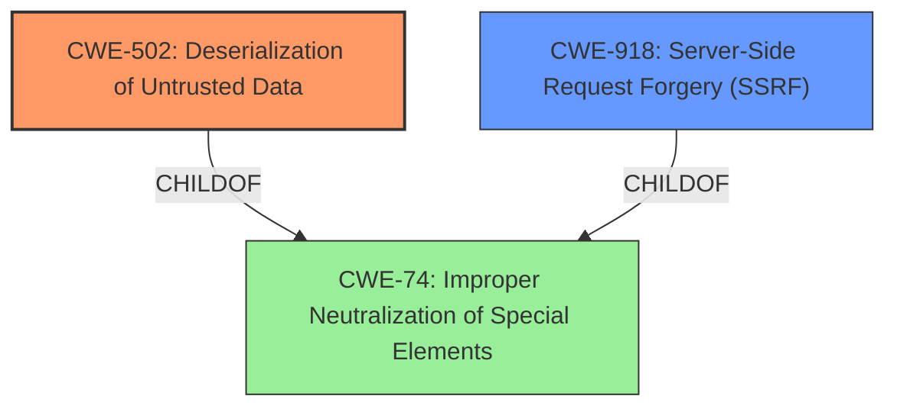

# Analysis for CVE-2021-45394

# Summary
| CWE ID | CWE Name | Confidence | CWE Abstraction Level | CWE Vulnerability Mapping Label | CWE-Vulnerability Mapping Notes |
|---|---|---|---|---|---|
| CWE-502 | Deserialization of Untrusted Data | 1.0 | Base | Allowed | Primary CWE |
| CWE-918 | Server-Side Request Forgery (SSRF) | 0.8 | Base | Allowed | Secondary CWE |

## Evidence and Confidence

*   **Confidence Score:** 0.9
*   **Evidence Strength:** HIGH

## Relationship Analysis
The primary relationship is that the **deserialization of untrusted data** (CWE-502) can lead to remote code execution or other unexpected behaviors. Additionally, the use of `file_get_contents` with an attacker-controlled argument makes Server-Side Request Forgery (SSRF) a concern, as it allows the attacker to force the service to retrieve data from an arbitrary URL (CWE-918).

## Vulnerability Chain
The vulnerability chain starts with the injection of a malicious tag in the converted HTML document. The CSS parser uses `file_get_contents` with an attacker-controlled argument from the link tag's href attribute. This leads to **deserialization of arbitrary data** (CWE-502) and can also cause Server-Side Request Forgery (CWE-918) due to the ability to control the URL. Remote Code Execution (RCE) can be achieved by exploiting the PHAR deserialization vulnerability.

## Summary of Analysis
The initial analysis identified **deserialization of arbitrary data** as the primary weakness (CWE-502) due to the ability to inject a malicious tag that leads to insecure deserialization. The analysis was refined by considering that the `file_get_contents` function is used with an attacker-controlled argument, which supports protocols like HTTP(S) and PHAR, leading to the possibility of Server-Side Request Forgery (SSRF).

The evidence for CWE-502 is strong: "Attackers can trigger **deserialization of arbitrary data** via the injection of a malicious tag in the converted HTML document." This statement directly supports the **deserialization of untrusted data** vulnerability. The CVE Reference Links Content Summary confirms: "Insecure PHAR deserialization due to usage of `phar://` wrapper in `file_get_contents`"

The evidence for CWE-918 is also present: "Server-Side Request Forgery (SSRF) due to the usage of `file_get_contents` with attacker controlled input." This indicates that the attacker can control the URL used by `file_get_contents`, which is a key characteristic of SSRF.

The hierarchical relationships influenced the selection by ensuring that the chosen CWEs are at the appropriate level of specificity. Both CWE-502 and CWE-918 are Base-level CWEs, which is the preferred level of abstraction.

CWE-79 was considered because of the mention of HTML injection and the possibility of Cross-Site Scripting, but it was rejected because the vulnerability primarily involves server-side deserialization and SSRF rather than client-side script execution.

CWE-1336 was also considered because the vulnerability involves parsing HTML, but it was deemed less relevant than CWE-502 and CWE-918 because the core issue is not about template injection but rather about insecure deserialization and uncontrolled requests.

The selected CWEs are at the optimal level of specificity because they accurately represent the root causes of the vulnerability, as confirmed by the vulnerability description and CVE reference links.

Relevant CWE Information:

# Enhanced Context (25 CWEs)
The following CWEs were identified as potentially relevant to this vulnerability:

## CWE-113: Improper Neutralization of CRLF Sequences in HTTP Headers ('HTTP Request/Response Splitting')
**Abstraction Level**: Variant
**Similarity Score**: 0.78
**Source**: dense

**Description**:
The product receives data from an HTTP agent/component (e.g., web server, proxy, browser, etc.), but it does not neutralize or incorrectly neutralizes CR and LF characters before the data is included in outgoing HTTP headers.

**Mapping Guidance**:
- Usage: Allowed
- Rationale: This CWE entry is at the Variant level of abstraction, which is a preferred level of abstraction for mapping to the root causes of vulnerabilities.

## CWE-74: Improper Neutralization of Special Elements in Output Used by a Downstream Component ('Injection')
**Abstraction Level**: Class
**Similarity Score**: 0.74
**Source**: dense

**Description**:
The product constructs all or part of a command, data structure, or record using externally-influenced input from an upstream component, but it does not neutralize or incorrectly neutralizes special elements that could modify how it is parsed or interpreted when it is sent to a downstream component.

**Mapping Guidance**:
- Usage: Discouraged
- Rationale: CWE-74 is high-level and often misused when lower-level weaknesses are more appropriate.

## CWE-80: Improper Neutralization of Script-Related HTML Tags in a Web Page (Basic XSS)
**Abstraction Level**: Variant
**Similarity Score**: 0.74
**Source**: dense

**Description**:
The product receives input from an upstream component, but it does not neutralize or incorrectly neutralizes special characters such as "<", ">", and "&" that could be interpreted as web-scripting elements when they are sent to a downstream component that processes web pages.

**Mapping Guidance**:
- Usage: Allowed
- Rationale: This CWE entry is at the Variant level of abstraction, which is a preferred level of abstraction for mapping to the root causes of vulnerabilities.

## CWE-93: Improper Neutralization of CRLF Sequences ('CRLF Injection')
**Abstraction Level**: Base
**Similarity Score**: 0.74
**Source**: dense

**Description**:
The product uses CRLF (carriage return line feeds) as a special element, e.g. to separate lines or records, but it does not neutralize or incorrectly neutralizes CRLF sequences from inputs.

**Mapping Guidance**:
- Usage: Allowed
- Rationale: This CWE entry is at the Base level of abstraction, which is a preferred level of abstraction for mapping to the root causes of vulnerabilities.

## CWE-611: Improper Restriction of XML External Entity Reference
**Abstraction Level**: Base
**Similarity Score**: 0.73
**Source**: dense

**Description**:
The product processes an XML document that can contain XML entities with URIs that resolve to documents outside of the intended sphere of control, causing the product to embed incorrect documents into its output.

**Mapping Guidance**:
- Usage: Allowed
- Rationale: This CWE entry is at the Base level of abstraction, which is a preferred level of abstraction for mapping to the root causes of vulnerabilities.

## CWE-138: Improper Neutralization of Special Elements
**Abstraction Level**: Class
**Similarity Score**: 0.73
**Source**: dense

**Description**:
The product receives input from an upstream component, but it does not neutralize or incorrectly neutralizes special elements that could be interpreted as control elements or syntactic markers when they are sent to a downstream component.

**Mapping Guidance**:
- Usage: Discouraged
- Rationale: This CWE entry is a level-1 Class (i.e., a child of a Pillar). It might have lower-level children that would be more appropriate

## CWE-162: Improper Neutralization of Trailing Special Elements
**Abstraction Level**: Variant
**Similarity Score**: 0.72
**Source**: dense

**Description**:
The product receives input from an upstream component, but it does not neutralize or incorrectly neutralizes trailing special elements that could be interpreted in unexpected ways when they are sent to a downstream component.

**Mapping Guidance**:
- Usage: Allowed
- Rationale: This CWE entry is at the Variant level of abstraction, which is a preferred level of abstraction for mapping to the root causes of vulnerabilities.

## CWE-184: Incomplete List of Disallowed Inputs
**Abstraction Level**: Base
**Similarity Score**: 0.72
**Source**: dense

**Description**:
The product implements a protection mechanism that relies on a list of inputs (or properties of inputs) that are not allowed by policy or otherwise require other action to neutralize before additional processing takes place, but the list is incomplete.

**Mapping Guidance**:
- Usage: Allowed
- Rationale: This CWE entry is at the Base level of abstraction, which is a preferred level of abstraction for mapping to the root causes of vulnerabilities.

## CWE-1