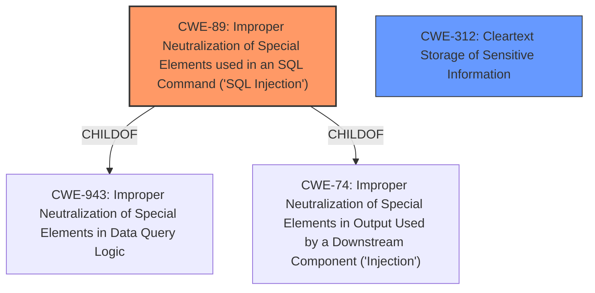

# Analysis for CVE-2021-45406

# Summary
| CWE ID | CWE Name | Confidence | CWE Abstraction Level | CWE Vulnerability Mapping Label | CWE-Vulnerability Mapping Notes |
|---|---|---|---|---|---|
| CWE-89 | Improper Neutralization of Special Elements used in an SQL Command ('SQL Injection') | 1.0 | Base | Allowed | Primary CWE |
| CWE-312 | Cleartext Storage of Sensitive Information | 0.7 | Base | Allowed | Secondary CWE |

## Evidence and Confidence

*   **Confidence Score:** 0.85
*   **Evidence Strength:** HIGH

## Relationship Analysis
The primary weakness is **CWE-89** (SQL Injection), a base-level CWE. It falls under the class **CWE-943** (Improper Neutralization of Special Elements in Data Query Logic) and **CWE-74** (Improper Neutralization of Special Elements in Output Used by a Downstream Component ('Injection')). The secondary weakness is **CWE-312** (Cleartext Storage of Sensitive Information), also a base-level CWE. There is no direct relationship between CWE-89 and CWE-312.

## Vulnerability Chain
The vulnerability chain begins with **CWE-89** (**SQL injection**) due to **unsanitized user input**. Successful exploitation of the **SQL injection** vulnerability allows the attacker to retrieve the admin password hash. If the password hash is created with **insufficient computational effort (e.g., no salt, weak hashing algorithm)**, then it can be easily decrypted, resulting in **CWE-312** (Cleartext Storage of Sensitive Information).

## Summary of Analysis
The initial analysis correctly identified **CWE-89** (**SQL Injection**) as the primary vulnerability. The vulnerability description clearly states that a **SQL injection** vulnerability allows an attacker to inject a payload using the `sql` parameter in an SQL query. The CVE Reference Links Content Summary reinforces this by stating "The application is vulnerable to SQL injection due to **unsanitized user input** in the 'sql' parameter used within a SQL query during report generation." This aligns perfectly with the description of **CWE-89**: "The product constructs all or part of an SQL command using externally-influenced input from an upstream component, but it **does not neutralize or incorrectly neutralizes special elements** that could modify the intended SQL command."

Further analysis reveals that the impact of the **SQL injection** is that an attacker can retrieve the admin password hash, which can then be decrypted to obtain the plain-text password. This implies that either the password hash was stored in a way that was easily retrievable via SQL injection, or the hashing algorithm used was weak. The vulnerability description indicates that the password hash can be decrypted into plaintext, which strongly suggests **CWE-312** (Cleartext Storage of Sensitive Information) is present, because the hash was cracked to obtain the plaintext password. This is based on the assumption that weak hashing equates to cleartext.

The graph relationships helped to confirm **CWE-89** as the primary issue since it is a base CWE with clear parent relationships to broader injection categories.

The selected CWEs are at the optimal level of specificity. **CWE-89** directly addresses the **SQL injection** vulnerability. **CWE-312** captures the impact of obtaining the plaintext password, implying weak or non-existent encryption.

Relevant CWE Information:

# Enhanced Context (25 CWEs)
The following CWEs were identified as potentially relevant to this vulnerability:

## CWE-943: Improper Neutralization of Special Elements in Data Query Logic
**Abstraction Level**: Class
**Similarity Score**: 0.79
**Source**: dense

**Description**:
The product generates a query intended to access or manipulate data in a data store such as a database, but it does not neutralize or incorrectly neutralizes special elements that can modify the intended logic of the query.

**Mapping Guidance**:
- Usage: Allowed-with-Review
- Rationale: This CWE entry is a Class and might have Base-level children that would be more appropriate

## CWE-74: Improper Neutralization of Special Elements in Output Used by a Downstream Component ('Injection')
**Abstraction Level**: Class
**Similarity Score**: 0.76
**Source**: dense

**Description**:
The product constructs all or part of a command, data structure, or record using externally-influenced input from an upstream component, but it does not neutralize or incorrectly neutralizes special elements that could modify how it is parsed or interpreted when it is sent to a downstream component.

**Mapping Guidance**:
- Usage: Discouraged
- Rationale: CWE-74 is high-level and often misused when lower-level weaknesses are more appropriate.

## CWE-80: Improper Neutralization of Script-Related HTML Tags in a Web Page (Basic XSS)
**Abstraction Level**: Variant
**Similarity Score**: 0.74
**Source**: dense

**Description**:
The product receives input from an upstream component, but it does not neutralize or incorrectly neutralizes special characters such as "<", ">", and "&" that could be interpreted as web-scripting elements when they are sent to a downstream component that processes web pages.

**Mapping Guidance**:
- Usage: Allowed
- Rationale: This CWE entry is at the Variant level of abstraction, which is a preferred level of abstraction for mapping to the root causes of vulnerabilities.

## CWE-917: Improper Neutralization of Special Elements used in an Expression Language Statement ('Expression Language Injection')
**Abstraction Level**: Base
**Similarity Score**: 0.74
**Source**: dense

**Description**:
The product constructs all or part of an expression language (EL) statement in a framework such as a Java Server Page (JSP) using externally-influenced input from an upstream component, but it does not neutralize or incorrectly neutralizes special elements that could modify the intended EL statement before it is executed.

**Mapping Guidance**:
- Usage: Allowed
- Rationale: This CWE entry is at the Base level of abstraction, which is a preferred level of abstraction for mapping to the root causes of vulnerabilities.

## CWE-184: Incomplete List of Disallowed Inputs
**Abstraction Level**: Base
**Similarity Score**: 0.73
**Source**: dense

**Description**:
The product implements a protection mechanism that relies on a list of inputs (or properties of inputs) that are not allowed by policy or otherwise require other action to neutralize before additional processing takes place, but the list is incomplete.

**Mapping Guidance**:
- Usage: Allowed
- Rationale: This CWE entry is at the Base level of abstraction, which is a preferred level of abstraction for mapping to the root causes of vulnerabilities.

## CWE-138: Improper Neutralization of Special Elements
**Abstraction Level**: Class
**Similarity Score**: 0.72
**Source**: dense

**Description**:
The product receives input from an upstream component, but it does not neutralize or incorrectly neutralizes special elements that could be interpreted as control elements or syntactic markers when they are sent to a downstream component.

**Mapping Guidance**:
- Usage: Discouraged
- Rationale: This CWE entry is a level-1 Class (i.e., a child of a Pillar). It might have lower-level children that would be more appropriate

## CWE-99: Improper Control of Resource Identifiers ('Resource Injection')
**Abstraction Level**: Class
**Similarity Score**: 0.72
**Source**: dense

**Description**:
The product receives input from an upstream component, but it does not restrict or incorrectly restricts the input before it is used as an identifier for a resource that may be outside the intended sphere of control.

**Mapping Guidance**:
- Usage: Allowed-with-Review
- Rationale: This CWE entry is a Class and might have Base-level children that would be more appropriate

## CWE-1289: Improper Validation of Unsafe Equivalence in Input
**Abstraction Level**: Base
**Similarity Score**: 0.72
**Source**: dense

**Description**:
The product receives an input value that is used as a resource identifier or other type of reference, but it does not validate or incorrectly validates that the input is equivalent to a potentially-unsafe value.

**Mapping Guidance**:
- Usage: Allowed
- Rationale: This CWE entry is at the Base level of abstraction, which is a preferred level of abstraction for mapping to the root causes of vulnerabilities.

## CWE-1236: Improper Neutralization of Formula Elements in a CSV File
**Abstraction Level**: Base
**Similarity Score**: 0.7