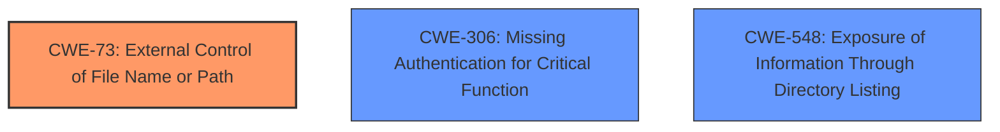

# Analysis Report for CVE-2021-45420

# Vulnerability Analysis Report: CVE-2021-45420

## Description


## Analysis (with Relationship Data)

# Summary
| CWE ID | CWE Name | Confidence | CWE Abstraction Level | CWE Vulnerability Mapping Label | CWE-Vulnerability Mapping Notes |
|---|---|---|---|---|---|
| CWE-73 | External Control of File Name or Path | 0.9 | Base | Primary | Allowed |
| CWE-306 | Missing Authentication for Critical Function | 0.8 | Base | Secondary | Allowed |
| CWE-548 | Exposure of Information Through Directory Listing | 0.7 | Variant | Secondary | Allowed |

## Evidence and Confidence

*   **Confidence Score:** 0.8
*   **Evidence Strength:** HIGH

## Relationship Analysis
The primary CWE is CWE-73, which indicates external control over the file name or path. CWE-306 (Missing Authentication) highlights a security control **weakness** that allows unauthenticated access. CWE-548 (Directory Listing) relates to information exposure. These CWEs are related in that the **lack of authentication** (CWE-306) can lead to **arbitrary file writes** due to external control of file paths (CWE-73), while a misconfiguration can expose sensitive information (CWE-548).



## Vulnerability Chain
The chain of events is as follows:
1.  **Missing Authentication** (CWE-306) allows unauthorized access.
2.  **External Control of File Name or Path** (CWE-73) enables **arbitrary file write**.
3.  **Exposure of Information Through Directory Listing** (CWE-548) can further assist attackers.
The root cause is the **lack of authentication**, which then leads to **arbitrary file writes**, and potentially information exposure through directory listing.

## Summary of Analysis
The analysis indicates that the primary **weakness** is the external control of file paths (CWE-73) due to the **lack of authentication** (CWE-306), resulting in **arbitrary file writes**. The additional exposure through directory listings (CWE-548) could aid in further exploitation.

The description states "Emerson Dixell XWEB-500 products are affected by **arbitrary file write** vulnerability in /cgi-bin/logo_extra_upload.cgi, /cgi-bin/cal_save.cgi, and /cgi-bin/lo_utils.cgi. An attacker will be able to write any file on the target system without any kind of authentication mechanism...". The CVE Reference Links Content Summary confirms "**Root Cause:** The vulnerability stems from the lack of proper sanitization or validation of file paths and names when writing files through specific CGI scripts... **Weaknesses: CWE-73:** External Control of File Name or Path - The application allows external control over the file name or path used in file system operations. Lack of authentication: The file write operations through the vulnerable CGI scripts do not require any authentication.".

The selection of CWE-73 is at the optimal level of specificity, as it accurately captures the root cause related to external control of file paths. CWE-306 is also relevant due to the **missing authentication**. CWE-548 is included because of the directory listing vulnerability.

Relevant CWE Information:

# Enhanced Context (25 CWEs)
The following CWEs were identified as potentially relevant to this vulnerability:

## CWE-798: Use of Hard-coded Credentials
**Abstraction Level**: Base
**Similarity Score**: 0.80
**Source**: dense

**Description**:
The product contains hard-coded credentials, such as a password or cryptographic key.

**Mapping Guidance**:
- Usage: Allowed
- Rationale: This CWE entry is at the Base level of abstraction, which is a preferred level of abstraction for mapping to the root causes of vulnerabilities.

**Why Not Used:** While the product may contain hardcoded credentials, this is not the primary vulnerability described. The vulnerability description focuses on the **arbitrary file write** due to **lack of authentication** and improper file path handling. Therefore, CWE-798 is not selected.

## CWE-1391: Use of Weak Credentials
**Abstraction Level**: Class
**Similarity Score**: 0.79
**Source**: dense

**Description**:
The product uses weak credentials (such as a default key or hard-coded password) that can be calculated, derived, reused, or guessed by an attacker.

**Mapping Guidance**:
- Usage: Allowed-with-Review
- Rationale: This CWE entry is a Class and might have Base-level children that would be more appropriate

**Why Not Used:** Similar to CWE-798, the use of weak credentials is not the primary vulnerability. The core issue is the **arbitrary file write** due to **lack of authentication** and file path mishandling. Therefore, CWE-1391 is not selected.

## CWE-41: Improper Resolution of Path Equivalence
**Abstraction Level**: Base
**Similarity Score**: 0.79
**Source**: dense

**Description**:
The product is vulnerable to file system contents disclosure through path equivalence. Path equivalence involves the use of special characters in file and directory names. The associated manipulations are intended to generate multiple names for the same object.

**Mapping Guidance**:
- Usage: Allowed
- Rationale: This CWE entry is at the Base level of abstraction, which is a preferred level of abstraction for mapping to the root causes of vulnerabilities.

**Why Not Used:** While path equivalence issues might be present, the primary vulnerability is the **arbitrary file write** due to **lack of authentication** and improper handling of file paths. Therefore, CWE-41 is not selected.

## CWE-807: Reliance on Untrusted Inputs in a Security Decision
**Abstraction Level**: Base
**Similarity Score**: 0.79
**Source**: dense

**Description**:
The product uses a protection mechanism that relies on the existence or values of an input, but the input can be modified by an untrusted actor in a way that bypasses the protection mechanism.

**Mapping Guidance**:
- Usage: Allowed
- Rationale: This CWE entry is at the Base level of abstraction, which is a preferred level of abstraction for mapping to the root causes of vulnerabilities.

**Why Not Used:** This CWE is not directly relevant as the **lack of authentication** is the more prominent issue, enabling the **arbitrary file write**. Therefore, CWE-807 is not selected.

## CWE-23: Relative Path Traversal
**Abstraction Level**: Base
**Similarity Score**: 0.79
**Source**: dense

**Description**:
The product uses external input to construct a pathname that should be within a restricted directory, but it does not properly neutralize sequences such as ".." that can resolve to a location that is outside of that directory.

**Mapping Guidance**:
- Usage: Allowed
- Rationale: This CWE entry is at the Base level of abstraction, which is a preferred level of abstraction for mapping to the root causes of vulnerabilities.

**Why Not Used:** While relative path traversal could be a contributing factor, CWE-73 better describes the general issue of external control over file names or paths, leading to **arbitrary file writes**. Therefore, CWE-23 is not selected in favor of CWE-73.

## CWE-74: Improper Neutralization of Special Elements in Output Used by a Downstream Component ('Injection')
**Abstraction Level**: Class
**Similarity Score**: 0.79
**Source**: dense

**Description**:
The product constructs all or part of a command, data structure, or record using externally-influenced input from an upstream component, but it does not neutralize or incorrectly neutralizes special elements that could modify how it is parsed or interpreted when it is sent to a downstream component.

**Mapping Guidance**:
- Usage: Discouraged
- Rationale: CWE-74 is high-level and often misused when lower-level weaknesses are more appropriate.

**Why Not Used:** CWE-74 is too generic. CWE-73 more specifically addresses the external control of file names or paths. Therefore, CWE-74 is not selected.

## CWE-668: Exposure of Resource to Wrong Sphere
**Abstraction Level**: Class
**Similarity Score**: 0.78
**Source**: dense

**Description**:
The product exposes a resource to the wrong control sphere, providing unintended actors with inappropriate access to the resource.

**Mapping Guidance**:
- Usage: Discouraged
- Rationale: CWE-668 is high-level and is often misused as a catch-all when lower-level CWE IDs might be applicable. It is sometimes used for low-information vulnerability reports [REF-1287]. It is a level-1 Class (i.e., a child of a Pillar). It is not useful for trend analysis.

**Why Not Used:** CWE-668 is too broad. The more specific CWE-73 and CWE-


## CWE Relationship Analysis

Current CWEs represent these abstraction levels: .


### Vulnerability Chain Analysis

**Chain starting from CWE-306:**
- 306 (Missing Authentication for Critical Function) - ROOT


**Chain starting from CWE-73:**
- 73 (External Control of File Name or Path) - ROOT


### CWE Relationship Diagram

```mermaid
graph TD
    classDef primary fill:#f96,stroke:#333,stroke-width:2px
    classDef secondary fill:#69f,stroke:#333
    classDef tertiary fill:#9e9,stroke:#333
```


*Report generated on 2025-04-02 05:02:51*
