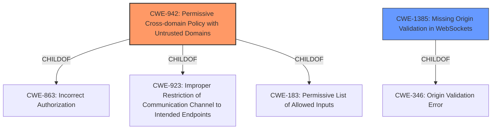

# Analysis Report for CVE-2021-45457

# Vulnerability Analysis Report: CVE-2021-45457

## Description


## Analysis (with Relationship Data)

# Summary
| CWE ID | CWE Name | Confidence | CWE Abstraction Level | CWE Vulnerability Mapping Label | CWE-Vulnerability Mapping Notes |
|---|---|---|---|---|---|
| CWE-942 | Permissive Cross-domain Policy with Untrusted Domains | 1.0 | Variant | Allowed | Primary CWE |
| CWE-1385 | Missing Origin Validation in WebSockets | 0.7 | Variant | Allowed | Secondary Candidate |

## Evidence and Confidence

*   **Confidence Score:** 0.9
*   **Evidence Strength:** HIGH

## Relationship Analysis
The primary CWE, CWE-942 (Permissive Cross-domain Policy with Untrusted Domains), is a Variant-level CWE. It is related to CWE-863 (Incorrect Authorization), CWE-923 (Improper Restriction of Communication Channel to Intended Endpoints), and CWE-183 (Permissive List of Allowed Inputs) through ChildOf relationships. The vulnerability description strongly aligns with the characteristics of CWE-942, indicating it is the most appropriate choice.

CWE-1385 (Missing Origin Validation in WebSockets) is also a Variant, and a secondary candidate, related to CWE-346. Although websockets aren't explicitly mentioned, the description speaks to Cross-Origin Request issues so this CWE is a less specific, but related weakness.



## Vulnerability Chain
The vulnerability chain starts with an **insecure CORS configuration**, leading to the **acceptance of cross-origin requests from any origin**. This allows an attacker to potentially **access sensitive data** or **manipulate configurations** if the user has an active session.

## Summary of Analysis
The initial analysis indicated CWE-942 as the primary candidate, which aligns with the **weakness** of allowing cross-origin requests with credentials from any origin. This assessment is strongly supported by the CVE Reference Links Content Summary.

> Root Cause of Vulnerability:
>
> *   The vulnerability stems from an overly broad Cross-Origin Resource Sharing (CORS) configuration in Apache Kylin. Specifically, the server reflects the `Origin` header in the `Access-Control-Allow-Origin` response header, allowing any origin to make cross-origin requests.

The relationship analysis further solidified this choice, as CWE-942 is a Variant-level CWE that directly addresses permissive cross-domain policies. The retriever results also listed CWE-942 as the top candidate.

CWE-1385 was considered because the summary mentions request origin validation.

> **Weaknesses/Vulnerabilities Present:**
>
> *   **Insecure CORS Configuration:** The server dynamically reflects the `Origin` header value in the `Access-Control-Allow-Origin` response, effectively allowing any website to make cross-origin requests to the Kylin API. This bypasses the intended security of the CORS policy.

The selected CWEs are at the optimal level of specificity, with CWE-942 being a Variant that accurately reflects the vulnerability's root cause.

Relevant CWE Information:

# Enhanced Context (25 CWEs)
The following CWEs were identified as potentially relevant to this vulnerability:

## CWE-942: Permissive Cross-domain Policy with Untrusted Domains
**Abstraction Level**: Variant
**Similarity Score**: 7198.56
**Source**: sparse

**Description**:
The product uses a cross-domain policy file that includes domains that should not be trusted.

**Mapping Guidance**:
- Usage: Allowed
- Rationale: This CWE entry is at the Variant level of abstraction, which is a preferred level of abstraction for mapping to the root causes of vulnerabilities.

## CWE-1385: Missing Origin Validation in WebSockets
**Abstraction Level**: Variant
**Similarity Score**: 6699.16
**Source**: sparse

**Description**:
The product uses a WebSocket, but it does not properly verify that the source of data or communication is valid.

**Mapping Guidance**:
- Usage: Allowed
- Rationale: This CWE entry is at the Variant level of abstraction, which is a preferred level of abstraction for mapping to the root causes of vulnerabilities.


## CWE Relationship Analysis

Current CWEs represent these abstraction levels: .


### Vulnerability Chain Analysis

**Chain starting from CWE-1385:**
- 1385 (Missing Origin Validation in WebSockets) - ROOT


**Chain starting from CWE-923:**
- 923 (Improper Restriction of Communication Channel to Intended Endpoints) - ROOT


### CWE Relationship Diagram

```mermaid
graph TD
    classDef primary fill:#f96,stroke:#333,stroke-width:2px
    classDef secondary fill:#69f,stroke:#333
    classDef tertiary fill:#9e9,stroke:#333
```


*Report generated on 2025-04-02 08:35:13*
