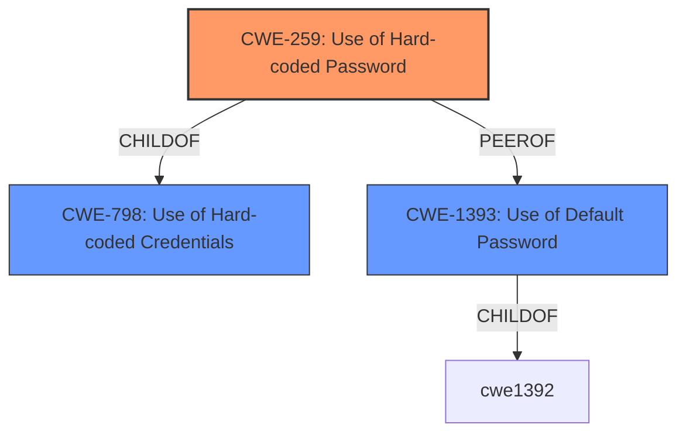

# Analysis for CVE-2021-45520

# Summary
| CWE ID  | CWE Name                                                  | Confidence | CWE Abstraction Level | CWE Vulnerability Mapping Label | CWE-Vulnerability Mapping Notes |
| :-------- | :-------------------------------------------------------- | :--------- | :-------------------- | :------------------------------ | :------------------------------ |
| CWE-259   | Use of Hard-coded Password                              | 1.0        | Variant               | Primary                         | Allowed                       |
| CWE-798   | Use of Hard-coded Credentials                           | 0.9       | Base                  | Secondary                       | Allowed                       |
| CWE-1393  | Use of Default Password                                 | 0.7        | Base                  | Secondary                       | Allowed                       |

## Evidence and Confidence

*   **Confidence Score:** 0.9
*   **Evidence Strength:** HIGH

## Relationship Analysis
The primary CWE selected is CWE-259 (Use of Hard-coded Password), a Variant of CWE-798 (Use of Hard-coded Credentials), a Base CWE. CWE-1393 (Use of Default Password) is also a Base CWE and a peer of CWE-259. The vulnerability clearly states a **hardcoded password** as the root cause, justifying the selection of CWE-259 as the most specific and appropriate classification.

## Vulnerability Chain
The vulnerability chain is straightforward: the **hardcoded password** (CWE-259) directly leads to unauthorized access and control over the affected device.

## Summary of Analysis
The initial analysis strongly indicates the presence of a **hardcoded password** vulnerability. The vulnerability description and CVE reference links explicitly state the **hardcoded password** as the root cause. The retriever results also point towards CWE-259 (Use of Hard-coded Password) and its parent, CWE-798 (Use of Hard-coded Credentials), as potential matches. Given the specific nature of the vulnerability, CWE-259 is the most accurate and specific classification.

The evidence for CWE-259 is overwhelming: "Certain NETGEAR devices are affected by a **hardcoded password**" (Vulnerability Description). This statement aligns directly with the CWE-259 description: "The product contains a **hard-coded password**, which it uses for its own inbound authentication or for outbound communication to external components." The fact that the password is **hardcoded** is the core of the vulnerability.

The graph relationships reinforced the selection of CWE-259, as it is a variant (more specific) of CWE-798. This aligns with the principle of selecting the most specific CWE possible.

Relevant CWE Information:

# Enhanced Context (25 CWEs)
The following CWEs were identified as potentially relevant to this vulnerability:

## CWE-41: Improper Resolution of Path Equivalence
**Abstraction Level**: Base
**Similarity Score**: 0.78
**Source**: dense
## CWE-472: External Control of Assumed-Immutable Web Parameter
**Abstraction Level**: Base
**Similarity Score**: 0.78
**Source**: dense
## CWE-807: Reliance on Untrusted Inputs in a Security Decision
**Abstraction Level**: Base
**Similarity Score**: 0.78
**Source**: dense
## CWE-74: Improper Neutralization of Special Elements in Output Used by a Downstream Component ('Injection')
**Abstraction Level**: Class
**Similarity Score**: 0.77
**Source**: dense
## CWE-425: Direct Request ('Forced Browsing')
**Abstraction Level**: Base
**Similarity Score**: 0.77
**Source**: dense
## CWE-1391: Use of Weak Credentials
**Abstraction Level**: Class
**Similarity Score**: 0.77
**Source**: dense
## CWE-184: Incomplete List of Disallowed Inputs
**Abstraction Level**: Base
**Similarity Score**: 0.77
**Source**: dense
## CWE-668: Exposure of Resource to Wrong Sphere
**Abstraction Level**: Class
**Similarity Score**: 0.77
**Source**: dense
## CWE-798: Use of Hard-coded Credentials
**Abstraction Level**: Base
**Similarity Score**: 0.76
**Source**: dense
## CWE-451: User Interface (UI) Misrepresentation of Critical Information
**Abstraction Level**: Class
**Similarity Score**: 0.76
**Source**: dense
## CWE-259: Use of Hard-coded Password
**Abstraction Level**: Variant
**Similarity Score**: 6734.38
**Source**: sparse
## CWE-798: Use of Hard-coded Credentials
**Abstraction Level**: Base
**Similarity Score**: 6622.28
**Source**: sparse
## CWE-321: Use of Hard-coded Cryptographic Key
**Abstraction Level**: Variant
**Similarity Score**: 6255.96
**Source**: sparse
## CWE-1391: Use of Weak Credentials
**Abstraction Level**: Class
**Similarity Score**: 6191.54
**Source**: sparse
## CWE-22: Improper Limitation of a Pathname to a Restricted Directory ('Path Traversal')
**Abstraction Level**: Base
**Similarity Score**: 5958.32
**Source**: sparse
## CWE-78: Improper Neutralization of Special Elements used in an OS Command ('OS Command Injection')
**Abstraction Level**: base
**Similarity Score**: 4.59
**Source**: graph
## CWE-22: Improper Limitation of a Pathname to a Restricted Directory ('Path Traversal')
**Abstraction Level**: base
**Similarity Score**: 4.33
**Source**: graph
## CWE-471: Modification of Assumed-Immutable Data (MAID)
**Abstraction Level**: base
**Similarity Score**: 4.33
**Source**: graph
## CWE-259: Use of Hard-coded Password
**Abstraction Level**: variant
**Similarity Score**: 4.01
**Source**: graph
## CWE-321: Use of Hard-coded Cryptographic Key
**Abstraction Level**: variant
**Similarity Score**: 4.01
**Source**: graph
## CWE-88: Improper Neutralization of Argument Delimiters in a Command ('Argument Injection')
**Abstraction Level**: base
**Similarity Score**: 3.64
**Source**: graph
## CWE-257: Storing Passwords in a Recoverable Format
**Abstraction Level**: base
**Similarity Score**: 3.64
**Source**: graph
## CWE-79: Improper Neutralization of Input During Web Page Generation ('Cross-site Scripting')
**Abstraction Level**: base
**Similarity Score**: 3.61
**Source**: graph
## CWE-98: Improper Control of Filename for Include/Require Statement in PHP Program ('PHP Remote File Inclusion')
**Abstraction Level**: variant
**Similarity Score**: 3.24
**Source**: graph
## CWE-41: Improper Resolution of Path Equivalence
**Abstraction Level**: Base
**Similarity Score**: 2.91
**Source**: graph

### Other CWEs Considered and Rejected:

*   **CWE-77 Improper Neutralization of Special Elements used in a Command ('Command Injection'):** While the CVSS score is high and could lead to command execution, the root cause is not command injection. Therefore, this CWE is not appropriate.
*   **CWE-74 Improper Neutralization of Special Elements in Output Used by a Downstream Component ('Injection'):** This is a very general injection CWE, and more specific CWEs exist. The root cause isn't a failure to neutralize special elements, but a **hardcoded password**.
*   **CWE-321 Use of Hard-coded Cryptographic Key:** This CWE is related to cryptographic keys, not passwords. It is not appropriate.
*   **CWE-1393 Use of Default Password:** This CWE is similar, but less specific than CWE-259. The term "default password" typically implies a password that's intended to be changed, whereas a **"hardcoded password"** often implies it's baked into the system and not easily changeable. This is a subtle distinction, but justifies the use of CWE-259. Since the device ships with a **hardcoded password**, it could be argued that it is also a default password, hence the inclusion of CWE-1