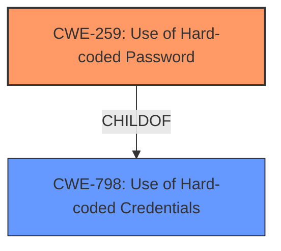

# Enhanced Analysis for CVE-2021-45522

# Summary
| CWE ID | CWE Name | Confidence | CWE Abstraction Level | CWE Vulnerability Mapping Label | CWE-Vulnerability Mapping Notes |
|---|---|---|---|---|---|
| CWE-259 | Use of Hard-coded Password | 1.0 | Variant | Allowed | Primary CWE. The vulnerability explicitly states that a hardcoded password exists. |
| CWE-798 | Use of Hard-coded Credentials | 0.7 | Base | Allowed | Secondary candidate. CWE-798 is a more general form of CWE-259. While applicable, CWE-259 is more specific. |

## Evidence and Confidence

*   **Confidence Score:** 1.0
*   **Evidence Strength:** HIGH

## Relationship Analysis
The primary relationship influencing the decision is the ChildOf relationship between CWE-259 and CWE-798. CWE-259 is a Variant of CWE-798, making it a more specific and appropriate choice given the available information. There are no discernible chain relationships in this simple scenario.



## Vulnerability Chain
The chain of events is simple:
1.  **Root Cause:** CWE-259 (**Use of Hard-coded Password**)
2.  **Impact:** Unauthorized access and control over the affected device.

## Summary of Analysis
The initial assessment strongly pointed towards CWE-259 due to the explicit mention of a **hardcoded password** in the vulnerability description and the "CVE Reference Links Content Summary". The Retriever Results also listed CWE-259 and CWE-798 as top candidates.

The relationship analysis reinforced this choice. CWE-259 is a variant (more specific) of CWE-798. Given the direct evidence, selecting the more specific CWE-259 is the correct decision.

The selection is based on:

*   **Vulnerability Description Key Phrases:** The **rootcause** is identified as "**hardcoded password**."
*   **CVE Reference Links Content Summary:** States "**Root cause of vulnerability: Hardcoded password**" and "**Weaknesses/vulnerabilities present: Use of a hardcoded password.**"

Therefore, CWE-259 is the optimal choice because it directly and accurately describes the **root cause** of the vulnerability.

Relevant CWE Information:

# Enhanced Context (25 CWEs)

## CWE-259: Use of Hard-coded Password
**Abstraction:** Variant
**Status:** Draft

### Description
The product contains a **hard-coded password**, which it uses for its own inbound authentication or for outbound communication to external components.

### Extended Description


A **hard-coded password** typically leads to a significant authentication failure that can be difficult for the system administrator to detect. Once detected, it can be difficult to fix, so the administrator may be forced into disabling the product entirely. There are two main variations:

```
		Inbound: the product contains an authentication mechanism that checks for a hard-coded password.
		Outbound: the product connects to another system or component, and it contains hard-coded password for connecting to that component.
```
In the Inbound variant, a default administration account is created, and a simple password is **hard-coded** into the product and associated with that account. This **hard-coded password** is the same for each installation of the product, and it usually cannot be changed or disabled by system administrators without manually modifying the program, or otherwise patching the product. If the password is ever discovered or published (a common occurrence on the Internet), then anybody with knowledge of this password can access the product. Finally, since all installations of the product will have the same password, even across different organizations, this enables massive attacks such as worms to take place.

The Outbound variant applies to front-end systems that authenticate with a back-end service. The back-end service may require a fixed password which can be easily discovered. The programmer may simply **hard-code** those back-end credentials into the front-end product. Any user of that program may be able to extract the password. Client-side systems with **hard-coded passwords** pose even more of a threat, since the extraction of a password from a binary is usually very simple.

### Mapping Guidance
**Usage:** Allowed
**Rationale:** This CWE entry is at the Variant level of abstraction, which is a preferred level of abstraction for mapping to the root causes of vulnerabilities.

## CWE-798: Use of Hard-coded Credentials
**Abstraction:** Base
**Status:** Draft

### Description
The product contains **hard-coded credentials**, such as a password or cryptographic key.

### Extended Description
There are two main variations:
  - Inbound: the product contains an authentication mechanism that checks the input credentials against a **hard-coded** set of credentials. In this variant, a default administration account is created, and a simple password is **hard-coded** into the product and associated with that account. This **hard-coded password** is the same for each installation of the product, and it usually cannot be changed or disabled by system administrators without manually modifying the program, or otherwise patching the product. It can also be difficult for the administrator to detect.
  - Outbound: the product connects to another system or component, and it contains **hard-coded credentials** for connecting to that component. This variant applies to front-end systems that authenticate with a back-end service. The back-end service may require a fixed password that can be easily discovered. The programmer may simply **hard-code** those back-end credentials into the front-end product.

### Mapping Guidance
**Usage:** Allowed
**Rationale:** This CWE entry is at the Base level of abstraction, which is a preferred level of abstraction for mapping to the root causes of vulnerabilities.

## Other CWEs Considered and Rejected:
*   CWE-321: Use of Hard-coded Cryptographic Key - While hardcoded, the vulnerability description specifically mentions a password, not a cryptographic key.
*   CWE-1393: Use of Default Password - The description specifies that the password is hardcoded, not a default password.
*   CWE-77, CWE-74, CWE-472, CWE-425, CWE-187, CWE-912 - These CWEs are related to injection, external control, forced browsing, and hidden functionality, none of which are directly applicable to the **hardcoded password** issue.


## CWE Relationship Analysis

Current CWEs represent these abstraction levels: .


### Vulnerability Chain Analysis

**Chain starting from CWE-912:**
- 912 (Hidden Functionality) - ROOT


**Chain starting from CWE-1393:**
- 1393 (Use of Default Password) - ROOT


### CWE Relationship Diagram

```mermaid
graph TD
    classDef primary fill:#f96,stroke:#333,stroke-width:2px
    classDef secondary fill:#69f,stroke:#333
    classDef tertiary fill:#9e9,stroke:#333
```