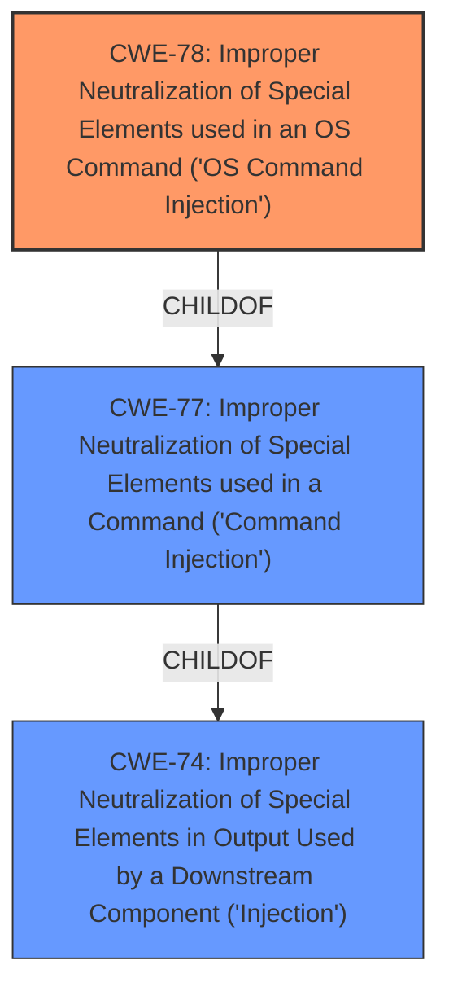

# Enhanced Analysis for CVE-2021-45532

# Summary
| CWE ID | CWE Name | Confidence | CWE Abstraction Level | CWE Vulnerability Mapping Label | CWE-Vulnerability Mapping Notes |
|---|---|---|---|---|---|
| CWE-78 | Improper Neutralization of Special Elements used in an OS Command ('OS Command Injection') | 1.0 | Base | Allowed | Primary CWE |

## Evidence and Confidence

*   **Confidence Score:** 1.0
*   **Evidence Strength:** HIGH

## Relationship Analysis
The primary relationship that influenced the CWE selection was the ChildOf relationship between CWE-78 and CWE-77, and also CWE-74. While the description mentions "command injection," the context and the NETGEAR security advisory point towards OS commands, making CWE-78 a more specific and accurate choice than CWE-77 (Improper Neutralization of Special Elements used in a Command). CWE-74 is a more general class of Improper Neutralization, so it is less specific than CWE-78. The selection of CWE-78 as the base vulnerability benefits from its direct alignment with the evidence.



## Vulnerability Chain
The vulnerability chain starts with:
1.  **Root Cause:** **Command Injection** due to **improper neutralization** of special elements.
2.  **Vulnerability:** An authenticated user can inject OS commands.
3.  **Impact:** Execution of arbitrary commands, system compromise, data theft, settings manipulation, malicious firmware installation, or botnet participation.

## Summary of Analysis
The initial assessment identified **command injection** as the core issue. The key evidence supporting this is the vulnerability description stating, "NETGEAR R8000 devices before 1.0.4.76 are affected by **command injection** by an authenticated user." The "CWE for similar CVE Descriptions" section also indicates that CWE-78 is the primary match for similar vulnerabilities. The NETGEAR security advisory content summary confirms that the **root cause** is a post-authentication **command injection** flaw that allows execution of arbitrary commands.

Based on the evidence and the retriever results, CWE-78 is the most appropriate choice. It aligns with the base level of abstraction and accurately represents the vulnerability. The MITRE mapping guidance allows the usage of CWE-78 at the base level, reinforcing the selection.

CWE-77 was considered but not chosen because it is a class-level CWE and less specific than CWE-78, which directly addresses OS command injection.
CWE-74 was considered but not chosen because it is a class-level CWE and too generic, which is the improper neutralization of special elements, rather than specifically OS command injection.
# Relevant CWE Information:

# Enhanced Context (25 CWEs)

## CWE-697: Incorrect Comparison
**Abstraction Level**: Pillar
**Similarity Score**: 0.74

**Description**:
The product compares two entities in a security-relevant context, but the comparison is incorrect, which may lead to resultant weaknesses.
*Not chosen*: Irrelevant to command injection.

## CWE-1289: Improper Validation of Unsafe Equivalence in Input
**Abstraction Level**: Base
**Similarity Score**: 0.74

**Description**:
The product receives an input value that is used as a resource identifier or other type of reference, but it does not validate or incorrectly validates that the input is equivalent to a potentially-unsafe value.
*Not chosen*: Irrelevant to command injection.

## CWE-74: Improper Neutralization of Special Elements in Output Used by a Downstream Component ('Injection')
**Abstraction Level**: Class
**Similarity Score**: 0.74

**Description**:
The product constructs all or part of a command, data structure, or record using externally-influenced input from an upstream component, but it does not neutralize or incorrectly neutralizes special elements that could modify how it is parsed or interpreted when it is sent to a downstream component.
*Not chosen*: CWE-74 is too high-level and generic for this specific vulnerability.

## CWE-184: Incomplete List of Disallowed Inputs
**Abstraction Level**: Base
**Similarity Score**: 0.72

**Description**:
The product implements a protection mechanism that relies on a list of inputs (or properties of inputs) that are not allowed by policy or otherwise require other action to neutralize before additional processing takes place, but the list is incomplete.
*Not chosen*: Irrelevant to command injection.

## CWE-943: Improper Neutralization of Special Elements in Data Query Logic
**Abstraction Level**: Class
**Similarity Score**: 0.72

**Description**:
The product generates a query intended to access or manipulate data in a data store such as a database, but it does not neutralize or incorrectly neutralizes special elements that can modify the intended logic of the query.
*Not chosen*: Irrelevant to command injection.

## CWE-41: Improper Resolution of Path Equivalence
**Abstraction Level**: Base
**Similarity Score**: 0.71

**Description**:
The product is vulnerable to file system contents disclosure through path equivalence. Path equivalence involves the use of special characters in file and directory names. The associated manipulations are intended to generate multiple names for the same object.
*Not chosen*: Irrelevant to command injection.

## CWE-80: Improper Neutralization of Script-Related HTML Tags in a Web Page (Basic XSS)
**Abstraction Level**: Variant
**Similarity Score**: 0.71

**Description**:
The product receives input from an upstream component, but it does not neutralize or incorrectly neutralizes special characters such as "<", ">", and "&" that could be interpreted as web-scripting elements when they are sent to a downstream component that processes web pages.
*Not chosen*: Irrelevant to command injection.

## CWE-703: Improper Check or Handling of Exceptional Conditions
**Abstraction Level**: Pillar
**Similarity Score**: 0.71

**Description**:
The product does not properly anticipate or handle exceptional conditions that rarely occur during normal operation of the product.
*Not chosen*: Irrelevant to command injection.

## CWE-653: Improper Isolation or Compartmentalization
**Abstraction Level**: Class
**Similarity Score**: 0.71

**Description**:
The product does not properly compartmentalize or isolate functionality, processes, or resources that require different privilege levels, rights, or permissions.
*Not chosen*: Irrelevant to command injection.

## CWE-138: Improper Neutralization of Special Elements
**Abstraction Level**: Class
**Similarity Score**: 0.71

**Description**:
The product receives input from an upstream component, but it does not neutralize or incorrectly neutralizes special elements that could be interpreted as control elements or syntactic markers when they are sent to a downstream component.
*Not chosen*: CWE-138 is too high-level and generic for this specific vulnerability.

## CWE-88: Improper Neutralization of Argument Delimiters in a Command ('Argument Injection')
**Abstraction Level**: Base
**Similarity Score**: 8168.33

**Description**:
The product constructs a string for a command to be executed by a separate component
in another control sphere, but it does not properly delimit the
intended arguments, options, or switches within that command string.
*Not chosen*: Argument injection is a separate issue from command injection.

## CWE-79: Improper Neutralization of Input During Web Page Generation ('Cross-site Scripting')
**Abstraction Level**: Base
**Similarity Score**: 8041.65

**Description**:
The product does not neutralize or incorrectly neutralizes user-controllable input before it is placed in output that is used as a web page that is served to other users.
*Not chosen*: Irrelevant to command injection.

## CWE-116: Improper Encoding or Escaping of Output
**Abstraction Level**: Class
**Similarity Score**: 8002.22

**Description**:
The product prepares a structured message for communication with another component, but encoding or escaping of the data is either missing or done incorrectly. As a result, the intended structure of the message is not preserved.
*Not chosen*: Irrelevant to command injection.

## CWE-138: Improper Neutralization of Special Elements
**Abstraction Level**: Class
**Similarity Score**: 7971.56

**Description**:
The product receives input from an upstream component, but it does not neutralize or incorrectly neutralizes special elements that could be interpreted as control elements or syntactic markers when they are sent to a downstream component.
*Not chosen*: CWE-138 is too high-level and generic


## CWE Relationship Analysis

Current CWEs represent these abstraction levels: .


### Vulnerability Chain Analysis

**Chain starting from CWE-79:**
- 79 (Improper Neutralization of Input During Web Page Generation ('Cross-site Scripting')) - ROOT


**Chain starting from CWE-943:**
- 943 (Improper Neutralization of Special Elements in Data Query Logic) - ROOT


### CWE Relationship Diagram

```mermaid
graph TD
    classDef primary fill:#f96,stroke:#333,stroke-width:2px
    classDef secondary fill:#69f,stroke:#333
    classDef tertiary fill:#9e9,stroke:#333
```