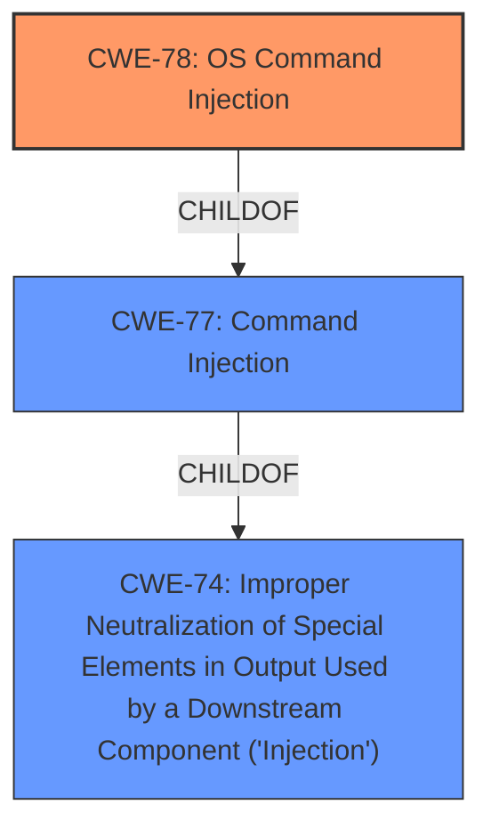

# Raw Analyzer Response for CVE-2021-45536

# Summary
| CWE ID  | CWE Name  | Confidence | CWE Abstraction Level | CWE Vulnerability Mapping Label | CWE-Vulnerability Mapping Notes |
|---|---|---|---|---|---|
| CWE-78 | Improper Neutralization of Special Elements used in an OS Command ('OS Command Injection') | 1.0 | Base | Allowed | Primary CWE |
| CWE-77 | Improper Neutralization of Special Elements used in a Command ('Command Injection') | 0.7 | Class | Allowed-with-Review | Secondary Candidate |

## Evidence and Confidence

*   **Confidence Score:** 0.9
*   **Evidence Strength:** HIGH

## Relationship Analysis
The primary CWE is CWE-78, which is a base level CWE and a child of the class-level CWE-77. This relationship is important because while the description mentions **command injection**, the specific nature of the commands being injected are OS commands, making CWE-78 a more precise fit.

## Vulnerability Chain
The vulnerability chain starts with the **improper neutralization** of special elements within the OS command, leading to **OS Command Injection**.
  - The root cause is the insufficient input validation/sanitization.
  - The impact is the ability to execute arbitrary commands on the operating system.

## Summary of Analysis
The initial assessment identified **command injection** as the key weakness. The subsequent analysis, strengthened by the "CVE Reference Links Content Summary," clearly points to the commands being OS commands. The primary CWE match from similar CVE descriptions is CWE-77, but CWE-78 is more specific and appropriate given the nature of the injected commands. The evidence from the summary explicitly states that the vulnerability enables an attacker to inject and execute arbitrary commands on the underlying operating system of the device.

> **Supporting Evidence:** "Root Cause: The vulnerability is a post-authentication command injection issue. This means that after a user has successfully logged into the device, they can inject and execute arbitrary commands on the underlying operating system of the device."

This evidence strongly supports the selection of CWE-78. The graph relationships confirm that CWE-78 is a child of CWE-77, making it a more specific choice when the commands are OS commands.

The decision to use CWE-78 is based on the specificity of the vulnerability description and the hierarchical relationships between the CWEs. CWE-78 accurately represents the weakness at the optimal level of specificity (Base).

Relevant CWE Information:

# Enhanced Context (25 CWEs)

## CWE-917: Improper Neutralization of Special Elements used in an Expression Language Statement ('Expression Language Injection')
**Abstraction Level**: Base
**Similarity Score**: 0.78

**Description**:
The product constructs all or part of an expression language (EL) statement in a framework such as a Java Server Page (JSP) using externally-influenced input from an upstream component, but it does not neutralize or incorrectly neutralizes special elements that could modify the intended EL statement before it is executed.
**Not Used**: This CWE is not applicable because the vulnerability is about OS commands, not expression language statements.

## CWE-943: Improper Neutralization of Special Elements in Data Query Logic
**Abstraction Level**: Class
**Similarity Score**: 0.71

**Description**:
The product generates a query intended to access or manipulate data in a data store such as a database, but it does not neutralize or incorrectly neutralizes special elements that can modify the intended logic of the query.
**Not Used**: This CWE is not applicable because the vulnerability is about OS commands, not data query logic.

## CWE-80: Improper Neutralization of Script-Related HTML Tags in a Web Page (Basic XSS)
**Abstraction Level**: Variant
**Similarity Score**: 0.71

**Description**:
The product receives input from an upstream component, but it does not neutralize or incorrectly neutralizes special characters such as "<", ">", and "&" that could be interpreted as web-scripting elements when they are sent to a downstream component that processes web pages.
**Not Used**: This CWE is not applicable because the vulnerability is about OS commands, not script-related HTML tags.

## CWE-162: Improper Neutralization of Trailing Special Elements
**Abstraction Level**: Variant
**Similarity Score**: 0.70

**Description**:
The product receives input from an upstream component, but it does not neutralize or incorrectly neutralizes trailing special elements that could be interpreted in unexpected ways when they are sent to a downstream component.
**Not Used**: This CWE is not specific enough and the description does not indicate the injection is related to trailing special elements.

## CWE-150: Improper Neutralization of Escape, Meta, or Control Sequences
**Abstraction Level**: Variant
**Similarity Score**: 0.70

**Description**:
The product receives input from an upstream component, but it does not neutralize or incorrectly neutralizes special elements that could be interpreted as escape, meta, or control character sequences when they are sent to a downstream component.
**Not Used**: This CWE is not specific enough and the description does not focus on escape, meta, or control sequences.

## CWE-643: Improper Neutralization of Data within XPath Expressions ('XPath Injection')
**Abstraction Level**: Base
**Similarity Score**: 0.70

**Description**:
The product uses external input to dynamically construct an XPath expression used to retrieve data from an XML database, but it does not neutralize or incorrectly neutralizes that input. This allows an attacker to control the structure of the query.
**Not Used**: This CWE is not applicable because the vulnerability is about OS commands, not XPath expressions.

## CWE-146: Improper Neutralization of Expression/Command Delimiters
**Abstraction Level**: Variant
**Similarity Score**: 0.70

**Description**:
The product receives input from an upstream component, but it does not neutralize or incorrectly neutralizes special elements that could be interpreted as expression or command delimiters when they are sent to a downstream component.
**Not Used**: While this is related to command delimiters it is less specific than CWE-78.

## CWE-652: Improper Neutralization of Data within XQuery Expressions ('XQuery Injection')
**Abstraction Level**: Base
**Similarity Score**: 0.69

**Description**:
The product uses external input to dynamically construct an XQuery expression used to retrieve data from an XML database, but it does not neutralize or incorrectly neutralizes that input. This allows an attacker to control the structure of the query.
**Not Used**: This CWE is not applicable because the vulnerability is about OS commands, not XQuery expressions.

## CWE-470: Use of Externally-Controlled Input to Select Classes or Code ('Unsafe Reflection')
**Abstraction Level**: Base
**Similarity Score**: 0.69

**Description**:
The product uses external input with reflection to select which classes or code to use, but it does not sufficiently prevent the input from selecting improper classes or code.
**Not Used**: This CWE is not applicable because the vulnerability is about OS commands, not selecting classes or code.

## CWE-653: Improper Isolation or Compartmentalization
**Abstraction Level**: Class
**Similarity Score**: 0.68

**Description**:
The product does not properly compartmentalize or isolate functionality, processes, or resources that require different privilege levels, rights, or permissions.
**Not Used**: This CWE is not applicable because the vulnerability is about OS commands, not isolation or compartmentalization.

## CWE-22: Improper Limitation of a Pathname to a Restricted Directory ('Path Traversal')
**Abstraction Level**: Base
**Similarity Score**: 10186.63

**Description**:
The product uses external input to construct a pathname that is intended to identify a file or directory that is located underneath a restricted parent directory, but the product does not properly neutralize special elements within the pathname that can cause the pathname to resolve to a location that is outside of the restricted directory.
**Not Used**: This CWE is not applicable because the vulnerability is about OS commands, not path traversal.

## CWE-79: Improper Neutralization of Input During Web Page Generation ('Cross-site Scripting')
**Abstraction Level**: Base
**Similarity Score**: 10067.92

**Description**:
The product does not neutralize or incorrectly neutralizes user-controllable input before it is placed in output that is used as a web page that is served to other users.
**Not Used**: This CWE is not applicable because the vulnerability is about OS commands, not cross-site scripting.

## CWE-88: Improper Neutralization of Argument Delimiters in a Command ('Argument Injection')
**Abstraction Level**: Base
**Similarity Score**: 9885.55

**Description**:
The product constructs a string for a command to be