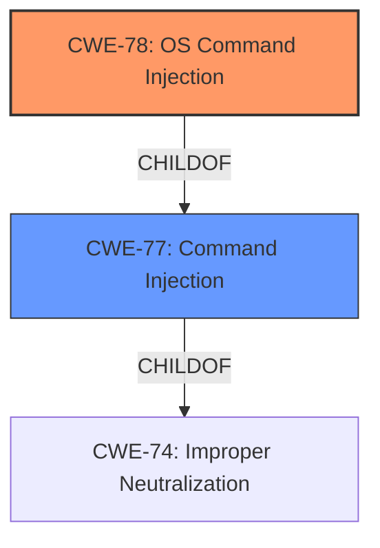

# Analysis for CVE-2021-45540

# Summary
| CWE ID | CWE Name | Confidence | CWE Abstraction Level | CWE Vulnerability Mapping Label | CWE-Vulnerability Mapping Notes |
|---|---|---|---|---|---|
| CWE-78 | Improper Neutralization of Special Elements used in an OS Command ('OS Command Injection') | 1.0 | Base | Allowed | Primary CWE |
| CWE-77 | Improper Neutralization of Special Elements used in a Command ('Command Injection') | 0.7 | Class | Allowed-with-Review | Secondary Candidate |

## Evidence and Confidence

*   **Confidence Score:** 0.9
*   **Evidence Strength:** HIGH

## Relationship Analysis
The primary relationship influencing the CWE selection is the ChildOf relationship between CWE-78 and CWE-77. CWE-78 is a more specific (Base) case of CWE-77 (Class), focusing on OS commands. Since the vulnerability description explicitly mentions **command injection** without specifying a non-OS command language, CWE-78 is the more appropriate choice.

## Vulnerability Chain
The chain of events is as follows:
1.  **Root Cause:** Improper Neutralization of Special Elements used in an OS Command (CWE-78).
2.  **Weakness:** An authenticated user can inject arbitrary commands.
3.  **Impact:** Full control of the device, including unauthorized access, data theft, and further malicious activity.

## Summary of Analysis
The initial assessment identified **command injection** as the primary **weakness**. The evidence from the vulnerability description explicitly states, "Certain NETGEAR devices are affected by **command injection** by an authenticated user." The CVE Reference Links Content Summary further clarifies this by stating, "The vulnerability is a post-authentication command injection flaw" and "An attacker can inject arbitrary commands into the system."

The Retriever Results listed CWE-77 as the top match, but the description for CWE-77 states "Note: often used when 'OS command injection' (CWE-78) was intended." Also, the description for CWE-78 says "This CWE entry is at the Base level of abstraction, which is a preferred level of abstraction for mapping to the root causes of vulnerabilities." The relationship analysis confirms that CWE-78 is a child of CWE-77, making it more specific.

Therefore, CWE-78 is chosen as the primary CWE because the **command injection** occurs in the context of OS commands, and CWE-78 is more specific and at the Base level of abstraction. CWE-77 is a secondary candidate in case the specific commands are not OS commands, but are commands in another language.

Relevant CWE Information:

# Enhanced Context (25 CWEs)
The following CWEs were identified as potentially relevant to this vulnerability:

## CWE-74: Improper Neutralization of Special Elements in Output Used by a Downstream Component ('Injection')
**Abstraction Level**: Class
**Similarity Score**: 0.77
**Source**: dense

**Description**:
The product constructs all or part of a command, data structure, or record using externally-influenced input from an upstream component, but it does not neutralize or incorrectly neutralizes special elements that could modify how it is parsed or interpreted when it is sent to a downstream component.

**Mapping Guidance**:
- Usage: Discouraged
- Rationale: CWE-74 is high-level and often misused when lower-level weaknesses are more appropriate.

## CWE-78: Improper Neutralization of Special Elements used in an OS Command ('OS Command Injection')
**Abstraction Level**: Base
**Similarity Score**: 4.47
**Source**: graph

**Description**:
CWE-78: Improper Neutralization of Special Elements used in an OS Command ('OS Command Injection')

**Mapping Guidance**:
- Usage: Allowed
- Rationale: This CWE entry is at the Base level of abstraction, which is a preferred level of abstraction for mapping to the root causes of vulnerabilities.

## CWE-77: Improper Neutralization of Special Elements used in a Command ('Command Injection')
**Abstraction Level:** Class
**Status:** Draft

### Description
The product constructs all or part of a command using externally-influenced input from an upstream component, but it does not neutralize or incorrectly neutralizes special elements that could modify the intended command when it is sent to a downstream component.

### Extended Description

Many protocols and products have their own custom command language. While OS or shell command strings are frequently discovered and targeted, developers may not realize that these other command languages might also be vulnerable to attacks.