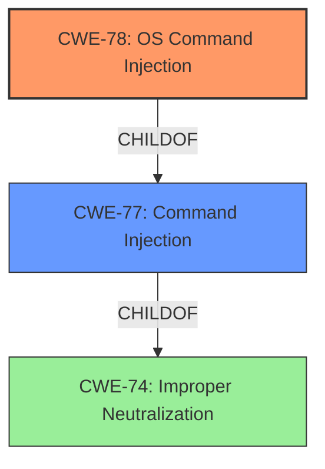

# Enhanced Analysis for CVE-2021-45549

# Summary
| CWE ID | CWE Name | Confidence | CWE Abstraction Level | CWE Vulnerability Mapping Label | CWE-Vulnerability Mapping Notes |
|---|---|---|---|---|---|
| CWE-78 | Improper Neutralization of Special Elements used in an OS Command ('OS Command Injection') | 1.0 | Base | Primary | Allowed |
| CWE-77 | Improper Neutralization of Special Elements used in a Command ('Command Injection') | 0.7 | Class | Secondary | Allowed-with-Review |

## Evidence and Confidence

*   **Confidence Score:** 1.0
*   **Evidence Strength:** HIGH

## Relationship Analysis
The primary CWE is CWE-78, which is a base level CWE and a child of CWE-77.
CWE-78 is more specific than CWE-77.



## Vulnerability Chain
The chain of events is as follows:
1.  The product receives input from an authenticated user.
2.  The product fails to neutralize special elements in that input.
3.  The input is used to construct an OS command.
4.  The OS command is executed, leading to a **command injection** vulnerability.

## Summary of Analysis
The vulnerability is a **command injection** vulnerability affecting NETGEAR devices. An authenticated user can inject commands into the system.
The retriever results list CWE-77 as the top candidate, but the description clearly states this is an OS command.
CWE-78 is the more appropriate selection, as it is a base level CWE for OS command injection, and a child of CWE-77.
The advisory states the vulnerability is a *post-authentication* command injection and the CVSS vector reflects this with `PR:H`.

Relevant CWE Information:

# Enhanced Context (25 CWEs)
The following CWEs were identified as potentially relevant to this vulnerability:

## CWE-77: Improper Neutralization of Special Elements used in a Command ('Command Injection')
**Abstraction Level**: Class
**Similarity Score**: 1.00

The product constructs all or part of a command using externally-influenced input from an upstream component, but it does not neutralize or incorrectly neutralizes special elements that could modify the intended command when it is sent to a downstream component.

**Mapping Guidance**:
**Usage:** Allowed-with-Review
**Rationale:** CWE-77 is often misused when OS command injection (CWE-78) was intended instead [REF-1287].
**Comments:** Ensure that the analysis focuses on the root-cause error that allows the execution of commands, as there are many weaknesses that can lead to this consequence. See Terminology Notes. If the weakness involves a command language besides OS shell invocation, then CWE-77 could be used.
**Suggested Alternatives:**
- CWE-78: OS Command Injection

## CWE-78: Improper Neutralization of Special Elements used in an OS Command ('OS Command Injection')
**Abstraction Level**: Base
**Similarity Score**: 0.70

The product constructs all or part of an OS command using externally-influenced input from an upstream component, but it does not neutralize or incorrectly neutralizes special elements that could modify the intended OS command when it is sent to a downstream component.

**Mapping Guidance**:
**Usage:** Allowed
**Rationale:** This CWE entry is at the Base level of abstraction, which is a preferred level of abstraction for mapping to the root causes of vulnerabilities.

### Other CWE Considerations
CWE-74: Improper Neutralization of Special Elements in Output Used by a Downstream Component ('Injection') - This is a class level CWE that is too high level. The children CWE-77 and CWE-78 are more appropriate.
CWE-94: Improper Control of Generation of Code ('Code Injection') - This CWE is for when the product intentionally constructs a code segment. This is not the case here, so it is not appropriate.
CWE-79: Improper Neutralization of Input During Web Page Generation ('Cross-site Scripting') - This CWE is for cross-site scripting vulnerabilities. This is not the case here, so it is not appropriate.
CWE-88: Improper Neutralization of Argument Delimiters in a Command ('Argument Injection') - This CWE is for when the product does not properly delimit the intended arguments. This may be a secondary weakness, but the primary weakness is the lack of neutralization, making CWE-78 more appropriate.
CWE-121: Stack-based Buffer Overflow - This is a buffer overflow. While command injection could result in a buffer overflow, this is not the root cause.
CWE-400: Uncontrolled Resource Consumption - This is a resource consumption vulnerability. While command injection could result in resource consumption, this is not the root cause.
CWE-770: Allocation of Resources Without Limits or Throttling - This is a resource allocation vulnerability. While command injection could result in this, it is not the root cause.
CWE-190: Integer Overflow or Wraparound - This is an integer overflow. This is not the root cause.
CWE-1284: Improper Validation of Specified Quantity in Input - This is an input validation issue. This is not the root cause.
CWE-410: Insufficient Resource Pool - This is a resource pool issue. This is not the root cause.
CWE-789: Memory Allocation with Excessive Size Value - This is a memory allocation issue. This is not the root cause.
CWE-96: Improper Neutralization of Directives in Statically Saved Code ('Static Code Injection') - This is for static code injection. This is not the case here.
CWE-843: Access of Resource Using Incompatible Type ('Type Confusion') - This is type confusion. This is not the root cause.
CWE-116: Improper Encoding or Escaping of Output - This is for improper encoding or escaping of output. This is similar to CWE-78, but it is more general.


## CWE Relationship Analysis

Current CWEs represent these abstraction levels: .


### Vulnerability Chain Analysis

**Chain starting from CWE-121:**
- 121 (Stack-based Buffer Overflow) - ROOT


**Chain starting from CWE-79:**
- 79 (Improper Neutralization of Input During Web Page Generation ('Cross-site Scripting')) - ROOT


### CWE Relationship Diagram

```mermaid
graph TD
    classDef primary fill:#f96,stroke:#333,stroke-width:2px
    classDef secondary fill:#69f,stroke:#333
    classDef tertiary fill:#9e9,stroke:#333
```