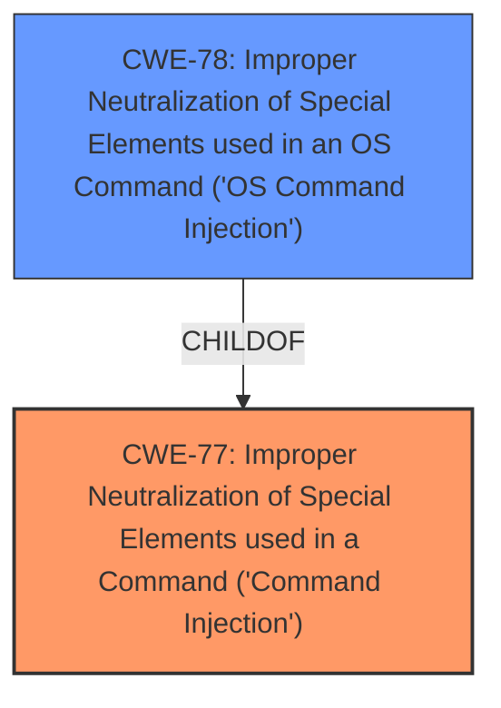

# Enhanced Analysis for CVE-2021-45558

# Summary
| CWE ID | CWE Name | Confidence | CWE Abstraction Level | CWE Vulnerability Mapping Label | CWE-Vulnerability Mapping Notes |
|---|---|---|---|---|---|
| CWE-77 | Improper Neutralization of Special Elements used in a Command ('Command Injection') | 1.0 | Class | Allowed-with-Review | Primary CWE |
| CWE-78 | Improper Neutralization of Special Elements used in an OS Command ('OS Command Injection') | 0.7 | Base | Allowed | Secondary Candidate |

## Evidence and Confidence

*   **Confidence Score:** 0.9
*   **Evidence Strength:** HIGH

## Relationship Analysis
The primary identified CWE is CWE-77, which is a Class-level weakness. CWE-78 is a more specific, Base-level weakness and is a child of CWE-77.
The relationship influenced the decision to consider CWE-78 as a secondary candidate.



## Vulnerability Chain
The vulnerability chain involves an authenticated user injecting commands due to **improper neutralization** of special elements in a command, leading to arbitrary command execution.
  - Root Cause: **Improper Neutralization** (CWE-77)
  - Impact: Arbitrary command execution

## Summary of Analysis
The initial analysis focused on the **command injection** vulnerability. The primary CWE match from similar CVE descriptions is CWE-77. The provided evidence from the "CVE Reference Links Content Summary" explicitly mentions a **command injection vulnerability** and the potential for arbitrary command execution, supporting the selection of CWE-77. The Retriever Results also listed CWE-77 as the top candidate with a score of 1.0.

CWE-78 was considered as a more specific alternative, given that the commands being injected are OS commands. However, the vulnerability description does not explicitly state that the injected commands are exclusively OS commands. Therefore, CWE-77 is chosen as the primary CWE because it represents the broader category of **command injection**, while CWE-78 is a suitable secondary candidate if more information comes to light showing OS commands are involved.

The final selection prioritizes CWE-77 due to its direct alignment with the **command injection** weakness described in the vulnerability and supporting evidence. This decision is based on the available evidence, relationship analysis, and mapping guidance.

Relevant CWE Information:

# Enhanced Context (25 CWEs)
The following CWEs were identified as potentially relevant to this vulnerability:

## CWE-77: Improper Neutralization of Special Elements used in a Command ('Command Injection')
**Abstraction Level**: Class
**Similarity Score**: 0.76
**Source**: dense

**Description**:
The product constructs all or part of a command using externally-influenced input from an upstream component, but it does not neutralize or incorrectly neutralizes special elements that could modify the intended command when it is sent to a downstream component.

**Mapping Guidance**:
- Usage: Allowed-with-Review
- Rationale: CWE-77 is often misused when OS command injection (CWE-78) was intended instead [REF-1287].
- Comments: Ensure that the analysis focuses on the root-cause error that allows the execution of commands, as there are many weaknesses that can lead to this consequence. See Terminology Notes. If the weakness involves a command language besides OS shell invocation, then CWE-77 could be used.
- Reasons:
- Frequent Misuse
- Suggested Alternatives:
- CWE-78: OS Command Injection

**Supporting Evidence:** "The product constructs all or part of a command using externally-influenced input...but it does not neutralize or incorrectly neutralizes special elements that could modify the intended command..." This perfectly aligns with the vulnerability description where an authenticated user can inject commands due to **improper neutralization**. The weakness is the **improper neutralization** that leads to the arbitrary command execution.

## CWE-78: Improper Neutralization of Special Elements used in an OS Command ('OS Command Injection')
**Abstraction Level**: Base
**Similarity Score**: 5.03
**Source**: graph

**Description**:
The product constructs all or part of an OS command using externally-influenced input from an upstream component, but it does not neutralize or incorrectly neutralizes special elements that could modify the intended OS command when it is sent to a downstream component.

**Mapping Guidance**:
- Usage: Allowed
- Rationale: This CWE entry is at the Base level of abstraction, which is a preferred level of abstraction for mapping to the root causes of vulnerabilities.

**Supporting Evidence:** The vulnerability summary indicates **command injection**. If the injected commands are determined to be OS commands, then this CWE would be a more specific fit. However, without more information, CWE-77 is a more appropriate initial classification.

## CWE-74: Improper Neutralization of Special Elements in Output Used by a Downstream Component ('Injection')
**Abstraction Level**: Class
**Similarity Score**: 9479.69
**Source**: sparse

**Description**:
The product constructs all or part of a command, data structure, or record using externally-influenced input from an upstream component, but it does not neutralize or incorrectly neutralizes special elements that could modify how it is parsed or interpreted when it is sent to a downstream component.

**Mapping Guidance**:
- Usage: Discouraged
- Rationale: CWE-74 is high-level and often misused when lower-level weaknesses are more appropriate.

**Reasons for Exclusion**: While this CWE relates to **improper neutralization**, it is too generic. CWE-77 and CWE-78 are more specific to **command injection**.

## CWE-121: Stack-based Buffer Overflow
**Abstraction Level**: Variant
**Similarity Score**: 0.269
**Source**: sparse

**Description**:
A stack-based buffer overflow condition is a condition where the buffer being overwritten is allocated on the stack (i.e., is a local variable or, rarely, a parameter to a function).

**Reasons for Exclusion:** This CWE is not relevant to the described vulnerability. The root cause is **command injection**, not a buffer overflow.

## CWE-400: Uncontrolled Resource Consumption
**Abstraction Level**: Class
**Similarity Score**: 0.249
**Source**: sparse

**Description**:
The product does not properly control the allocation and maintenance of a limited resource, thereby enabling an actor to influence the amount of resources consumed, eventually leading to the exhaustion of available resources.

**Reasons for Exclusion:** The vulnerability is primarily about **command injection**, not resource consumption.

## CWE-94: Improper Control of Generation of Code ('Code Injection')
**Abstraction Level**: Base
**Similarity Score**: 0.583
**Source**: dense

**Description**:
The product constructs all or part of a code segment using externally-influenced input from an upstream component, but it does not neutralize or incorrectly neutralizes special elements that could modify the syntax or behavior of the intended code segment.

**Reasons for Exclusion**: Code injection is a different weakness from **command injection**. While both involve injecting malicious input, code injection typically refers to injecting actual code that is then executed, while **command injection** involves injecting commands that are interpreted by a command interpreter.

## CWE-79: Improper Neutralization of Input During Web Page Generation ('Cross-site Scripting')
**Abstraction Level**: Base
**Similarity Score**: 0.002
**Source**: graph

**Description**:
The product does not neutralize or incorrectly neutralizes user-controllable input before it is placed in output that is used as a web page that is served to other users.

**Reasons for Exclusion:** This CWE is not relevant as it pertains to cross-site scripting, not **command injection**.

## CWE-22: Improper Limitation of a Pathname to a Restricted Directory ('Path Traversal')
**Abstraction Level**: Base
**Similarity Score**: 0.234
**Source**: sparse

**Description**:
The product uses external input to construct a pathname that is intended to identify a file or directory that is located underneath a restricted parent directory, but the product does not properly neutralize special elements within the pathname that can cause the pathname to resolve to a location that is outside of the restricted directory.

**Reasons for Exclusion:** The root cause is **command injection**, not path traversal.

## CWE-917: Improper Neutralization of Special Elements used in an Expression Language Statement ('Expression Language Injection')
**Abstraction Level**: Base
**Similarity Score**: 0.232
**Source**: sparse

**Description**:
The product constructs all or part of an expression language (EL) statement in a framework such as a Java Server Page (JSP) using externally-influenced input from an upstream component, but it does not neutralize or incorrectly neutralizes special elements that could modify the intended EL statement before it is executed.

**Reasons for Exclusion:** This is expression language injection, not **command injection**.

## CWE-269: Improper Privilege Management
**Abstraction Level**: Class


## CWE Relationship Analysis

Current CWEs represent these abstraction levels: .


### Vulnerability Chain Analysis

**Chain starting from CWE-121:**
- 121 (Stack-based Buffer Overflow) - ROOT


**Chain starting from CWE-79:**
- 79 (Improper Neutralization of Input During Web Page Generation ('Cross-site Scripting')) - ROOT


### CWE Relationship Diagram

```mermaid
graph TD
    classDef primary fill:#f96,stroke:#333,stroke-width:2px
    classDef secondary fill:#69f,stroke:#333
    classDef tertiary fill:#9e9,stroke:#333
```