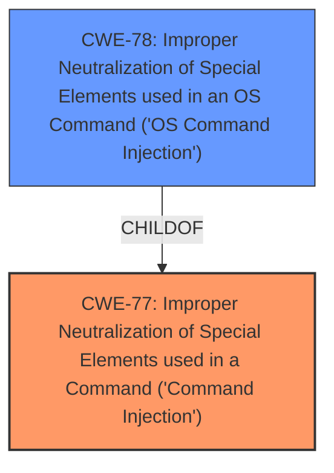

# Analysis for CVE-2021-45559

# Summary
| CWE ID | CWE Name | Confidence | CWE Abstraction Level | CWE Vulnerability Mapping Label | CWE-Vulnerability Mapping Notes |
|---|---|---|---|---|---|
| CWE-77 | Improper Neutralization of Special Elements used in a Command ('Command Injection') | 1.0 | Class | Allowed-with-Review | Primary CWE |
| CWE-78 | Improper Neutralization of Special Elements used in an OS Command ('OS Command Injection') | 0.7 | Base | Allowed | Secondary Candidate |

## Evidence and Confidence

*   **Confidence Score:** 0.85
*   **Evidence Strength:** HIGH

## Relationship Analysis
The primary relationship considered was the parent-child relationship between CWE-77 (Improper Neutralization of Special Elements used in a Command) and CWE-78 (Improper Neutralization of Special Elements used in an OS Command). CWE-77 is a class-level CWE, while CWE-78 is a base-level CWE and a specific type of command injection related to OS commands. Since the vulnerability description and CVE Reference Links point to a general **command injection**, CWE-77 is selected as the primary with CWE-78 as a possible secondary, more specific, match if more information becomes available.

## Vulnerability Chain
The vulnerability chain starts with the **improper neutralization** of input, leading to **command injection**. The chain is as follows:
1.  Authenticated user provides input.
2.  The input is not properly neutralized.
3.  **Command injection** occurs.
4.  The attacker can execute arbitrary commands.
5.  Full compromise of the device (Confidentiality, Integrity, Availability).

## Summary of Analysis
The initial analysis identified **command injection** as the weakness. The primary CWE match from similar CVE descriptions is CWE-77. The retriever results also listed CWE-77 as the top combined result. The CVE Reference Links Content Summary explicitly mentions a "post-authentication **command injection** vulnerability".

The relationship analysis considered that CWE-78 is a child of CWE-77. The mapping guidance for CWE-77 suggests it is often misused when CWE-78 is intended. However, without more specific information that the command injection is directly related to OS commands, CWE-77 is the more appropriate choice.

The final decision to select CWE-77 as the primary CWE is based on the vulnerability description explicitly stating "**command injection** by an authenticated user" and the supporting evidence in the CVE Reference Links Content Summary which also indicates a "**command injection** vulnerability". The confidence level is high because of the clear evidence. CWE-78 is considered as a secondary candidate since the specific type of commands are not specified.

Relevant CWE Information:
- Vulnerability Description: "Certain NETGEAR devices are affected by **command injection** by an authenticated user."
- Vulnerability Description Key Phrases: "**weakness:** **command injection**"
- CVE Reference Links Content Summary: "**Weaknesses/vulnerabilities present:** - **Command Injection**: An attacker, after successfully authenticating, can inject commands to be executed by the system."

Other CWEs Considered but Not Used:
- CWE-78: While related to command injection, it is more specific to OS commands. The description doesn't specify it is limited to OS commands so CWE-77 is more appropriate.
- CWE-74: Considered too high-level.
- CWE-94: Requires code generation which is not mentioned in the description.