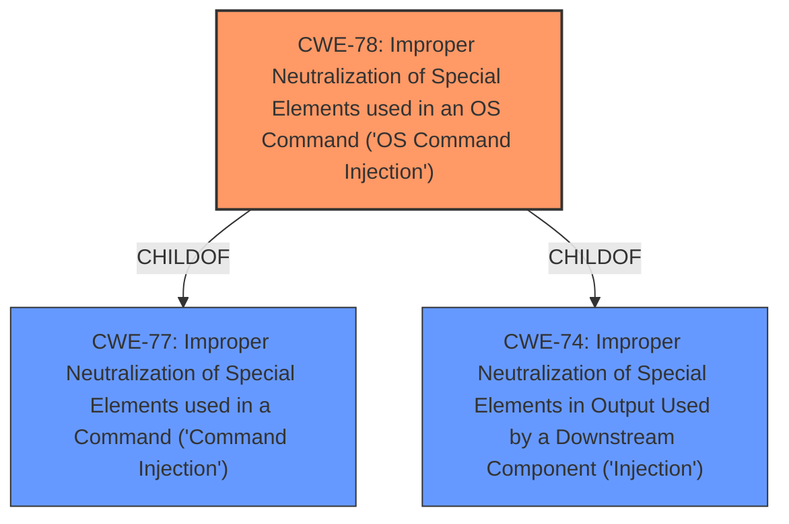

# Raw Analyzer Response for CVE-2021-45560

# Summary
| CWE ID  | CWE Name   | Confidence | CWE Abstraction Level | CWE Vulnerability Mapping Label | CWE-Vulnerability Mapping Notes |
| :------- | :-------------------------------------------------------------------------------------- | :--------- | :---------------------- | :---------------------------------- | :---------------------------------------------------------------------------------------------------------------------------------------------------------------------------------------------------------------------------------------------------------------------------------------------------------------------------------------------------------------------------------------------------------------------------- |
| CWE-78 | Improper Neutralization of Special Elements used in an OS Command ('OS Command Injection') | 1  | Base  | Primary | Allowed: The vulnerability description explicitly states "**command injection**" by an authenticated user, and the CVE Reference Links Content Summary confirms a post-authentication **command injection** vulnerability. CWE-78 directly addresses the **improper neutralization** of special elements used in an OS command, aligning perfectly with the vulnerability details. |

## Evidence and Confidence

*   **Confidence Score:** 1
*   **Evidence Strength:** HIGH

## Relationship Analysis
The primary CWE, CWE-78, is a Base level CWE and a child of CWE-77 and CWE-74. Choosing CWE-78 provides a more specific and accurate representation of the vulnerability because the **command injection** occurs at the operating system level. The relationships influenced the decision to choose the most specific CWE that accurately describes the **command injection**.

## Vulnerability Chain
The vulnerability chain involves an authenticated user exploiting a **command injection** flaw to execute arbitrary commands on the affected device.
  - Root Cause: **Improper neutralization** of special elements in OS commands (CWE-78).
  - Impact: Execution of arbitrary commands on the device.

## Summary of Analysis
The initial assessment, based on the vulnerability description stating "**command injection** by an authenticated user" and the CVE Reference Links Content Summary confirming "post-authentication **command injection** vulnerability," strongly suggests CWE-78. The relationship analysis further reinforces this selection, as CWE-78 is the most specific and accurate representation of the vulnerability.

The primary basis of this assessment is based on the provided evidence, specifically the phrase "**command injection**" in the vulnerability description and the root cause identified in the CVE Reference Links Content Summary: "Post-authentication **command injection** vulnerability."

The selection of CWE-78 is at the optimal level of specificity because it directly addresses the **improper neutralization** of special elements used in OS commands, which aligns perfectly with the vulnerability's details. While CWE-77 is a parent CWE, it is more general and less descriptive of the specific vulnerability. Other CWEs were considered but deemed less relevant because they did not directly address the root cause of the **command injection** vulnerability.

Relevant CWE Information:

# Enhanced Context (25 CWEs)

## CWE-653: Improper Isolation or Compartmentalization
**Abstraction Level**: Class
**Similarity Score**: 0.77
**Source**: dense

**Description**:
The product does not properly compartmentalize or isolate functionality, processes, or resources that require different privilege levels, rights, or permissions.
**Rationale for not selecting**: This CWE is too high-level and doesn't directly relate to the **command injection** root cause. The issue isn't necessarily about improper isolation but rather the **improper handling** of special elements in commands.

## CWE-274: Improper Handling of Insufficient Privileges
**Abstraction Level**: Base
**Similarity Score**: 0.76
**Source**: dense

**Description**:
The product does not handle or incorrectly handles when it has insufficient privileges to perform an operation, leading to resultant weaknesses.
**Rationale for not selecting**: This CWE is not applicable because the vulnerability is due to **improper neutralization** of command elements, not insufficient privileges.

## CWE-266: Incorrect Privilege Assignment
**Abstraction Level**: Base
**Similarity Score**: 0.76
**Source**: dense

**Description**:
A product incorrectly assigns a privilege to a particular actor, creating an unintended sphere of control for that actor.
**Rationale for not selecting**: This CWE doesn't apply as the issue isn't about incorrect privilege assignment but about **improper input validation** leading to **command injection**.

## CWE-267: Privilege Defined With Unsafe Actions
**Abstraction Level**: Base
**Similarity Score**: 0.75
**Source**: dense

**Description**:
A particular privilege, role, capability, or right can be used to perform unsafe actions that were not intended, even when it is assigned to the correct entity.
**Rationale for not selecting**: This CWE doesn't apply as the issue isn't about privileges enabling unsafe actions, but about **improper handling** of special elements in commands.

## CWE-74: Improper Neutralization of Special Elements in Output Used by a Downstream Component ('Injection')
**Abstraction Level**: Class
**Similarity Score**: 0.75
**Source**: dense

**Description**:
The product constructs all or part of a command, data structure, or record using externally-influenced input from an upstream component, but it does not neutralize or incorrectly neutralizes special elements that could modify how it is parsed or interpreted when it is sent to a downstream component.
**Rationale for not selecting**: While CWE-74 is related and is a parent of CWE-78, it is a more general class. CWE-78 is more specific to OS command injection.

## CWE-668: Exposure of Resource to Wrong Sphere
**Abstraction Level**: Class
**Similarity Score**: 0.75
**Source**: dense

**Description**:
The product exposes a resource to the wrong control sphere, providing unintended actors with inappropriate access to the resource.
**Rationale for not selecting**: This CWE is too high-level and does not accurately describe the specific vulnerability.

## CWE-664: Improper Control of a Resource Through its Lifetime
**Abstraction Level**: Pillar
**Similarity Score**: 0.75
**Source**: dense

**Description**:
The product does not maintain or incorrectly maintains control over a resource throughout its lifetime of creation, use, and release.
**Rationale for not selecting**: This CWE is a Pillar and is too general. It doesn't directly relate to the **command injection** vulnerability.

## CWE-280: Improper Handling of Insufficient Permissions or Privileges
**Abstraction Level**: Base
**Similarity Score**: 0.74
**Source**: dense

**Description**:
The product does not handle or incorrectly handles when it has insufficient privileges to access resources or functionality as specified by their permissions. This may cause it to follow unexpected code paths that may leave the product in an invalid state.
**Rationale for not selecting**: This CWE is not applicable as the vulnerability is about **improper neutralization** of command elements, not insufficient permissions.

## CWE-917: Improper Neutralization of Special Elements used in an Expression Language Statement ('Expression Language Injection')
**Abstraction Level**: Base
**Similarity Score**: 0.74
**Source**: dense

**Description**:
The product constructs all or part of an expression language (EL) statement in a framework such as a Java Server Page (JSP) using externally-influenced input from an upstream component, but it does not neutralize or incorrectly neutralizes special elements that could modify the intended EL statement before it is executed.
**Rationale for not selecting**: This CWE is specific to Expression Language injection, which is not the case here. The vulnerability is about OS command injection.

## CWE-41: Improper Resolution of Path Equivalence
**Abstraction Level**: Base
**Similarity Score**: 0.74
**Source**: dense

**Description**:
The product is vulnerable to file system contents disclosure through path equivalence. Path equivalence involves the use of special characters in file and directory names. The associated manipulations are intended to generate multiple names for the same object.
**Rationale for not selecting**: This CWE is not relevant to the **command injection** vulnerability.

## CWE-79: Improper Neutralization of Input During Web Page Generation ('Cross-site Scripting')
**Abstraction Level**: Base
**Similarity Score**: 9398.60
**Source**: sparse

**Description**:
The product does not neutralize or incorrectly neutralizes user-controllable input before it is placed in output that is used as a web page that is served to other users.
**Rationale for not selecting**: This CWE is specific to Cross-Site Scripting (XSS), which is not the vulnerability here.

## CWE-22: Improper Limitation of a Pathname to a Restricted Directory ('Path Traversal')
**Abstraction Level**: Base
**Similarity Score**: 9358.89
**Source**: sparse