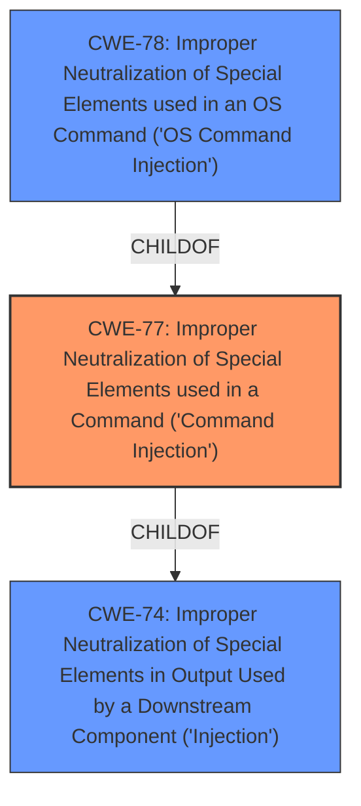

# Analysis Report for CVE-2021-45564

# Vulnerability Analysis Report: CVE-2021-45564

## Description


## Analysis (with Relationship Data)

# Summary
| CWE ID  | CWE Name                                                                 | Confidence | CWE Abstraction Level | CWE Vulnerability Mapping Label | CWE-Vulnerability Mapping Notes |
| ------- | ------------------------------------------------------------------------ | ---------- | ----------------------- | ------------------------------- | ------------------------------- |
| CWE-77  | Improper Neutralization of Special Elements used in a Command ('Command Injection') | 1          | Class                   | Allowed-with-Review             | Primary CWE                     |

## Evidence and Confidence

*   **Confidence Score:** 1
*   **Evidence Strength:** HIGH

## Relationship Analysis
The primary relationship influencing the CWE selection is the ChildOf relationship between CWE-77 and CWE-74 (Improper Neutralization of Special Elements in Output Used by a Downstream Component ('Injection')). CWE-77 is a more specific type of injection related to command construction. Also, CWE-78 (Improper Neutralization of Special Elements used in an OS Command ('OS Command Injection')) is a child of CWE-77 and a good candidate, but CWE-77 is what is present in the vulnerability description key phrases.



## Vulnerability Chain
The vulnerability chain starts with the **improper neutralization** of special elements within a command. This leads to **command injection**, allowing an authenticated user to execute arbitrary commands on the system.
- **Root Cause:** Improper Neutralization of Special Elements used in a Command (CWE-77)
- **Impact:** Command Injection, Arbitrary Command Execution

## Summary of Analysis
The initial analysis correctly identifies CWE-77 as the primary weakness based on the vulnerability description and the "CWE for similar CVE Descriptions" section. The description clearly states "**command injection** by an authenticated user," which aligns directly with CWE-77. The CVE Reference Links Content Summary also supports this, stating the "**Root Cause:** The vulnerability is a post-authentication command injection issue."

The choice of CWE-77 is further reinforced by the Retriever Results, which lists CWE-77 as the top combined result with a score of 1.000. While CWE-78 (OS Command Injection) is also a strong candidate, the vulnerability description doesn't explicitly specify OS commands, making CWE-77 a more appropriate fit.

The evidence is strong, and the selected CWE aligns with the vulnerability description, reference links content, and retriever results. CWE-77 is at the Class level of abstraction. Though CWE-78 is at the Base level, CWE-77 is a better fit based on the description.

Relevant CWE Information:
## CWE-77: Improper Neutralization of Special Elements used in a Command ('Command Injection')
**Abstraction:** Class
**Status:** Draft

### Description
The product constructs all or part of a command using externally-influenced input from an upstream component, but it does not neutralize or incorrectly neutralizes special elements that could modify the intended command when it is sent to a downstream component.

### Extended Description
Many protocols and products have their own custom command language. While OS or shell command strings are frequently discovered and targeted, developers may not realize that these other command languages might also be vulnerable to attacks.

### Observed Examples
- **CVE-2022-1509:** injection of sed script syntax ("sed injection")
- **CVE-2024-5184:** API service using a large generative AI model allows direct prompt injection to leak hard-coded system prompts or execute other prompts.


## CWE Relationship Analysis

Current CWEs represent these abstraction levels: .


### Vulnerability Chain Analysis

**Chain starting from CWE-78:**
- 78 (Improper Neutralization of Special Elements used in an OS Command ('OS Command Injection')) - ROOT


**Chain starting from CWE-74:**
- 74 (Improper Neutralization of Special Elements in Output Used by a Downstream Component ('Injection')) - ROOT


### CWE Relationship Diagram

```mermaid
graph TD
    classDef primary fill:#f96,stroke:#333,stroke-width:2px
    classDef secondary fill:#69f,stroke:#333
    classDef tertiary fill:#9e9,stroke:#333
```


*Report generated on 2025-04-01 19:44:07*
