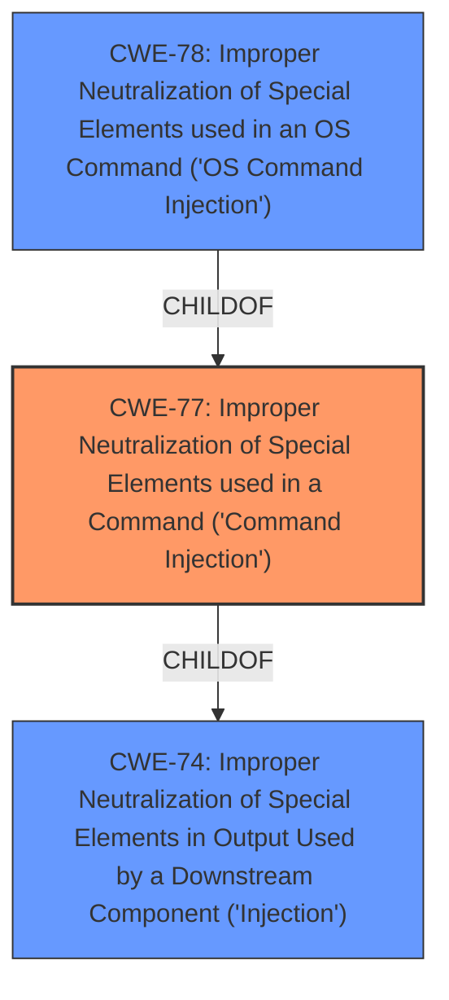

# Analysis for CVE-2021-45566

```markdown
# Summary
| CWE ID  | CWE Name                                                                                                        | Confidence | CWE Abstraction Level | CWE Vulnerability Mapping Label | CWE-Vulnerability Mapping Notes |
| ------- | --------------------------------------------------------------------------------------------------------------- | ---------- | ----------------------- | ----------------------------- | ------------------------------- |
| CWE-77  | Improper Neutralization of Special Elements used in a Command ('Command Injection')                                 | 1.0        | Class                   | Primary                       | Allowed-with-Review             |
| CWE-78  | Improper Neutralization of Special Elements used in an OS Command ('OS Command Injection')                       | 0.7        | Base                    | Secondary                     | Allowed                         |
| CWE-74  | Improper Neutralization of Special Elements in Output Used by a Downstream Component ('Injection')                 | 0.5        | Class                   | Secondary                     | Discouraged                     |

## Evidence and Confidence

*   **Confidence Score:** 0.8
*   **Evidence Strength:** HIGH

## Relationship Analysis
The primary relationship that influenced the decision was the parent-child relationship between CWE-77 and CWE-78. While the vulnerability description specifies "**command injection**," it does not explicitly state whether it is OS command injection or some other form of command injection. CWE-77, being a class-level CWE, is more general than CWE-78 (Base). The tool's retriever results also strongly suggest CWE-77. CWE-74 is a parent of CWE-77, but it's too general and discouraged by MITRE.



## Vulnerability Chain
The vulnerability chain starts with the **improper neutralization** of special elements in a command. This leads to the ability to inject commands, which, in turn, can lead to arbitrary command execution.

## Summary of Analysis
The initial analysis focused on identifying the root cause of the vulnerability, which is the **command injection** weakness. The evidence from the "Vulnerability Description Key Phrases" clearly indicates "**command injection**" as the **weakness**. The CVE Reference Links Content Summary also mentions "post-authentication command injection vulnerability."

The retriever results and the "CWE for similar CVE Descriptions" section both point to CWE-77 as the primary candidate. However, given that OS command injection is a common occurrence, CWE-78 was also considered, although less specific.

The final decision was to primarily map to CWE-77 because it aligns with the vulnerability description and the retriever results. The mapping guidance for CWE-77 suggests reviewing whether OS command injection (CWE-78) is more appropriate. While there's no specific evidence to confirm it's OS command injection, it remains a plausible secondary mapping. CWE-74 is too general, as it encompasses all types of injection. The selected CWEs are at the optimal level of specificity based on the available evidence.
```