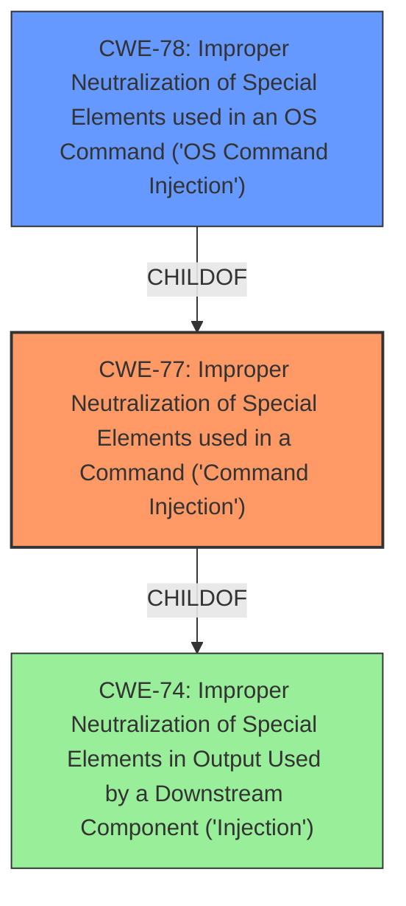

# Raw Analyzer Response for CVE-2021-45568

# Summary
| CWE ID | CWE Name | Confidence | CWE Abstraction Level | CWE Vulnerability Mapping Label | CWE-Vulnerability Mapping Notes |
|---|---|---|---|---|---|
| CWE-77 | Improper Neutralization of Special Elements used in a Command ('Command Injection') | 1.0 | Class | Allowed-with-Review | Primary CWE |
| CWE-78 | Improper Neutralization of Special Elements used in an OS Command ('OS Command Injection') | 0.7 | Base | Allowed | Secondary Candidate |

## Evidence and Confidence

*   **Confidence Score:** 0.9
*   **Evidence Strength:** HIGH

## Relationship Analysis
The primary relationship influencing the CWE selection is the parent-child relationship between CWE-77 (Improper Neutralization of Special Elements used in a Command) and CWE-78 (Improper Neutralization of Special Elements used in an OS Command). CWE-77 is a class-level CWE, while CWE-78 is a base-level CWE. The vulnerability description indicates a **command injection** issue, and the retriever results and similar CVE descriptions also support CWE-77 as the primary candidate. However, the specifics of whether the command is explicitly an OS command are not definitively stated, making CWE-77 a more appropriate initial classification, with CWE-78 as a possible refinement if more information is available. The other CWEs were less relevant due to their lack of direct connection to the **command injection** vulnerability described.

## Vulnerability Chain
The vulnerability chain involves the following steps:
1.  An authenticated user provides input to the NETGEAR device's web interface.
2.  The device **fails to properly neutralize special elements in the input**.
3.  The input is used to construct a command.
4.  The attacker injects malicious commands.
5.  The device executes the injected commands, leading to complete system compromise.

The root cause is the **improper neutralization of special elements**, and the impact is arbitrary command execution.

## Summary of Analysis
The initial analysis strongly pointed to CWE-77 (Improper Neutralization of Special Elements used in a Command) due to the presence of **command injection** as the primary **weakness** in the vulnerability description. The retriever results and similar CVE descriptions further supported this selection. The "CVE Reference Links Content Summary" explicitly mentions the "Root cause of vulnerability: Post-authentication command injection" and "Weaknesses/vulnerabilities present: Command injection vulnerability exists in the web interface of the affected NETGEAR Orbi products.".

The relationship between CWE-77 and its child CWE-78 (Improper Neutralization of Special Elements used in an OS Command) was carefully considered. While the description does not explicitly state that the injected command is an OS command, the possibility exists, making CWE-78 a relevant secondary candidate.

CWE-74 (Improper Neutralization of Special Elements in Output Used by a Downstream Component ('Injection')) was also considered, as CWE-77 is a child of CWE-74. However, CWE-74 is a high-level class, and CWE-77 provides a more specific classification for **command injection** vulnerabilities.

The final decision was to assign CWE-77 as the primary CWE, with CWE-78 as a secondary candidate, reflecting the uncertainty regarding the specific type of command being injected. This decision is based on the evidence available in the vulnerability description and the retriever results, as well as the mapping guidance provided by MITRE. The selected CWEs are at the optimal level of specificity, given the information available.

Relevant CWE Information:

# Enhanced Context (25 CWEs)
The following CWEs were identified as potentially relevant to this vulnerability:

## CWE-653: Improper Isolation or Compartmentalization
**Abstraction Level**: Class
**Similarity Score**: 0.75
**Source**: dense

**Description**:
The product does not properly compartmentalize or isolate functionality, processes, or resources that require different privilege levels, rights, or permissions.

**Mapping Guidance**:
- Usage: Allowed
- Rationale: This CWE entry is at the Base level of abstraction, which is a preferred level of abstraction for mapping to the root causes of vulnerabilities.

*This CWE is not applicable since the description does not provide any evidence of isolation or compartmentalization issues.*

## CWE-274: Improper Handling of Insufficient Privileges
**Abstraction Level**: Base
**Similarity Score**: 0.73
**Source**: dense

**Description**:
The product does not handle or incorrectly handles when it has insufficient privileges to perform an operation, leading to resultant weaknesses.

**Mapping Guidance**:
- Usage: Discouraged
- Rationale: This CWE entry could be deprecated in a future version of CWE.

*This CWE is not applicable since the description does not provide any evidence of privilege handling issues.*

## CWE-664: Improper Control of a Resource Through its Lifetime
**Abstraction Level**: Pillar
**Similarity Score**: 0.72
**Source**: dense

**Description**:
The product does not maintain or incorrectly maintains control over a resource throughout its lifetime of creation, use, and release.

**Mapping Guidance**:
- Usage: Discouraged
- Rationale: This CWE entry is high-level when lower-level children are available.

*This CWE is too abstract to be applicable.*

## CWE-266: Incorrect Privilege Assignment
**Abstraction Level**: Base
**Similarity Score**: 0.72
**Source**: dense

**Description**:
A product incorrectly assigns a privilege to a particular actor, creating an unintended sphere of control for that actor.

**Mapping Guidance**:
- Usage: Allowed
- Rationale: This CWE entry is at the Base level of abstraction, which is a preferred level of abstraction for mapping to the root causes of vulnerabilities.

*This CWE is not applicable since the description does not provide any evidence of privilege assignment issues.*

## CWE-691: Insufficient Control Flow Management
**Abstraction Level**: Pillar
**Similarity Score**: 0.71
**Source**: dense

**Description**:
The code does not sufficiently manage its control flow during execution, creating conditions in which the control flow can be modified in unexpected ways.

**Mapping Guidance**:
- Usage: Discouraged
- Rationale: This CWE entry is extremely high-level, a Pillar. However, classification research is limited for weaknesses of this type, so there can be gaps or organizational difficulties within CWE that force use of this weakness, even at such a high level of abstraction.

*This CWE is too abstract to be applicable.*

## CWE-405: Asymmetric Resource Consumption (Amplification)
**Abstraction Level**: Class
**Similarity Score**: 0.71
**Source**: dense

**Description**:
The product does not properly control situations in which an adversary can cause the product to consume or produce excessive resources without requiring the adversary to invest equivalent work or otherwise prove authorization, i.e., the adversary's influence is "asymmetric."

**Mapping Guidance**:
- Usage: Allowed-with-Review
- Rationale: This CWE entry is a Class and might have Base-level children that would be more appropriate

*This CWE is not applicable since the description does not provide any evidence of resource consumption issues.*

## CWE-280: Improper Handling of Insufficient Permissions or Privileges
**Abstraction Level**: Base
**Similarity Score**: 0.71
**Source**: dense

**Description**:
The product does not handle or incorrectly handles when it has insufficient privileges to access resources or functionality as specified by their permissions. This may cause it to follow unexpected code paths that may leave the product in an invalid state.

**Mapping Guidance**:
- Usage: Allowed
- Rationale: This CWE entry is at the Base level of abstraction, which is a preferred level of abstraction for mapping to the root causes of vulnerabilities.

*This CWE is not applicable since the description does not provide any evidence of privilege handling issues.*

## CWE-267: Privilege Defined With Unsafe Actions
**Abstraction Level**: Base
**Similarity Score**: 0.70
**Source**: dense

**Description**:
A particular privilege, role, capability, or right can be used to perform unsafe actions that were not intended, even when it is assigned to the correct entity.

**Mapping Guidance**:
- Usage: Allowed
- Rationale: This CWE entry is at the Base level of abstraction, which is a preferred level of abstraction for mapping to the root causes of vulnerabilities.

*This CWE is not applicable since the description does not provide any evidence of privilege related issues.*

## CWE-74