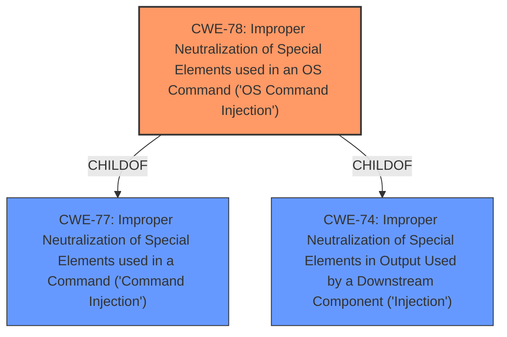

# Raw Analyzer Response for CVE-2021-45574

# Summary
| CWE ID | CWE Name | Confidence | CWE Abstraction Level | CWE Vulnerability Mapping Label | CWE-Vulnerability Mapping Notes |
|---|---|---|---|---|---|
| CWE-78 | Improper Neutralization of Special Elements used in an OS Command ('OS Command Injection') | 1.0 | Base | Allowed | Primary CWE |

## Evidence and Confidence

*   **Confidence Score:** 1.0
*   **Evidence Strength:** HIGH

## Relationship Analysis
The primary CWE is CWE-78, which is a Base level CWE.
CWE-78 is a child of CWE-77 and CWE-74.
CWE-77 is a Class level CWE that is often misused when OS command injection (CWE-78) was intended instead.
CWE-74 is a Class level CWE that is high-level and often misused when lower-level weaknesses are more appropriate.
Therefore, based on the descriptions, relationship, and mapping guidance, CWE-78 is the most appropriate CWE for this vulnerability.

## Vulnerability Chain
The chain of root cause and weaknesses that followed for the Vulnerability Description:
1.  Improper Neutralization of Special Elements used in an OS Command (**CWE-78**)
2.  Execution of arbitrary commands, leading to a full compromise of the device (Impact)

## Summary of Analysis
The vulnerability is a **command injection** vulnerability in NETGEAR devices. An authenticated user can exploit this vulnerability to execute arbitrary commands on the affected devices.

The vulnerability description states: "Certain NETGEAR devices are affected by **command injection** by an authenticated user." The CVE Reference Links Content Summary confirms this: "**Root cause of vulnerability:** Post-authentication command injection" and "**Weaknesses/vulnerabilities present:** Command injection vulnerability that allows an attacker to execute arbitrary commands on the affected devices."

The Retriever Results list CWE-77 as the top combined result, but the mapping guidance states that CWE-77 is often misused when OS command injection (**CWE-78**) was intended instead. CWE-78 is also listed in the Retriever Results.

CWE-78 (Improper Neutralization of Special Elements used in an OS Command ('OS Command Injection')) is the most appropriate CWE for this vulnerability because the **command injection** vulnerability allows an attacker to execute arbitrary commands on the affected devices.

CWE-77 (Improper Neutralization of Special Elements used in a Command ('Command Injection')) was considered, but the mapping guidance states that it is often misused when OS command injection (**CWE-78**) was intended instead.

Relevant CWE Information:
# Enhanced Context (25 CWEs)
The following CWEs were identified as potentially relevant to this vulnerability:

## CWE-917: Improper Neutralization of Special Elements used in an Expression Language Statement ('Expression Language Injection')
**Abstraction Level**: Base
**Similarity Score**: 0.81

## CWE-74: Improper Neutralization of Special Elements in Output Used by a Downstream Component ('Injection')
**Abstraction Level**: Class
**Similarity Score**: 0.75

## CWE-80: Improper Neutralization of Script-Related HTML Tags in a Web Page (Basic XSS)
**Abstraction Level**: Variant
**Similarity Score**: 0.75

## CWE-943: Improper Neutralization of Special Elements in Data Query Logic
**Abstraction Level**: Class
**Similarity Score**: 0.74

## CWE-184: Incomplete List of Disallowed Inputs
**Abstraction Level**: Base
**Similarity Score**: 0.73

## CWE-162: Improper Neutralization of Trailing Special Elements
**Abstraction Level**: Variant
**Similarity Score**: 0.73

## CWE-1289: Improper Validation of Unsafe Equivalence in Input
**Abstraction Level**: Base
**Similarity Score**: 0.73

## CWE-150: Improper Neutralization of Escape, Meta, or Control Sequences
**Abstraction Level**: Variant
**Similarity Score**: 0.73

## CWE-138: Improper Neutralization of Special Elements
**Abstraction Level**: Class
**Similarity Score**: 0.72

## CWE-73: External Control of File Name or Path
**Abstraction Level**: Base
**Similarity Score**: 0.72

## CWE-22: Improper Limitation of a Pathname to a Restricted Directory ('Path Traversal')
**Abstraction Level**: Base
**Similarity Score**: 9944.92

## CWE-79: Improper Neutralization of Input During Web Page Generation ('Cross-site Scripting')
**Abstraction Level**: Base
**Similarity Score**: 9855.30

## CWE-88: Improper Neutralization of Argument Delimiters in a Command ('Argument Injection')
**Abstraction Level**: Base
**Similarity Score**: 9669.78

## CWE-116: Improper Encoding or Escaping of Output
**Abstraction Level**: Class
**Similarity Score**: 9630.79

## CWE-74: Improper Neutralization of Special Elements in Output Used by a Downstream Component ('Injection')
**Abstraction Level**: Class
**Similarity Score**: 9619.84

## CWE-78: Improper Neutralization of Special Elements used in an OS Command ('OS Command Injection')
**Abstraction Level**: base
**Similarity Score**: 5.03

## CWE-79: Improper Neutralization of Input During Web Page Generation ('Cross-site Scripting')
**Abstraction Level**: base
**Similarity Score**: 5.03

## CWE-494: Download of Code Without Integrity Check
**Abstraction Level**: base
**Similarity Score**: 4.33

## CWE-22: Improper Limitation of a Pathname to a Restricted Directory ('Path Traversal')
**Abstraction Level**: base
**Similarity Score**: 4.33

## CWE-770: Allocation of Resources Without Limits or Throttling
**Abstraction Level**: base
**Similarity Score**: 4.33

## CWE-1284: Improper Validation of Specified Quantity in Input
**Abstraction Level**: base
**Similarity Score**: 4.33

## CWE-410: Insufficient Resource Pool
**Abstraction Level**: base
**Similarity Score**: 4.33

## CWE-789: Memory Allocation with Excessive Size Value
**Abstraction Level**: variant
**Similarity Score**: 3.88

## CWE-190: Integer Overflow or Wraparound
**Abstraction Level**: base
**Similarity Score**: 3.65

## CWE-94: Improper Control of Generation of Code ('Code Injection')
**Abstraction Level**: base
**Similarity Score**: 3.65